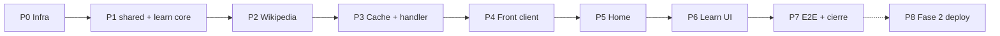

# Plan de desarrollo — Modo aprendizaje (Fase 1)

Basado en [01-prd-modo-aprendizaje.md](docs/tasks/backend-api-vercel/modo-aprendizaje/01-prd-modo-aprendizaje.md) y [00-decision-resumen-planificacion-backend.md](docs/tasks/backend-api-vercel/00-decision-resumen-planificacion-backend.md).

**Estado actual del repo:** solo frontend Vite; sin `api/`, `server/`, `vercel.json` ni `vercel` en [package.json](package.json). Reutilizar: [WorldMap.tsx](src/components/WorldMap.tsx), [country-localization.ts](src/data/country-localization.ts), [translateApiErrorCode](src/i18n/translate-api-error.ts), selector de idioma en [SetupView.tsx](src/features/setup/SetupView.tsx) (`#app-locale`).

**Convención de checkpoint (después de cada bloque Pn):**

| Actividad | Qué hacer |
|-----------|-----------|
| **Review** | Releer diff vs PRD (RF/RNF del bloque); handlers delgados; sin secretos en cliente; User-Agent documentado si aplica |
| **Errores** | `npm run lint`, `tsc -b`, revisar casos límite del PRD §7 del bloque |
| **Testear** | Comandos del bloque + regresión mínima (`npm test`; e2e quiz si tocó `App`/`WorldMap`) |

---

## Bloque P0 — Infra local Vercel (sin deploy nube)

**Objetivo:** `npx vercel dev` sirve health y estructura de carpetas lista.

**Tareas:**

1. **Acuerdo previo:** instalar `vercel` como devDependency siguiendo [.cursor/rules/dependency-security.mdc](.cursor/rules/dependency-security.mdc) (nombre exacto, `npm view`, scripts, consentimiento, `--ignore-scripts`).
2. Crear `vercel.json`: `framework: vite`, `devCommand: npm run dev`, `buildCommand` / `outputDirectory` para SPA, rewrites `/api/*` → funciones.
3. `api/health.ts` (o `api/v1/health.ts`) → `GET` JSON `{ ok: true }`.
4. Esqueleto vacío: `server/learn/`, `server/prompts/.gitkeep` (RNF-E05), `shared/` opcional.
5. `.env.example`: `VITE_API_BASE_URL=http://localhost:3000`, `ALLOWED_ORIGINS=http://localhost:5173,http://localhost:3000` (sin secretos).
6. Doc breve en [docs/tasks/backend-api-vercel/modo-aprendizaje/](docs/tasks/backend-api-vercel/modo-aprendizaje/): User-Agent Wikipedia (**definir antes de P2**), `vercel dev`, `curl` health.

**Checkpoint P0**

- Review: `vercel.json` no rompe `npm run build` / `vite build`; `.env` no commiteado.
- Errores: `curl http://localhost:3000/api/health` (o ruta acordada); CORS aún no crítico.
- Testear: smoke manual; opcional script npm `dev:api` documentado.

---

## Bloque P1 — Contrato compartido y núcleo `server/learn`

**Objetivo:** lógica testeable sin HTTP ni Vercel.

**Tareas:**

1. `shared/learn-types.ts` (o `src/types/learn.ts` si se prefiere solo front + duplicar mínimo en server): `LearnProfile`, `LearnApiErrorCode`, `ApiErrorPayload`.
2. `server/learn/validate-learn-request.ts`: normalizar `iso2` mayúsculas; `locale` ∈ `{ es, en }` → códigos `INVALID_LOCALE`, `COUNTRY_NOT_FOUND` contra [countries-catalog](src/data/countries-catalog.json) (importar lista ISO allowlist en server — copia JSON o módulo compartido sin React).
3. `server/learn/get-country-learn-profile.ts`: orquestador que recibe deps inyectadas (`wikipediaClient`, `cache`, `resolveLocalizedName`).
4. Vitest: locale inválido, iso2 desconocido, happy path con **mocks** (sin red).

**Checkpoint P1**

- Review: funciones puras; sin `Request`/`Response` en `server/learn`.
- Errores: cobertura de todos los códigos de error del PRD §8.
- Testear: `npm test -- server/learn`.

---

## Bloque P2 — Cliente Wikipedia y resolución de artículo

**Objetivo:** RF-B08, RF-B09, RF-B05, fallback `en`.

**Tareas:**

1. Documentar User-Agent en README iteración (ej. `MapWorldGame/1.0 (https://github.com/...; contacto@...)`) — **bloqueante antes del primer fetch real**.
2. `server/learn/wikipedia-client.ts`: `fetch` a `https://{locale}.wikipedia.org/api/rest_v1/page/summary/{title}` y búsqueda (`/page/search` o equivalente REST) con timeout (~8s).
3. `server/learn/resolve-article-title.ts`: orden PRD — mapping opcional ISO→title; búsqueda por [getLocalizedCountryName](src/data/country-localization.ts) replicada en server (mismo algoritmo, datos del catálogo).
4. Pipeline fallback: si locale `es` falla → repetir con `en`; DTO con `locale` efectivo.
5. Mapper: `title`, `summary` (extract completo), `flagUrl` desde `thumbnail.source`, `wikipediaUrl` desde `content_urls.desktop.page`.
6. Vitest con fixtures JSON (200, 404, sin thumbnail, título con espacios/unicode).

**Checkpoint P2**

- Review: URLs solo `*.wikipedia.org`; logs sin cuerpos completos (RNF-S02).
- Errores: probar manualmente 2–3 países (`AR`, `US`, uno sin artículo en `es`) con `vercel dev` si handler ya existe, o test de integración mock.
- Testear: `npm test -- wikipedia`; no depender de Wikipedia en CI (mocks).

---

## Bloque P3 — Caché servidor y handler HTTP

**Objetivo:** RF-B01, RF-B10, RF-B07, endpoint real.

**Tareas:**

1. `server/learn/learn-cache.ts`: Map en memoria, clave `(iso2, locale)`, TTL 24h (configurable).
2. `api/v1/countries/[iso2]/learn.ts` (o estructura de rutas Vercel equivalente): handler delgado — CORS desde `ALLOWED_ORIGINS`, parse query `locale`, llamar `getCountryLearnProfile`, status 200/400/404/502/503.
3. Helper `api/_lib/cors.ts` + `json-response.ts` reutilizable.
4. Vitest: segunda llamada no invoca `wikipediaClient` (mock spy).

**Checkpoint P3**

- Review: respuestas JSON coinciden con PRD §6.1; stack no expuesto al cliente.
- Errores: `curl` casos `?locale=fr`, iso2 inválido, país inexistente; verificar headers CORS con origen `5173`.
- Testear: `npm test`; manual `curl "http://localhost:3000/api/v1/countries/AR/learn?locale=es"`.

---

## Bloque P4 — Cliente API frontend e i18n de errores

**Objetivo:** RF-I01–I04 antes de UI de mapa.

**Tareas:**

1. `src/services/learn-api-client.ts`: `fetchLearnProfile(iso2, locale)` → `Result<LearnProfile, ApiErrorPayload>`.
2. Claves en [src/i18n/resources/es.ts](src/i18n/resources/es.ts) y [en.ts](src/i18n/resources/en.ts) namespace `errors`: `INVALID_LOCALE`, `COUNTRY_NOT_FOUND`, `WIKIPEDIA_PAGE_NOT_FOUND`, `WIKIPEDIA_UNAVAILABLE`, `INTERNAL_ERROR`.
3. Namespace `learn` (copy modal, offline, reintentar, badge “Contenido en inglés”).
4. `src/services/learn-api-client.test.ts`: mock `global.fetch` (200, 404, red).

**Checkpoint P4**

- Review: solo `VITE_*` en cliente; tipos alineados con `shared`.
- Errores: `translateApiErrorCode` para cada código nuevo.
- Testear: `npm test -- learn-api-client`.

---

## Bloque P5 — Home: idioma + CTA aprendizaje

**Objetivo:** RF-L01, RF-L02, RF-L03.

**Tareas:**

1. [HomeView.tsx](src/features/home/HomeView.tsx): `FieldSelect` idioma (`#app-locale-home` o reutilizar id con cuidado en e2e) + botón **Modo aprendizaje**; props `onStartLearn`, `onLocaleChange` opcional si el estado vive en App.
2. [App.tsx](src/App.tsx): `AppView` → `'home' | 'setup' | 'game' | 'learn'`; handlers navegación.
3. Mantener selector en Setup enlazado al mismo `i18n.changeLanguage` (RF-L03).
4. Actualizar [App.test.tsx](src/App.test.tsx) si existe; tests Home.

**Checkpoint P5**

- Review: persistencia locale sin cambios de contrato en `GameConfig`.
- Errores: cambiar idioma en Home y verificar Setup/quiz en ese idioma.
- Testear: `npm test`; e2e [e2e/game-flow.spec.ts](e2e/game-flow.spec.ts) completo (regresión quiz).

---

## Bloque P6 — UI modo aprendizaje (mapa + modal)

**Objetivo:** RF-L10–L17, RNF-A01–A04.

**Tareas:**

1. Feature `src/features/learn/`:
   - `LearnMapView.tsx` — `WorldMap` `fullBleed`, `regionFilter="world"`, sin HUD jugadores.
   - `CountryLearnModal.tsx` — skeleton, contenido, error + Reintentar, badge locale efectivo ≠ pedido.
   - `use-country-learn.ts` — estado loading/error/data; caché última ficha (`sessionStorage` clave versionada); offline → última ficha + aviso.
2. Extender [WorldMap.tsx](src/components/WorldMap.tsx): props `mapInteractionLocked?: boolean` (bloquea clic + pan/zoom; reutilizar patrón de `answerLocked` donde aplique).
3. Reglas modal abierto: ignorar clics país; zoom deshabilitado (RF-L13).
4. Nav: Home y Setup desde overlay (RF-L04).
5. Tests: `LearnMapView.test.tsx`, `CountryLearnModal.test.tsx`, `WorldMap` si nuevas props.

**Checkpoint P6**

- Review: a11y modal (`role="dialog"`, Escape, foco); enlace Wikipedia `rel="noopener noreferrer"`.
- Errores: PRD §7 — modal abierto + clic rápido, sin thumbnail, extracto largo con scroll, offline con/sin caché.
- Testear: `npm test`; manual con `vercel dev` + `VITE_API_BASE_URL` + `npm run dev` (dos terminales o un solo `vercel dev` según P0).

---

## Bloque P7 — Integración E2E y cierre Fase 1

**Objetivo:** RNF-T03, RNF-T04, Definición de Done PRD §9.

**Tareas:**

1. `e2e/learn-flow.spec.ts`: Home → aprendizaje → mock `page.route` del endpoint learn → modal visible con título; cerrar modal → segundo país.
2. Ajustar `goToSetup` en e2e si el idioma pasa a Home (seleccionar locale en Home o Setup).
3. Actualizar [README](docs/tasks/backend-api-vercel/README.md) / checklist iteración con estado “en progreso / fase 1 cerrada”.
4. Promover entrada backlog *Modo aprendizaje* cuando se cierre.

**Checkpoint P7 (cierre fase 1)**

- Review: checklist completo PRD §9 fase 1; quiz sin cambios de comportamiento (RF-L05).
- Errores: `npm run lint`, `npm test`, `npm run e2e`.
- Testear: flujo manual 5 min (ES, EN, fallback EN, reintentar, offline simulado DevTools).

---

## Bloque P8 — Fase 2 (iteración separada, fuera de v1 obligatoria)

Solo planificar; ejecutar cuando se cierre fase 1.

1. Cuenta Vercel + `vercel link` + deploy preview/prod.
2. Env producción: `ALLOWED_ORIGINS`, `VITE_API_BASE_URL` en build.
3. Rate limiting en handler (`RATE_LIMITED`).
4. Smoke HTTPS + CORS; revisar cuotas Wikipedia.

**Checkpoint P8:** review seguridad pública; test manual producción; monitor cold starts.

---

## Dependencias y riesgos

| Riesgo | Mitigación |
|--------|------------|
| Instalar `vercel` sin acuerdo | P0 bloqueado hasta consentimiento explícito |
| CORS dos puertos (5173 vs 3000) | `ALLOWED_ORIGINS` en `.env.local`; doc P0 |
| Wikipedia en CI | Solo mocks; e2e con `page.route` |
| `WorldMap` crece en complejidad | Props acotadas `mapInteractionLocked`; no tocar lógica quiz |
| Catálogo en server | Import JSON estático; sin bundlear React |

---

## Orden de ejecución recomendado

**P0 → P1 → P2 → P3 → P4 → P5 → P6 → P7** (secuencial; P4 puede solaparse con P3 si dos personas, pero P6 depende de P4 y P5).

Estimación orientativa: **P0–P3** ~1–2 días backend; **P4–P7** ~1–2 días frontend + e2e (demo baja escala).
