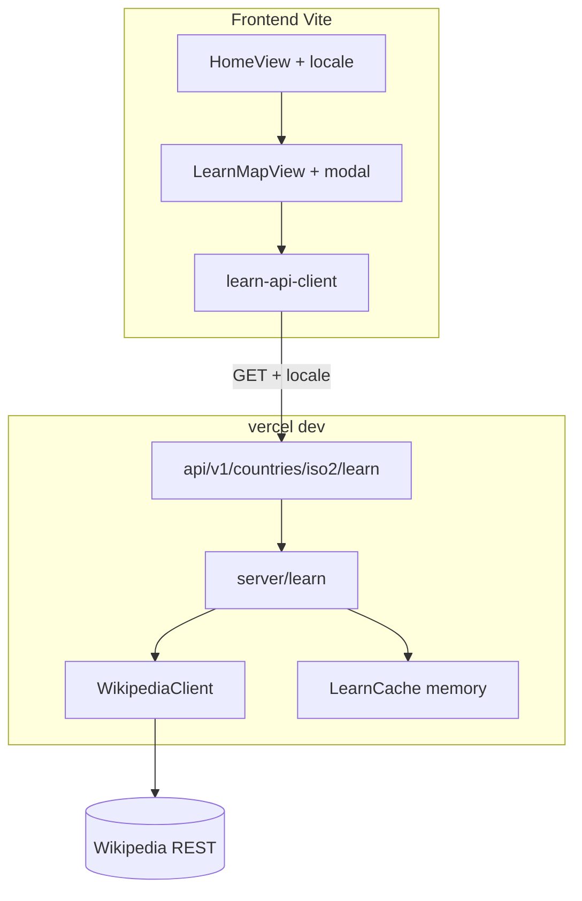

# PRD — Modo aprendizaje (explorar países + Wikipedia)

**Estado:** aprobado para implementación (producto)  
**Fecha:** 2026-05-18  
**Idioma del documento:** español  
**Audiencia:** desarrollo, QA, planificación de tareas  

**Referencias:**

- Decisiones de backend compartido: [`00-decision-resumen-planificacion-backend.md`](./00-decision-resumen-planificacion-backend.md)
- Estado producto: [`docs/requirements/04-current-state-post-mvp.mdc`](../../requirements/04-current-state-post-mvp.mdc)
- Backlog origen: [`ideas-features-backlog.md`](../ideas-features-backlog.md) — *Modo aprendizaje*

---

## 1. Resumen

**Modo aprendizaje** es una experiencia **separada del quiz** (país/capital con rondas, puntaje y setup). El usuario entra desde **Home**, con el **idioma ya elegido**, explora un **mapa interactivo idéntico en apariencia y comportamiento base** al del juego de adivinanza, y al hacer clic en un país obtiene una **ficha** (nombre, bandera, reseña de Wikipedia, enlace) servida por un **backend en el mismo monorepo** (Vercel Functions en fases posteriores de deploy).

No hay setup de partida, turnos, puntaje ni fin de sesión: la exploración es **abierta** hasta volver a Home o Setup (quiz).

El backend se diseña como **módulo `learn/`** reutilizable más adelante por **preguntas con IA (Gemini)** y otras features; esta iteración implementa solo Wikipedia + proxy + caché.

---

## 2. Decisiones de producto (cerradas)

| Tema | Decisión |
|------|----------|
| Entrada al modo | **Opción C:** CTA dedicado en **Home**, independiente del flujo Setup → quiz |
| Setup | **No aplica** al modo aprendizaje |
| Turnos / jugadores | **No** — mapa libre, clics ilimitados |
| Fin de sesión | **No** — abierta hasta Home o Setup |
| Modal abierto | Bloquea **nuevo clic en país** y **zoom** del mapa; pan según implementación (recomendado: bloquear también interacción del mapa detrás del overlay) |
| Idioma UI + contenido | Selector en **Home** (no solo en Setup); `locale` se envía al backend |
| Contenido Wikipedia | Idioma = `locale`; **fallback a `en`** si no hay artículo |
| Nombre en ficha | **Título devuelto por Wikipedia** |
| Bandera | **Thumbnail de Wikipedia** (REST summary) |
| Reseña | **Extracto completo** del `extract` del summary API; **scroll** en el modal si hace falta |
| País sin página directa | **Búsqueda por nombre localizado** (catálogo + `country-localization`) antes de fallar |
| Carga / error | **Skeleton** en modal; **Reintentar** si falla la API |
| Offline | Mostrar **última ficha vista** en caché cliente si no hay red |
| Fase 1 infra | **`vercel dev` + código en repo**; **sin deploy a la nube** |
| Fase 2 infra | **Deploy Vercel** + **rate limiting** |
| Caché servidor | **Sí** (TTL por definir en implementación; sugerido 24 h por `(iso2, locale)`) |
| User-Agent Wikipedia | **Definir antes de implementar** (nombre app + URL/contacto; requisito de la política de Wikimedia) |
| Quiz existente | **Sin cambios de comportamiento** salvo mover/añadir selector de idioma en Home |

---

## 3. User stories

### US-01 — Entrada desde Home

**Como** jugador curioso,  
**quiero** entrar al modo aprendizaje desde la pantalla principal sin configurar una partida,  
**para** explorar países de forma inmediata.

### US-02 — Idioma antes de explorar

**Como** usuario bilingüe,  
**quiero** elegir español o inglés en Home antes de abrir el mapa de aprendizaje,  
**para** ver la UI y las fichas de Wikipedia en el idioma que prefiero.

### US-03 — Explorar el mapa

**Como** usuario en modo aprendizaje,  
**quiero** hacer clic en cualquier país del catálogo tantas veces como quiera,  
**para** aprender sin presión de tiempo ni puntaje.

### US-04 — Ficha informativa

**Como** usuario,  
**quiero** ver en un modal el nombre del país, su bandera, un texto de Wikipedia y un enlace a la página completa,  
**para** profundizar si me interesa.

### US-05 — Una ficha a la vez

**Como** usuario,  
**quiero** que no pueda abrir otra ficha hasta cerrar la actual,  
**para** leer con calma sin solapamientos.

### US-06 — Contenido en mi idioma con respaldo

**Como** usuario con locale `es`,  
**quiero** leer el artículo en español cuando exista, y en inglés si no hay artículo en español,  
**para** no quedarme sin información.

### US-07 — Recuperación ante fallos

**Como** usuario con mala conexión,  
**quiero** ver un estado de carga claro, reintentar si falla la petición, y seguir viendo la última ficha que cargó bien sin red,  
**para** no perder el hilo de exploración.

### US-08 — Volver al resto de la app

**Como** usuario,  
**quiero** volver a Home o ir a Setup (quiz) desde el mapa de aprendizaje,  
**para** cambiar de actividad cuando termine de explorar.

### US-09 — Desarrollador / mantenedor

**Como** desarrollador,  
**quiero** un endpoint versionado y un núcleo `server/learn` testeable sin Vercel,  
**para** reutilizar el mismo pipeline cuando integremos Gemini y otras APIs.

---

## 4. Requisitos funcionales y criterios de aceptación

Convención: **RF-L** = aprendizaje (learn), **RF-B** = backend, **RF-I** = integración.

### 4.1 Home y navegación

| ID | Requisito | Criterios de aceptación |
|----|-----------|-------------------------|
| RF-L01 | CTA **Modo aprendizaje** en Home | Existe botón/enlace visible en `HomeView`; al activarlo se abre la vista de mapa de aprendizaje sin pasar por Setup |
| RF-L02 | Selector de idioma en Home | Control ES/EN en Home; persiste igual que hoy (`localStorage` versionado); `document.documentElement.lang` se actualiza |
| RF-L03 | Setup conserva idioma | Si el usuario va a Setup después de cambiar idioma en Home, el quiz usa el mismo locale global |
| RF-L04 | Salida del modo | Desde el mapa de aprendizaje: acciones **Home** y **Setup (quiz)**; no hay pantalla de resultados ni ranking |
| RF-L05 | Quiz sin regresión | Flujo Setup → juego → resultados se comporta igual que antes; tests e2e del quiz siguen pasando |

### 4.2 Mapa y modal (frontend)

| ID | Requisito | Criterios de aceptación |
|----|-----------|-------------------------|
| RF-L10 | Mismo mapa base | Misma componente/capa de mapa que el quiz: hover, highlight por continente, pan; **sin** overlay de ronda ni HUD de jugadores |
| RF-L11 | Clic en país | Solo países presentes en el catálogo son seleccionables; clic dispara petición al backend con `iso2` y `locale` |
| RF-L12 | Modal de ficha | Muestra: título (Wikipedia), imagen (thumbnail), extracto con scroll, enlace externo a Wikipedia (`target="_blank"`, `rel="noopener noreferrer"`) |
| RF-L13 | Bloqueo con modal abierto | Con modal abierto: no se acepta otro clic de país; **zoom del mapa deshabilitado** |
| RF-L14 | Cerrar modal | Botón o acción explícita (y Escape si se implementa accesibilidad) cierra el modal y restaura interacción del mapa |
| RF-L15 | Estados de carga | Mientras carga: modal visible con **skeleton** (no modal vacío sin feedback) |
| RF-L16 | Error y reintento | Si la API falla: mensaje i18n por código + botón **Reintentar** que repite la última petición `(iso2, locale)` |
| RF-L17 | Caché cliente | Tras una ficha exitosa, se guarda en memoria/sessionStorage (decisión de implementación); sin red se muestra la **última ficha exitosa** con indicador de “sin conexión” (copy i18n) |
| RF-L18 | Filtro región | **Fuera de alcance v1:** no hay filtro por continente en aprendizaje; mapa muestra el catálogo completo salvo decisión futura |

### 4.3 Backend — contrato API

| ID | Requisito | Criterios de aceptación |
|----|-----------|-------------------------|
| RF-B01 | Endpoint | `GET /api/v1/countries/:iso2/learn?locale={es\|en}` — `iso2` en mayúsculas o normalizado a mayúsculas en servidor |
| RF-B02 | Respuesta exitosa `200` | JSON con al menos: `iso2`, `locale` (idioma efectivo del contenido), `title`, `summary` (extracto completo), `flagUrl` (thumbnail o null), `wikipediaUrl`, `source: "wikipedia"` |
| RF-B03 | Locale | Solo `es` y `en` aceptados; otro valor → `400` + código `INVALID_LOCALE` |
| RF-B04 | País desconocido | `iso2` no en catálogo interno → `404` + `COUNTRY_NOT_FOUND` |
| RF-B05 | Sin artículo | Tras búsqueda por título localizado y fallback `en`: si no hay página → `404` + `WIKIPEDIA_PAGE_NOT_FOUND` |
| RF-B06 | Errores upstream | Timeout/error Wikipedia → `502` o `503` + `WIKIPEDIA_UNAVAILABLE` (sin filtrar stack al cliente) |
| RF-B07 | CORS | Orígenes permitidos vía env (`ALLOWED_ORIGINS`); en dev: `http://localhost:3000`, `http://localhost:5173` (ajustar al puerto real de `vercel dev` / Vite) |
| RF-B08 | Proxy Wikipedia | Llamadas a [Wikipedia REST API](https://en.wikipedia.org/api/rest_v1/) desde **servidor**; **User-Agent** identificable documentado en README de la iteración antes del primer request real |
| RF-B09 | Resolución de artículo | Orden: (1) título por `iso2` + locale si existe mapping; (2) **búsqueda por nombre localizado** (`country-localization` / catálogo); (3) mismo flujo con locale `en` si locale solicitado ≠ `en` y falló (1)-(2) |
| RF-B10 | Caché servidor | Segunda petición idéntica `(iso2, locale)` no llama a Wikipedia dentro del TTL; tests unitarios verifican que el adaptador de caché se usa |

### 4.4 Integración front ↔ back

| ID | Requisito | Criterios de aceptación |
|----|-----------|-------------------------|
| RF-I01 | Base URL | Cliente usa `import.meta.env.VITE_API_BASE_URL` (documentado en `.env.example` sin secretos) |
| RF-I02 | Query locale | Cada petición incluye `locale` alineado con `AppLocale` activo |
| RF-I03 | Errores | El front mapea `error.code` del JSON con `translateApiErrorCode` (namespace `errors`); existen claves para códigos listados en §8 |
| RF-I04 | Sin secretos en bundle | Ninguna API key de Wikipedia/Gemini en el cliente |

---

## 5. Requisitos no funcionales

### 5.1 Rendimiento

| ID | Requisito |
|----|-----------|
| RNF-P01 | Primera carga de ficha (cache miss): objetivo **&lt; 3 s** en red doméstica razonable (p95 local/demo); segunda carga (cache hit servidor): **&lt; 500 ms** |
| RNF-P02 | El mapa permanece fluido (60 fps objetivo en desktop estándar) con modal cerrado |
| RNF-P03 | El extracto largo no bloquea el hilo principal: render en modal con scroll nativo |

### 5.2 Seguridad y privacidad

| ID | Requisito |
|----|-----------|
| RNF-S01 | Sin API keys en el frontend |
| RNF-S02 | Sin PII en logs del servidor; logs de error sin cuerpos completos de respuestas Wikipedia |
| RNF-S03 | Enlaces externos solo HTTPS a dominios `*.wikipedia.org` |
| RNF-S04 | Validar `iso2` contra allowlist del catálogo (evitar path traversal / iso arbitrario) |
| RNF-S05 | **Fase 2:** rate limiting por IP u origen antes de producción pública |

### 5.3 Escalabilidad y mantenibilidad

| ID | Requisito |
|----|-----------|
| RNF-E01 | Handlers en `api/` delgados; lógica en `server/learn/` (funciones puras + adaptadores) |
| RNF-E02 | Tipos/DTO compartidos en `shared/` (opcional) sin importar React |
| RNF-E03 | El módulo `WikipediaClient` es intercambiable (tests con mock) |
| RNF-E04 | Contrato `/v1/...` estable para futuros clientes (móvil, Gemini) |
| RNF-E05 | Preparar `server/prompts/` como carpeta vacía o interfaz común **sin implementar** Gemini en esta iteración |

### 5.4 Accesibilidad y UX

| ID | Requisito |
|----|-----------|
| RNF-A01 | Modal con `role="dialog"`, `aria-modal="true"`, foco atrapado o devuelto al cerrar |
| RNF-A02 | Imagen de bandera con `alt` descriptivo (título del país) |
| RNF-A03 | Enlace a Wikipedia con texto visible (no solo icono) |
| RNF-A04 | Copy de aprendizaje en namespaces i18n (`learn` o `home` + `common`) |

### 5.5 Observabilidad y pruebas

| ID | Requisito |
|----|-----------|
| RNF-T01 | Vitest: casos de uso `getCountryLearnProfile`, resolución de locale/fallback, caché, códigos de error |
| RNF-T02 | Vitest front: cliente API, caché de última ficha, estados loading/error |
| RNF-T03 | Playwright e2e: Home → aprendizaje → clic país → modal (mock de `fetch` a la API) |
| RNF-T04 | Playwright: regresión flujo quiz completo sin mocks de learn |

---

## 6. Arquitectura por áreas e fases

### Fase 1 — Backend local (sin deploy nube)



**Entregables fase 1:**

1. Carpetas `api/`, `server/learn/`, `vercel.json` mínimo, `vercel dev` respondiendo health + learn.
2. Módulo Wikipedia + caché en memoria + User-Agent documentado.
3. Cliente HTTP en front + tipos de respuesta.
4. `LearnMapView` (o feature `learn/`) + modal + Home CTA + idioma en Home.
5. Tests Vitest + e2e con mock.

**Checklist operativo Vercel (fase 1)** — detalle en [`00-decision-resumen-planificacion-backend.md`](./00-decision-resumen-planificacion-backend.md):

- [ ] Añadir `vercel` como devDependency (**con acuerdo explícito** y flujo de seguridad del repo).
- [ ] `vercel.json`: `devCommand` → `npm run dev`, rutas API, rewrites SPA si aplica.
- [ ] Endpoint `GET /api/health` o similar para smoke test.
- [ ] `.env.example`: `VITE_API_BASE_URL`, `ALLOWED_ORIGINS` (sin valores secretos).
- [ ] Documentar en README de iteración: comando `npx vercel dev`, puerto, ejemplo `curl`.

### Fase 2 — Producción y endurecimiento

- Cuenta Vercel + proyecto enlazado al repo + variables de entorno.
- Deploy preview/producción; `VITE_API_BASE_URL` apuntando a la URL desplegada.
- **Rate limiting** en el handler o middleware delgado.
- Revisar TTL de caché y límites de cuota Wikipedia.
- Smoke test manual en HTTPS.

### 6.1 Backend (`server/learn/`)

**Responsabilidades:**

- Validar `iso2` y `locale`.
- Resolver título de artículo (mapping ISO → wiki title opcional en v1; búsqueda por nombre localizado).
- Llamar `GET /page/summary/{title}` en el wiki del locale (`es` / `en`).
- Si 404 y locale ≠ `en`, repetir pipeline en `en`.
- Mapear respuesta REST a DTO de aprendizaje.
- Escribir/leer caché.

**DTO de respuesta (referencia):**

```json
{
  "iso2": "AR",
  "locale": "es",
  "title": "Argentina",
  "summary": "…extracto completo…",
  "flagUrl": "https://upload.wikimedia.org/…",
  "wikipediaUrl": "https://es.wikipedia.org/wiki/Argentina",
  "source": "wikipedia"
}
```

**Payload de error (referencia):**

```json
{
  "error": {
    "code": "WIKIPEDIA_UNAVAILABLE",
    "message": "Human-readable fallback for logs"
  }
}
```

### 6.2 Frontend

| Componente / área | Acción |
|-------------------|--------|
| `HomeView` | Selector idioma + CTA modo aprendizaje |
| `App.tsx` | Vista `learn` en máquina de estados (`home` \| `setup` \| `game` \| `learn`) |
| `features/learn/` (sugerido) | `LearnMapView`, `CountryLearnModal`, hook `useCountryLearn` |
| `services/learn-api-client.ts` | `fetchLearnProfile(iso2, locale)` |
| `i18n` | Namespace `learn` + códigos en `errors` |
| `WorldMap` | Props para deshabilitar zoom y clics según estado modal |

**Nota:** el selector de idioma puede **moverse** de Setup a Home o **duplicarse** en ambos; producto exige que esté en Home. Setup puede mantener el control por compatibilidad o delegar al mismo estado global.

### 6.3 Integración

Secuencia nominal:

1. Usuario elige `es` en Home → persiste locale.
2. Usuario pulsa **Modo aprendizaje** → `LearnMapView`.
3. Clic en `BR` → `GET {VITE_API_BASE_URL}/api/v1/countries/BR/learn?locale=es`.
4. Backend responde 200 → modal con datos.
5. Usuario cierra modal → puede clicar otro país.

---

## 7. Casos límite y escenarios de error

| Escenario | Comportamiento esperado |
|-----------|-------------------------|
| Clic rápido en otro país con modal abierto | Ignorado hasta cerrar modal |
| Wikipedia devuelve summary sin `thumbnail` | Modal sin imagen o placeholder i18n; resto de campos visibles |
| Artículo existe en `en` pero no en `es` | Respuesta 200 con `locale: "en"` (indicar en UI opcional: badge “Contenido en inglés”) — **recomendado en implementación** |
| Wikipedia rate-limit / 429 | `503` + `WIKIPEDIA_UNAVAILABLE`; front: Reintentar |
| Timeout de red | Igual que error API; Reintentar |
| `iso2` válido en catálogo pero sin resultados de búsqueda | `404` + `WIKIPEDIA_PAGE_NOT_FOUND`; mensaje amable en modal |
| Usuario offline con caché vacía | Error sin ficha previa; copy “sin conexión” |
| Usuario offline con caché previa | Mostrar última ficha + aviso offline |
| Cambio de idioma en Home con modal abierto en learn | **v1:** deshabilitar cambio de locale en learn o cerrar modal al cambiar; documentar en implementación |
| Artículo con extracto muy largo | Scroll dentro del modal; no expandir modal a pantalla completa obligatorio |
| Caracteres especiales en título de búsqueda | Codificación URL correcta hacia REST API |
| CORS bloqueado en dev (dos puertos) | Configurar `ALLOWED_ORIGINS` incluyendo origen Vite |

**Códigos de error estables (mínimo v1):**

`INVALID_LOCALE`, `COUNTRY_NOT_FOUND`, `WIKIPEDIA_PAGE_NOT_FOUND`, `WIKIPEDIA_UNAVAILABLE`, `RATE_LIMITED` (reservado fase 2), `INTERNAL_ERROR`

---

## 8. Fuera de alcance

### 8.1 Esta iteración (modo aprendizaje v1)

- Deploy a Vercel en la nube (**fase 2**).
- Rate limiting (**fase 2**).
- Modo trivia con IA (Gemini) y tags temáticos.
- Persistencia de puntajes / leaderboard en servidor.
- Setup de partida dentro del modo aprendizaje (jugadores, preguntas, anti-cheat, región).
- Turnos multijugador en aprendizaje.
- Filtro por continente en el mapa de aprendizaje.
- Traducción automática de extractos (solo wiki `es` / `en` + fallback `en`).
- PWA / modo offline completo del mapa (solo última ficha en caché cliente).
- Repositorio backend separado.
- Migración a Next.js.
- Auth de usuarios.

### 8.2 Explícitamente fuera para no mezclar con el quiz

- Modificar scoring, rondas o `buildQuestionPool` para aprendizaje.
- Mostrar `ResultsView` al salir de aprendizaje.

### 8.3 Heredado del documento de decisiones global

- Confiar en IA para elegir país correcto sin catálogo.
- Ranking global complejo, cuentas de usuario, pagos.

---

## 9. Definición de Done (iteración completa)

**Fase 1 (obligatoria para cerrar feature en repo):**

- [ ] `GET /api/v1/countries/:iso2/learn` funciona con `vercel dev` y Wikipedia real (o mock en CI).
- [ ] User-Agent y política de uso documentados.
- [ ] Caché servidor operativa con tests.
- [ ] Home: idioma + entrada a aprendizaje.
- [ ] Mapa + modal con skeleton, reintento, caché última ficha, bloqueo zoom/clic.
- [ ] Errores por código i18n.
- [ ] Vitest núcleo + cliente; Playwright aprendizaje (mock) + regresión quiz.
- [ ] Quiz sin regresiones funcionales.

**Fase 2 (iteración separada o extensión del mismo epic):**

- [ ] Deploy Vercel + `VITE_API_BASE_URL` producción.
- [ ] Rate limiting activo.
- [ ] Smoke HTTPS y CORS producción.

---

## 10. Orden sugerido de tareas (para descomposición)

1. **Infra local:** `api/health`, `vercel.json`, `vercel dev`, `.env.example`.
2. **`server/learn`:** Wikipedia client, resolución título, fallback `en`, DTO, tests.
3. **Caché + handler** `learn`.
4. **Front:** `learn-api-client`, tipos, errores i18n.
5. **Home:** locale + CTA.
6. **UI:** `LearnMapView`, modal, integración `WorldMap`.
7. **Tests e2e** + regresión quiz.
8. **(Fase 2)** Deploy + rate limit.

---

## 11. Glosario

| Término | Significado |
|---------|-------------|
| **Ficha** | Contenido mostrado en el modal para un país |
| **Locale efectivo** | Idioma real del extracto devuelto (`es` o `en` tras fallback) |
| **Handler delgado** | Archivo en `api/` que solo traduce HTTP ↔ caso de uso |
| **Learn profile** | DTO devuelto por el endpoint learn |

---

## 12. Historial

| Fecha | Cambio |
|-------|--------|
| 2026-05-18 | Versión inicial tras cierre de preguntas de producto |
