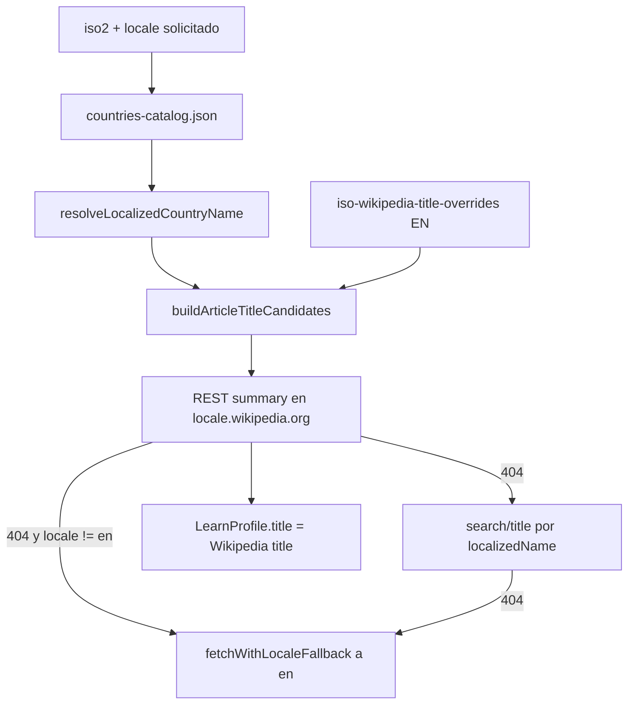
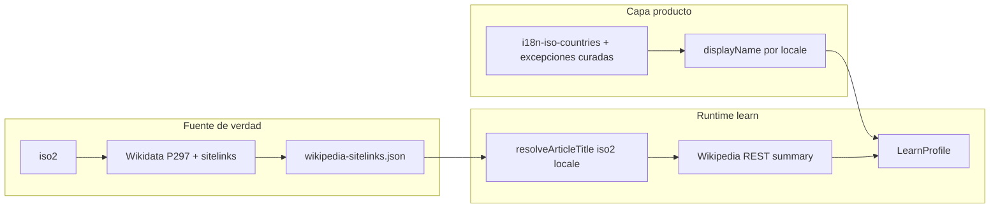

# PRD — Resolución de idioma: nombres de país y artículos de Wikipedia

**Estado:** implementado (2026-05-19)  
**Fecha:** 2026-05-19  
**Idioma del documento:** español  
**Audiencia:** desarrollo, QA, producto  

**Referencias:**

- Modo aprendizaje (comportamiento base): [`../01-prd-modo-aprendizaje.md`](../01-prd-modo-aprendizaje.md)
- Registro de bugs relacionados: [`turquia-bug.md`](./turquia-bug.md) (BUG-LEARN-01)
- Código actual: `server/learn/`, `src/data/country-localization.ts`, `src/data/countries-catalog.json`

**Incidencias que motivan este documento:**

| ID | País | `locale` | Síntoma |
|----|------|----------|---------|
| BUG-LEARN-01 | TR | `es` | Artículo del **pavo**; nombre «Turkey» |
| BUG-LEARN-02 | CD | `es` | Ficha en **inglés** (fallback) aunque existe artículo en `es.wikipedia.org` |
| BUG-LEARN-03 | FK | `en` | **404** / no encuentra artículo; en `es` sí funciona |

---

## 1. Resumen

El modo aprendizaje resuelve hoy el artículo de Wikipedia a partir de **nombres derivados del catálogo**, **overrides en inglés** y **búsqueda por título**. Eso produce fallos sistemáticos cuando el nombre localizado no coincide con el título real del wiki, cuando los overrides son válidos solo en `en.wikipedia.org`, o cuando el catálogo usa nombres políticos/abreviados que no existen en Wikipedia.

**Propuesta:** tratar **`iso2` como única clave canónica** y separar tres capas:

1. **Nombre para mostrar** — capa de producto/i18n (no depende del título del artículo).
2. **Título de artículo por idioma** — mapa estable `iso2 × locale → título Wikipedia`, generado desde **Wikidata sitelinks** (fuente de verdad para enlaces interwiki).
3. **Contenido** — REST Summary API en el dominio `{locale}.wikipedia.org`, con fallback controlado solo cuando no hay sitelink ni búsqueda fiable.

Así se corrigen TR, CD y FK — y el resto de países con el mismo patrón — sin mantener overrides país por país.

---

## 2. Problema de producto

**Como** usuario que eligió español o inglés en Home,  
**quiero** que el nombre del país en la ficha y el texto/enlace de Wikipedia correspondan a **ese idioma** y al **estado/país correcto**,  
**para** confiar en el modo aprendizaje sin ver artículos equivocados ni contenido en otro idioma sin aviso claro.

Hoy el PRD v1 decidió: *«Nombre en ficha: título devuelto por Wikipedia»* ([`01-prd-modo-aprendizaje.md`](../01-prd-modo-aprendizaje.md) §2). Esa decisión amplifica los errores de resolución de artículo: si Wikipedia devuelve «Turkey» o un extracto en inglés, la UI lo muestra tal cual.

---

## 3. Análisis de causa raíz (estado actual)

### 3.1 Pipeline actual (simplificado)



### 3.2 Hallazgos verificados (2026-05-19)

| Pieza | Comportamiento | Efecto |
|-------|----------------|--------|
| `resolveLocalizedCountryName` | Si `locale === 'en'` → `country.name` del **catálogo**; si `es` → `i18n-iso-countries` | FK en inglés usa «Malvinas Argentinas (Falkland Islands)» del catálogo → **404** en `en.wikipedia.org`. No usa «Falkland Islands (Malvinas)» de i18n. |
| `iso-wikipedia-title-overrides.ts` | Títulos **solo en inglés**, candidato **prioritario** | TR en `es`: «Turkey» abre artículo del **pavo**. CD en `es`: primer candidato 404; nombre i18n «Congo (República Democrática del)» también 404; acaba **fallback a `en`**. |
| `buildArticleTitleCandidates` | Orden: override → `localizedName` | En wikis no inglesas, el override anglosajón gana antes que el nombre localizado correcto. |
| `fetchWithLocaleFallback` | Si falla `es`, repite pipeline en `en` | CD en `es` termina con extracto en inglés; `profile.locale === 'en'` (badge parcial en UI). |
| `LearnProfile.title` | Siempre título del summary Wikipedia | Mezcla **identificador de artículo** con **nombre de producto**; nombres raros o en idioma incorrecto en modal y mapa. |
| Catálogo `name` | Mezcla inglés estándar, abreviaturas y nombres políticos | «DR Congo», «Malvinas Argentinas (Falkland Islands)» no son títulos Wikipedia en inglés. |

### 3.3 Pruebas directas a la REST API de Wikipedia

| Wiki | Título probado | HTTP | Título devuelto |
|------|----------------|------|-----------------|
| `es` | `Turkey` (override TR) | 200 | Turkey (artículo del **pavo**) |
| `es` | `Turquía` | 200 | Turquía (país) |
| `es` | `Democratic_Republic_of_the_Congo` (override CD) | 404 | — |
| `es` | `República Democrática del Congo` | 200 | República Democrática del Congo |
| `en` | `Malvinas Argentinas (Falkland Islands)` (catálogo) | 404 | — |
| `en` | `Falkland Islands (Malvinas)` (i18n) | 200 | Falkland Islands |

### 3.4 Wikidata como comprobación de «fuente de verdad»

Para los mismos países, sitelinks de Wikidata (propiedad **P297** = ISO 3166-1 alpha-2):

| ISO2 | QID | `enwiki` | `eswiki` |
|------|-----|----------|----------|
| CD | Q974 | Democratic Republic of the Congo | República Democrática del Congo |
| FK | Q9648 | Falkland Islands | Islas Malvinas (territorio británico de ultramar) |
| TR | Q43 | Turkey | Turquía |

Los títulos de sitelink coinciden con los artículos que funcionan en la REST API. **Un mapa `iso2 + locale → título` derivado de Wikidata elimina la ambigüedad** sin overrides manuales por país (salvo excepciones documentadas).

---

## 4. Decisiones de producto propuestas

| Tema | Decisión propuesta |
|------|-------------------|
| Clave canónica | **`iso2`** en catálogo, API, caché y mapa Wikidata |
| Nombre visible en ficha / juego | **`displayName`** desde capa i18n unificada (`en` y `es` vía `i18n-iso-countries` o mapa curado), **no** el título crudo de Wikipedia |
| Título de artículo | **`wikipediaArticleTitle`** interno; opcional en API para depuración; no sustituye `displayName` en UI |
| Resolución de artículo | **1)** sitelink del mapa → **2)** búsqueda `search/title` con `displayName` → **3)** fallback a sitelink `en` + badge «contenido en inglés» |
| Overrides manuales | **Deprecar** `iso-wikipedia-title-overrides.ts` salvo lista corta de **excepciones** (territorios sin P297, disputas); cada excepción con `locale` |
| Catálogo `name` | Solo identificador legado en inglés para datos de juego; **dejar de usarlo** como nombre localizado en backend learn |
| Contenido en otro idioma | Mantener badge cuando `contentLocale !== requestedLocale` |
| Caché servidor | Clave `(iso2, locale)` sin cambios; valor incluye `displayName` + contenido wiki |
| Nuevas dependencias npm | **Evitar** en runtime; mapa generado en **build/check** con `fetch` a Wikidata (script en repo) |

---

## 5. Arquitectura objetivo



### 5.1 Artefacto: `wikipedia-sitelinks.json` (o `.ts` generado)

- **Ubicación sugerida:** `shared/wikipedia-sitelinks.ts` o `src/data/wikipedia-sitelinks.json` (importable desde `server/` vía `shared/`).
- **Forma:**

```json
{
  "CD": {
    "wikidataId": "Q974",
    "titles": {
      "en": "Democratic Republic of the Congo",
      "es": "República Democrática del Congo"
    }
  }
}
```

- **Generación:** script `scripts/build-wikipedia-sitelinks.mjs` (nombre orientativo):
  - Entrada: lista `iso2` de `countries-catalog.json`.
  - Consulta Wikidata (SPARQL o `wbgetentities` por lotes) → sitelinks `enwiki`, `eswiki`.
  - Falla el build si falta sitelink para un `iso2` del catálogo en `en` o `es` (configurable: warn vs error).
  - Integrar en `npm run check:dataset-version` o script hermano `check:wikipedia-sitelinks`.

- **Ventajas:** cero llamadas Wikidata en producción; revisionable en PR; reproducible; alineado con política de no instalar paquetes sin aprobación.

### 5.2 Resolver de título (`server/learn/resolve-wikipedia-article-title.ts`)

Pseudológica:

1. `title = sitelinks[iso2].titles[locale]` → si existe, `fetchSummary(locale, title)`.
2. Si 404: `search/title(locale, displayName)`.
3. Si sigue 404 y `locale !== 'en'`: `fetchSummary('en', sitelinks[iso2].titles.en)` y marcar `contentLocale: 'en'`.
4. Si todo falla: `WIKIPEDIA_PAGE_NOT_FOUND`.

**No** mezclar overrides globales en inglés como primer candidato en wikis españolas.

### 5.3 Nombres para mostrar (`displayName`)

Unificar backend y frontend:

- **Backend:** `resolveLocalizedCountryName` debe usar **la misma regla** que `getLocalizedCountryName` en `src/data/country-localization.ts`:
  - `en` → `countries.getName(iso2, 'en') ?? country.name`
  - `es` → `countries.getName(iso2, 'es') ?? country.name`
- **Excepciones curadas** (opcional v1): archivo `country-display-overrides.json` por `iso2` + `locale` solo donde i18n-iso-countries sea inaceptable para producto (p. ej. FK: mostrar «Islas Malvinas» en ES aunque el artículo tenga título largo).

El modal debe mostrar **`profile.displayName`**, no `profile.title` del artículo.

### 5.4 Cambios en DTO `LearnProfile`

Propuesta de campos (versión API **v1.1** o convivencia con campos nuevos):

| Campo | Tipo | Uso |
|-------|------|-----|
| `iso2` | string | Sin cambio |
| `locale` | `AppLocale` | Locale **solicitado** por el cliente |
| `contentLocale` | `AppLocale` | Locale real del extracto (puede ser `en` tras fallback) |
| `displayName` | string | Nombre de país para UI |
| `summary` | string | Extracto Wikipedia |
| `flagUrl` | string \| null | Sin cambio |
| `wikipediaUrl` | string | Sin cambio |
| `source` | `'wikipedia'` | Sin cambio |
| `title` | string | **Deprecar** en favor de `displayName`; mantener temporalmente = `displayName` para no romper clientes |

Cliente (`CountryLearnModal`, tests): migrar a `displayName`.

### 5.5 Catálogo `countries-catalog.json`

- Normalizar `name` a **inglés estándar** alineado con i18n/Wikipedia donde sea posible (FK, CD, etc.).
- El catálogo **no** alimenta la resolución Wikipedia en learn; solo continúa en quiz, continente, capital.

---

## 6. Plan de implementación sugerido

### Fase A — Correcciones de bajo riesgo (1 PR)

| Tarea | Detalle |
|-------|---------|
| A.1 | Unificar `resolveLocalizedCountryName` con `getLocalizedCountryName` (i18n también para `en`) |
| A.2 | Invertir orden en candidatos: **nombre localizado / sitelink antes que override**; o eliminar overrides ya cubiertos por sitelinks |
| A.3 | Añadir `displayName` al DTO y usarlo en modal |
| A.4 | Tests unitarios: TR/es → Turquía; FK/en → 200; CD/es → extracto en español sin fallback |

**Limitación:** sin mapa Wikidata, CD/es puede seguir fallando si i18n devuelve «Congo (República Democrática del)» y la búsqueda no corrige. **Fase B es necesaria para cerrar el alcance completo.**

### Fase B — Mapa Wikidata (PR principal)

| Tarea | Detalle |
|-------|---------|
| B.1 | Script de generación + artefacto versionado |
| B.2 | `resolve-wikipedia-article-title` consumiendo el mapa |
| B.3 | Eliminar o reducir `iso-wikipedia-title-overrides.ts` |
| B.4 | Hook en CI: regenerar o verificar hash del JSON en PR que toque catálogo |
| B.5 | Ampliar tests de integración con fixtures por CD/FK/TR |

### Fase C — Catálogo y deuda (opcional mismo sprint)

| Tarea | Detalle |
|-------|---------|
| C.1 | Normalizar nombres en `countries-catalog.json` |
| C.2 | Documentar excepciones (territorios sin ISO, artículos desambiguados) |
| C.3 | Cerrar BUG-LEARN-01/02/03 en `turquia-bug.md` / nuevo registro |

---

## 7. Criterios de aceptación

### 7.1 Por bug reportado

- **TR + `locale=es`:** `displayName` = Turquía; enlace a `es.wikipedia.org/wiki/Turquía`; extracto del **estado**, no del pavo.
- **CD + `locale=es`:** extracto en **español**; `contentLocale=es`; sin depender del fallback a inglés en condiciones normales de red.
- **FK + `locale=en`:** 200; artículo `Falkland Islands` en `en.wikipedia.org`; `displayName` coherente en inglés.

### 7.2 Regresión general

- Muestra de **≥ 20 países** por continente: título de ficha = `displayName` en el locale pedido; URL de Wikipedia en dominio `{locale}.wikipedia.org` cuando exista sitelink.
- Países con override histórico (GB, US, KR, …): siguen resolviendo en `en` y `es`.
- Caché `(iso2, locale)` invalidada o versionada si cambia el esquema del DTO.
- Quiz / pool de preguntas: sin regresión en nombres (misma función de localización).

### 7.3 Observabilidad (servidor)

- Log estructurado (sin PII): `iso2`, `requestedLocale`, `contentLocale`, `articleTitle`, `resolverStep` (`sitelink` \| `search` \| `fallback_en`) — solo en errores o sampling, no en cada request en producción.

---

## 8. Casos límite

| Escenario | Comportamiento esperado |
|-----------|-------------------------|
| Sitelink `es` ausente en Wikidata pero `en` existe | Summary en `en` + badge; `displayName` en español |
| Título `es` muy largo (FK) | Summary funciona con título exacto del sitelink; `displayName` puede ser corto vía override de producto |
| Desambiguación (p. ej. Georgia país vs estado US) | Sitelink de **entidad soberana** P297; no búsqueda libre por nombre ambiguo |
| Wikidata sin ítem para `iso2` del catálogo | Build falla o entrada en `manual-sitelinks.json` documentada |
| Rate limit Wikipedia / Wikidata en script | Reintentos con backoff en generación; artefacto commiteado evita runtime |
| Cambio de idioma en UI con modal abierto | Sin cambio respecto a PRD v1 (cerrar modal o bloquear selector) |

---

## 9. Riesgos y mitigaciones

| Riesgo | Mitigación |
|--------|------------|
| Títulos Wikidata desactualizados | Regenerar mapa en releases; diff en PR |
| Artículo con extracto corto o sin bandera | Igual que hoy; no bloquea |
| Posición política en nombres (FK, TW, …) | `displayName` curado por producto; artículo = sitelink oficial del wiki en ese idioma |
| Tamaño del JSON (~200 países × 2 idiomas) | Aceptable (&lt; 100 KB); tree-shake en server |
| Romper clientes que lean `title` | Período de deprecación: `title === displayName` |

---

## 10. Fuera de alcance

- Más de dos locales (`fr`, `pt`, …) sin ampliar `AppLocale` y el mapa de sitelinks.
- Sincronización automática en runtime con Wikidata (solo build/CI).
- Editar contenido de Wikipedia o Gemini en esta iteración.
- Renombrar países en el mapa TopoJSON / disputas territoriales más allá de `displayName`.

---

## 11. Referencias técnicas

| Archivo | Rol actual |
|---------|------------|
| `server/learn/resolve-localized-country-name.ts` | Nombre para búsqueda; asimetría `en` / `es` |
| `server/learn/iso-wikipedia-title-overrides.ts` | Overrides EN prioritarios — **principal deuda** |
| `server/learn/resolve-article-title.ts` | Orden de candidatos |
| `server/learn/wikipedia-client.ts` | Summary + search |
| `server/learn/get-country-learn-profile.ts` | Fallback `es` → `en` |
| `src/data/country-localization.ts` | Patrón deseado para nombres en frontend |
| `src/features/learn/CountryLearnModal.tsx` | Muestra `profile.title` hoy |

**APIs externas:**

- Wikipedia REST: `https://{locale}.wikipedia.org/api/rest_v1/page/summary/{title}`
- Wikipedia search: `https://{locale}.wikipedia.org/w/rest.php/v1/search/title`
- Wikidata: `wbgetentities` / SPARQL con `wdt:P297`

---

## 12. Siguiente paso

1. **Aprobación producto** de separar `displayName` vs título de artículo y del artefacto Wikidata en repo.  
2. Priorizar **Fase B** si se exige solución sistémica en un solo sprint; **Fase A** solo como parche temporal.  
3. Tras aprobación: crear tareas de implementación y cerrar BUG-LEARN-01/02/03 con enlaces a este PRD.
