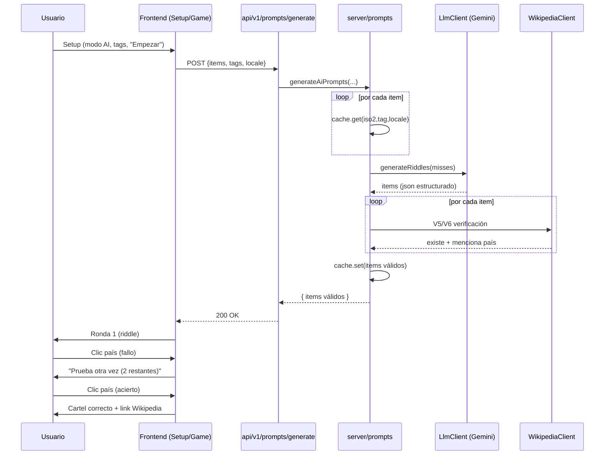

# PRD — Modo AI trivia (preguntas redactadas por LLM + tags temáticos)

> **Nota (2026-05-28):** las decisiones de **UX de intentos y feedback en modo AI** (gating del link Wikipedia, highlight persistente con nombres de país, anti-cheat pausado entre rondas, loading ilustrado, resumen final en resultados; §2 filas *Cartel con link Wikipedia* y *Anti-cheat con AI*, §4.5 RF-D05, §4.8 RF-F40..RF-F47, §3 US-07/US-08) fueron **extendidas** por [`../../modo-ai-trivia-ux-feedback/01-prd-ux-feedback-modo-ai.md`](../../modo-ai-trivia-ux-feedback/01-prd-ux-feedback-modo-ai.md). El resto de este PRD sigue siendo la fuente de verdad del modo AI trivia base.

> **Nota (2026-05-23):** las decisiones de **persistencia y caché** (§2 filas *Persistencia* y *Caché servidor*; §5.3 RNF-E06; §6.1 Fase 2 opcional Edge/KV; §8.1 *DB / persistencia*) fueron **sustituidas** por la iteración Convex. Ver [`../riddle-storage-convex/00-decision-persistencia-riddles-convex.md`](../riddle-storage-convex/00-decision-persistencia-riddles-convex.md) y [`../riddle-storage-convex/01-prd-riddle-storage-convex.md`](../riddle-storage-convex/01-prd-riddle-storage-convex.md). El resto de este PRD (approach B, validaciones V1–V8, UI, scoring, intentos) sigue siendo la fuente de verdad del modo AI trivia.

**Estado:** aprobado para descomposición en plan/tasks
**Fecha:** 2026-05-20
**Idioma del documento:** español
**Audiencia:** desarrollo (backend y frontend), QA, planificación de tareas

**Referencias obligadas:**

- Decisión de approach IA + data retrieval: [`./00-decision-approach-ai-y-data-retrieval.md`](./00-decision-approach-ai-y-data-retrieval.md) — approach B (prompt + validación server-side), §3, §4, §5, §6, §7
- Resumen de decisiones backend: [`../00-decision-resumen-planificacion-backend.md`](../00-decision-resumen-planificacion-backend.md) — §3, §7 (arquitectura modular), §10 (orden)
- PRD del modo aprendizaje (patrón a replicar para backend + caché Wikipedia): [`../modo-aprendizaje/01-prd-modo-aprendizaje.md`](../modo-aprendizaje/01-prd-modo-aprendizaje.md)
- Reglas del repo: `.cursor/rules/core.mdc`, `.cursor/rules/privacy.mdc`, `.cursor/rules/dependency-security.mdc`, `.cursor/rules/frontend-api-integration.mdc`

---

## 1. Resumen

**Modo AI trivia** es una **variante del quiz existente** en la que el `prompt` de cada ronda lo redacta un LLM en lugar de la plantilla fija (`country` / `capital`). El motor de juego (pool de países, turnos, mapa, scoring) **se mantiene**; lo que cambia es:

1. **Setup:** una tercera opción `ai` junto a `country` y `capital`, con multi-select de **tags temáticos** y selección del idioma (`locale`).
2. **Mecánica de respuesta:** en modo AI el jugador activo tiene **hasta 3 intentos** para acertar el país objetivo (constante `MAX_AI_ATTEMPTS = 3`, futura configurable). Score escalonado.
3. **Cartel de cierre de ronda:** muestra el enlace a la **fuente Wikipedia** declarada por el LLM (visible solo cuando la ronda se cierra: acierto en cualquier intento o agotados los 3).

Esta iteración **construye primero el backend completo** y, después, integra el frontend. El backend implementa el approach B vigente: prompt blindado + salida JSON estructurada + validaciones V1–V8 + verificación contra Wikipedia + caché + fallback. El proveedor LLM concreto es **Gemini Flash** en v1, detrás del adaptador `LlmClient` (intercambiable, ver §3 de la decisión de approach).

El catálogo de tags v1 vive en un **artefacto aislado** (`shared/ai-trivia-tag-dictionary.json`) para añadir/quitar tags sin tocar código.

---

## 2. Decisiones de producto (cerradas)

| Tema | Decisión |
|------|----------|
| Modo en `QuestionMode` | Añadir tercer valor: `'country' \| 'capital' \| 'ai'` |
| Catálogo de tags v1 (en `shared/ai-trivia-tag-dictionary.json`) | `historia`, `politica`, `geografia`, `flora-y-fauna`, `cultura-general`, `musica`, `literatura`, `cine`, `deportes` |
| `politica` | Incluido en v1, **restringido por prompt** a hechos históricos verificables en Wikipedia (sin actualidad ni temas polémicos) |
| Opción UI `todas` | Pseudo-tag de UI mutuamente excluyente con el resto. Al seleccionar `todas` se des-seleccionan los demás y viceversa. **No existe en el JSON del catálogo.** Se transmite al backend como `tags: []` (array vacío = "cualquier tag del catálogo") |
| Selección random del tag | **Por ronda**, en el servidor. Cada `iso2` del batch recibe un tag aleatorio del subconjunto enviado (o del catálogo completo si `tags: []`) |
| Intentos por ronda | `MAX_AI_ATTEMPTS = 3` (constante exportada en `server/` y `src/`); **solo aplica a modo AI**. Modos `country`/`capital` siguen con 1 intento (sin regresión) |
| Multiplayer + intentos | El jugador activo **mantiene el turno** hasta acertar o agotar los 3 intentos de su ronda |
| Mismo país en intentos | Se permite re-clickear un país ya intentado; cada clic consume un intento |
| Scoring escalonado (solo AI) | 1.º intento correcto: **+1**; 2.º: **+0.5**; 3.º: **+0.25**; fallo definitivo: **0**. `wrongAnswers` aumenta solo en fallo definitivo |
| Cartel con link Wikipedia | Visible **al cerrar la ronda**, nunca durante "prueba otra vez". Aplica tanto a acierto (cualquier intento) como a fallo definitivo |
| Anti-cheat con AI | Modo AI **fuerza `antiCheatMode: 'strict'`** en Setup (radio `normal` deshabilitado con tooltip explicativo) |
| Estrategia de generación | **Híbrida:** precarga las primeras `N = 3` rondas en batch antes de empezar; resto en background mientras el jugador resuelve las cargadas |
| Fallo total del batch | Bloquear inicio de partida, mostrar error con **Reintentar** + opción **Volver a Setup** (para cambiar a modo estándar) |
| Proveedor LLM v1 | Gemini Flash vía `LlmClient` (`fetch` nativo preferido sobre SDK; ver `dependency-security.mdc`) |
| Caché servidor | Clave `aiTrivia:iso2:tag:locale`, TTL 30 días, mismo motor que `learn/` |
| Locales soportados | `es`, `en` (alineados con `AppLocale`) |
| Persistencia | No hay DB. Caché en memoria (compartida con `learn/`) |

---

## 3. User stories

### US-01 — Elegir modo AI en Setup

**Como** jugador,
**quiero** elegir un nuevo modo `AI` en Setup junto a `país` y `capital`,
**para** que las preguntas del quiz sean redactadas por una IA con estilo de adivinanza.

### US-02 — Seleccionar tags temáticos

**Como** jugador en modo AI,
**quiero** marcar uno o varios tags (`Historia`, `Política`, `Geografía`, `Flora y Fauna`, `Cultura general`, `Música`, `Literatura`, `Cine`, `Deportes`) o elegir `Todas`,
**para** orientar el estilo de las preguntas hacia los temas que me interesan.

### US-03 — `Todas` mutuamente excluyente

**Como** jugador,
**quiero** que al marcar `Todas` se desmarquen el resto de tags (y al revés),
**para** entender claramente que `Todas` significa "cualquier tema del catálogo".

### US-04 — Precarga de preguntas con loading visible

**Como** jugador que pulsa "Empezar",
**quiero** ver un estado de carga claro mientras se generan las primeras preguntas IA,
**para** saber que el sistema está trabajando y que no es un bug.

### US-05 — Jugar con riddle en lugar de plantilla

**Como** jugador en una ronda AI,
**quiero** leer una adivinanza redactada por la IA (sin que mencione el nombre del país, gentilicio, capital ni moneda),
**para** que el reto sea más interesante que la plantilla fija.

### US-06 — Hasta 3 intentos por ronda

**Como** jugador,
**quiero** poder fallar hasta 2 veces antes de "perder" la ronda,
**para** tener más oportunidades de razonar la respuesta.

### US-07 — Feedback claro entre intentos

**Como** jugador que falla un clic,
**quiero** ver un mensaje "No, prueba otra vez" con el número de intentos restantes,
**para** saber dónde estoy parado sin perder el contexto de la pregunta.

### US-08 — Cartel final con fuente Wikipedia

**Como** jugador,
**quiero** ver al cerrar la ronda (acierto o 3 fallos) el enlace al artículo de Wikipedia que usó la IA,
**para** poder verificar/ampliar la información de la pregunta.

### US-09 — No revelar el link hasta cerrar ronda

**Como** diseñador del juego,
**quiero** que el link Wikipedia **no** aparezca durante "prueba otra vez",
**para** que el jugador no use el link como pista durante los intentos.

### US-10 — Fallback ante error de IA

**Como** jugador,
**quiero** un mensaje claro y la opción de reintentar o cambiar a modo estándar si la IA no responde,
**para** poder seguir jugando aunque el LLM esté caído.

### US-11 — Antiprivacidad y seguridad

**Como** dueño del proyecto,
**quiero** que la API key del proveedor LLM nunca salga del servidor y que ningún `riddle` con PII se logue,
**para** cumplir `privacy.mdc` y mantener el coste en $0.

### US-12 — Desarrollador / mantenedor

**Como** desarrollador,
**quiero** un endpoint versionado (`POST /v1/prompts/generate`) consumido por un cliente HTTP en `src/services/`, con `LlmClient` mockeable en tests y artefactos de validación commiteados en `shared/`,
**para** poder cambiar de proveedor LLM o ajustar el catálogo de tags sin reescribir backend ni frontend.

---

## 4. Requisitos funcionales y criterios de aceptación

**Convenciones de ID:**

- `RF-B##` — backend (`server/prompts/`, `api/v1/prompts/`, artefactos `shared/`)
- `RF-D##` — dominio compartido (`src/types`, `src/services` para mecánica de juego que cambia con AI)
- `RF-F##` — frontend (Setup, GameShell, cliente HTTP, i18n)
- `RF-I##` — integración (front ↔ back)

---

### 4.1 Backend — Catálogo y artefactos compartidos

| ID | Requisito | Criterios de aceptación |
|----|-----------|-------------------------|
| RF-B01 | **Artefacto de tags** | Existe `shared/ai-trivia-tag-dictionary.json` commiteado, con la lista cerrada del catálogo v1: `historia`, `politica`, `geografia`, `flora-y-fauna`, `cultura-general`, `musica`, `literatura`, `cine`, `deportes`. Cada entrada incluye `id`, `labels.es`, `labels.en`, `promptHint.es`, `promptHint.en` (instrucción extra para el prompt; en `politica` debe limitar a hechos históricos verificables). **No incluye** `todas`. |
| RF-B02 | **Schema de tags validable** | `shared/ai-trivia-tags-schema.ts` exporta tipo `AiTriviaTagId` (union derivado del JSON) y `AI_TRIVIA_TAGS` (lectura del JSON). Importable desde `server/` y `src/` sin React. |
| RF-B03 | **Artefacto de palabras prohibidas** | `shared/country-forbidden-terms.json` existe y se genera por `scripts/build-country-forbidden-terms.mjs` (input: Wikidata + catálogo + sitelinks). Por `iso2` contiene: nombre canónico (es/en), nombres alternativos, gentilicio masc/fem (es), capital, top 5 ciudades, moneda. Tests verifican que **todos los `iso2` del catálogo** tienen entrada y que no hay strings vacíos. |
| RF-B04 | **Generadores idempotentes** | Re-ejecutar los scripts produce el mismo JSON (orden estable, sin diff espurio). |
| RF-B05 | **Sin secretos en artefactos** | Los JSON commiteados solo contienen datos públicos. No incluyen API keys ni endpoints sensibles. |

### 4.2 Backend — Adaptador LLM (`LlmClient`)

| ID | Requisito | Criterios de aceptación |
|----|-----------|-------------------------|
| RF-B10 | **Interfaz estable** | `server/prompts/llm-client.ts` exporta interfaz `LlmClient` con método `generateRiddles(input: LlmGenerateInput): Promise<LlmGenerateOutput>`. Shape de I/O independiente del proveedor (ver §6.2). |
| RF-B11 | **Implementación Gemini Flash** | `server/prompts/llm-client-gemini.ts` implementa `LlmClient` usando `fetch` nativo contra la REST API oficial de Gemini. Modelo: Gemini Flash en tier gratuito. **No** se instala SDK del proveedor sin seguir `dependency-security.mdc`. |
| RF-B12 | **Configuración por env** | `GEMINI_API_KEY` se lee solo desde `process.env` en `server/`. Si está ausente, el factory devuelve un `LlmClient` que emite error tipado `LLM_UNAVAILABLE` (no rompe el bootstrap). |
| RF-B13 | **Salida estructurada JSON** | El adaptador pide al modelo respuesta JSON con shape de §4 del approach B (`iso2`, `tag`, `locale`, `riddle`, `expected_iso2`, `justification`, `claimed_source_title`, `claimed_source_locale`, `difficulty`, `valid`) o `{ iso2, tag, error: "insufficient_grounding" }`. |
| RF-B14 | **Timeout y reintentos de red** | Cada llamada al proveedor tiene timeout (≤ 15 s) y máximo 1 reintento de red (no confundir con re-roll de validación). Falla → `LLM_UNAVAILABLE`. |
| RF-B15 | **Sin logs con `riddle` completas** | En producción, logs solo registran `iso2`, `tag`, `locale`, `latency_ms`, `tokens_in/out` y `code` de validación fallida. **Nunca** el texto del riddle ni la justification. |
| RF-B16 | **Mock-friendly** | Tests `Vitest` usan un `LlmClient` fake (`server/prompts/llm-client-fake.ts`) que devuelve respuestas controladas; ningún test toca red real ni el proveedor. |

### 4.3 Backend — Validador (V1–V8)

| ID | Requisito | Criterios de aceptación |
|----|-----------|-------------------------|
| RF-B20 | **V1 ISO eco** | Validador rechaza ítem si `response.expected_iso2 !== request.iso2`. |
| RF-B21 | **V2 palabras prohibidas** | Validador rechaza si `riddle` contiene (case-insensitive, unicode-NFC) cualquier entrada del array correspondiente en `shared/country-forbidden-terms.json` (locales `es` y `en`). |
| RF-B22 | **V3 longitud** | `riddle.length` entre 20 y 280 caracteres. |
| RF-B23 | **V4 idioma** | Heurística de idioma sobre `riddle` (regex + stopwords) coincide con `request.locale`. |
| RF-B24 | **V5 artículo Wikipedia existe** | Verificar `claimed_source_title` contra `{claimed_source_locale}.wikipedia.org` via `WikipediaClient` (módulo ya existente del modo aprendizaje). El artículo no debe estar marcado `missing`. |
| RF-B25 | **V6 artículo menciona el país** | El artículo declarado contiene un link o categoría que referencia el título canónico del país en ese locale. Resultado cacheado por `(claimedTitle, locale, iso2)` para reutilizar en re-rolls. |
| RF-B26 | **V7 self-check** | Si el modelo devuelve `valid: false`, se rechaza. |
| RF-B27 | **V8 enum difficulty** | `difficulty ∈ {easy, medium, hard}` o se rechaza. |
| RF-B28 | **Re-roll acotado** | Si falla cualquier validación, se reintenta hasta `MAX_REROLLS = 2` por ítem con prompt reforzado (incluyendo en el contexto la regla violada). Tras agotar re-rolls, el ítem se descarta y se omite del response. |
| RF-B29 | **Logging por regla** | Cada validación fallida incrementa contador `ai_trivia.validation_failures{rule}` (V1..V8) sin loguear contenido. |

### 4.4 Backend — Endpoint y orquestación

| ID | Requisito | Criterios de aceptación |
|----|-----------|-------------------------|
| RF-B40 | **Ruta** | `POST /api/v1/prompts/generate` (handler delgado en `api/v1/prompts/generate.ts`). |
| RF-B41 | **Request body** | JSON `{ items: { iso2: string }[], tags: string[], locale: 'es' \| 'en', seed?: number }`. `tags: []` significa "cualquier tag del catálogo". Tamaño máximo de `items` ≤ 50 (validación). |
| RF-B42 | **Selección random del tag** | Para cada `item`, el servidor elige un tag al azar (uniforme): si `tags.length === 0` → del catálogo completo (`shared/ai-trivia-tag-dictionary.json`); si no → del subconjunto recibido. Si `seed` está presente, el RNG es determinista (útil en tests). |
| RF-B43 | **Cache-first** | Antes de llamar al LLM, por cada `(iso2, tag, locale)` se consulta caché. Hits se devuelven sin llamar al proveedor. |
| RF-B44 | **Batch al LLM** | Misses se agrupan en **una** llamada batch al `LlmClient.generateRiddles`. La respuesta se valida ítem por ítem (RF-B20..28). |
| RF-B45 | **Cacheo post-validación** | Items que pasan validación se guardan en caché con clave `aiTrivia:iso2:tag:locale`, TTL 30 días. Items inválidos o `insufficient_grounding` **no** se cachean. |
| RF-B46 | **Response body** | JSON `{ items: AiPromptItem[] }` donde `AiPromptItem = { iso2: string, tag: string, riddle: string, difficulty: 'easy'\|'medium'\|'hard', source: { title: string, locale: 'es'\|'en', url: string } }`. La `url` se compone server-side como `https://{source.locale}.wikipedia.org/wiki/{encodeURIComponent(source.title)}`. |
| RF-B47 | **Items omitidos** | Si tras re-rolls un ítem sigue inválido, **no aparece** en `response.items`. El frontend decide qué hacer (ver RF-F30, RF-I04). El response NO incluye un campo de "items fallidos"; la diferencia se infiere comparando con la lista de entrada. |
| RF-B48 | **Códigos de error estables** | `INVALID_LOCALE`, `INVALID_TAG` (tag enviado no está en catálogo), `INVALID_REQUEST` (body malformado, items > 50, iso2 desconocido), `LLM_UNAVAILABLE` (proveedor caído tras reintentos), `LLM_RATE_LIMITED`, `INTERNAL_ERROR`. Shape: `{ error: { code: string, message: string } }`. Status HTTP: `400` para `INVALID_*`, `429` para `LLM_RATE_LIMITED`, `503` para `LLM_UNAVAILABLE`, `500` para `INTERNAL_ERROR`. |
| RF-B49 | **CORS** | Configurado vía env `ALLOWED_ORIGINS`, mismo patrón que `learn/`. |
| RF-B50 | **Rate limiting (fase 2)** | Mismo middleware/adaptador que `learn/` ya en repo; key compuesta `(origin, ip, path)`. Documentado como reutilizable, no se reimplementa. |
| RF-B51 | **Handler delgado** | El archivo en `api/` solo: parsea body, valida shape mínimo, llama `server/prompts/generate-ai-prompts.ts`, mapea resultado a HTTP. **Cero lógica de negocio**. |

### 4.5 Dominio compartido — Cambios al motor de juego

| ID | Requisito | Criterios de aceptación |
|----|-----------|-------------------------|
| RF-D01 | **`QuestionMode` admite `ai`** | `src/types/domain.ts`: `export type QuestionMode = 'country' \| 'capital' \| 'ai'`. Tests existentes siguen pasando. |
| RF-D02 | **`GameConfig.tags` opcional** | Nuevo campo `readonly tags?: readonly AiTriviaTagId[]` en `GameConfig`. Presente solo si `questionMode === 'ai'`; ausente o vacío significa "todas". |
| RF-D03 | **Validación de config AI** | `validate-config.ts` rechaza con error tipado si `questionMode === 'ai'` y `antiCheatMode !== 'strict'`. También rechaza tags fuera del catálogo. |
| RF-D04 | **Constante de intentos** | `src/services/ai-trivia-rules.ts` exporta `MAX_AI_ATTEMPTS = 3` y helper `getAiScoreForAttempt(attemptNumber: 1 \| 2 \| 3): 1 \| 0.5 \| 0.25`. |
| RF-D05 | **`Round` con intentos** | `Round` añade campo opcional `readonly attempts?: readonly AiAttempt[]` (solo poblado en modo AI), donde `AiAttempt = { playerId: string, selectedCountryCode: IsoCountryCode, isCorrect: boolean, attemptedAtISO: string, scoreDelta: number }`. El campo `guess` existente se sigue poblando con el intento **final** (ganador o tercer fallo) para no romper consumidores actuales. |
| RF-D06 | **`Round.prompt` indistinto** | El campo `prompt` sigue siendo `string`. En modo AI lleva el `riddle`; en `country`/`capital`, la plantilla actual. Sin cambios de tipo. |
| RF-D07 | **`Round.aiSource` opcional** | `Round` añade `readonly aiSource?: { title: string, locale: 'es'\|'en', url: string }`, solo poblado si la ronda nació de un ítem AI válido. |
| RF-D08 | **`submitRoundGuess` en AI** | En modo AI, si el clic NO es correcto y `attempts.length < MAX_AI_ATTEMPTS - 1`: el round NO se cierra (`guess` queda sin asignar), se registra un `attempt` y el turno sigue siendo del mismo jugador. Si el clic es correcto **o** es el tercer fallo: el round se cierra (se asigna `guess` con el resultado final). |
| RF-D09 | **Scoring AI escalonado** | El delta de score se calcula con `getAiScoreForAttempt(attemptNumber)` al **primer acierto**; si se agotan los 3 sin acertar, `scoreDelta = 0` y `wrongAnswers` aumenta en 1. `correctAnswers` solo aumenta si hubo acierto. |
| RF-D10 | **Modos no-AI sin regresión** | Tests existentes de `submitRoundGuess`, `scoring`, `game-result` siguen pasando sin cambios. |
| RF-D11 | **Fin de juego sin cambios** | `advanceToNextRoundOrFinish` funciona igual: avanza si la ronda está cerrada (`guess` presente), tanto en AI como en los otros modos. |

### 4.6 Frontend — Setup (`SetupView`)

| ID | Requisito | Criterios de aceptación |
|----|-----------|-------------------------|
| RF-F01 | **Tercera opción de modo** | `questionModeOptions` incluye `['ai', 'modeAi']`. Las claves i18n nuevas viven en namespace `setup`. |
| RF-F02 | **Visibilidad condicional de tags** | El control de tags solo aparece si `questionMode === 'ai'`. |
| RF-F03 | **Multi-select de tags** | Componente `AiTriviaTagsPicker` (nuevo, en `src/features/setup/`). Render: chips/toggles con labels traducidos desde `shared/ai-trivia-tag-dictionary.json` + chip especial `todas` (label traducido). Roles WAI-ARIA: `group` + `checkbox` por chip. |
| RF-F04 | **`Todas` mutuamente excluyente** | Al activar `todas`, el componente limpia el resto del estado. Al activar cualquier tag concreto, `todas` se desactiva. Estado por defecto al cambiar a modo AI: `todas` activa. |
| RF-F05 | **Estado en `GameConfig`** | El frontend almacena `tags: AiTriviaTagId[]` en `setupDraft`. Si `todas` está activa → `tags: []`. Si hay tags concretos → `tags: [...subset]`. |
| RF-F06 | **Forzar `strict` en AI** | Al cambiar a modo AI, el frontend selecciona automáticamente `antiCheatMode: 'strict'` y deshabilita la opción `normal` con `aria-disabled` + tooltip i18n (`setup.antiCheatLockedByAi`). Al volver a `country`/`capital`, ambos modos se rehabilitan. |
| RF-F07 | **Validación visual** | Si tags concretos están seleccionados pero ninguno (estado inválido transitorio mientras des-marcan), el botón "Empezar" se deshabilita con mensaje i18n. (Reset implícito a `todas` si quedan en 0 puede ser la solución preferida: a decidir en implementación, documentar.) |
| RF-F08 | **Sin regresión `country`/`capital`** | Los flujos existentes funcionan idénticos: misma maquetación, mismos tests e2e pasan. |

### 4.7 Frontend — Inicio de partida (loading híbrido)

| ID | Requisito | Criterios de aceptación |
|----|-----------|-------------------------|
| RF-F20 | **Cliente HTTP** | `src/services/prompts-api-client.ts` exporta `generateAiPrompts(input): Promise<AiPromptsResponse>`. Tipos derivados de `shared/`. Usa `import.meta.env.VITE_API_BASE_URL`. |
| RF-F21 | **Disparo en `startGameWithConfig`** | Si `questionMode === 'ai'`: tras construir el pool con `buildQuestionPool`, llamar `generateAiPrompts({ items, tags, locale })` antes de `beginPlayingSession`. |
| RF-F22 | **Loading visible** | Mientras se resuelve el batch inicial, se renderiza una vista `AiPromptsLoadingView` (puede ser un overlay sobre Setup o una ruta efímera) con copy i18n `ai.loading.preparingQuestions`. |
| RF-F23 | **Estrategia híbrida** | El frontend pide el batch **completo** al servidor (que ya está limitado a ≤ 50 ítems). Una vez que respondan los primeros `PRELOAD_THRESHOLD = 3` ítems válidos, la partida puede iniciarse y el resto se completa en background mientras el jugador resuelve las primeras rondas. **Decisión de implementación:** el endpoint v1 devuelve toda la respuesta junta; el "background" se simula con una promesa pendiente del lado del cliente que el frontend resuelve antes de mostrar la ronda 4. Si en runtime el endpoint se vuelve streaming, esta capa se sustituye sin tocar el motor de juego. |
| RF-F24 | **Pool reducido a items válidos** | El pool con el que arranca `beginPlayingSession` contiene solo ítems que el servidor devolvió como válidos. Si por re-rolls hay menos de los pedidos, se reduce `questionCount` efectivo y se informa al usuario con un toast (`ai.notice.reducedQuestionCount`). |
| RF-F25 | **`prompt` y `aiSource` en cada `Round`** | El mapeo de `AiPromptItem` a `Round` asigna `prompt = riddle` y `aiSource = source`. |

### 4.8 Frontend — Mecánica de 3 intentos durante la partida

| ID | Requisito | Criterios de aceptación |
|----|-----------|-------------------------|
| RF-F40 | **Sin cambio de HUD entre intentos** | El jugador activo, el mapa y el prompt siguen renderizados; el clic en un país consume un intento (RF-D08). |
| RF-F41 | **Feedback intermedio "prueba otra vez"** | Tras un clic erróneo con intentos restantes: aparece `Alert` (i18n `ai.feedback.tryAgain`) con contador `attemptsLeft`. El cartel del prompt sigue visible. |
| RF-F42 | **Cartel de cierre de ronda** | Cuando la ronda se cierra: mostrar el cartel actual (correcto/incorrecto) + **enlace** a `aiSource.url` con texto `aiSource.title`. Atributos obligatorios: `target="_blank"`, `rel="noopener noreferrer"`, `aria-label` traducible. |
| RF-F43 | **Link NO visible durante intentos** | Mientras la ronda esté abierta y con intentos restantes, el frontend no debe renderizar el link Wikipedia ni el `aiSource.title` en ningún lado de la UI. |
| RF-F44 | **Botón "siguiente pregunta" igual que hoy** | El comportamiento de `advance-round-button` no cambia: aparece cuando la ronda está cerrada, su texto/hotkeys son los actuales. |
| RF-F45 | **Resaltado del país objetivo en fallo final** | Al tercer fallo, el mapa resalta el país correcto (mismo `mapFeedback` que hoy) — no hay regresión visual. |
| RF-F46 | **Mapa permanece interactivo durante intentos** | Hasta cerrar ronda, el `WorldMap` acepta clics; el cartel "prueba otra vez" no bloquea el mapa. |
| RF-F47 | **Click en país ya intentado** | Permitido (RF-D08 lo cuenta como nuevo intento). Opcional v1: leve indicador visual de "ya intentado" en el país, no bloqueante. |

### 4.9 Frontend — Errores y fallback

| ID | Requisito | Criterios de aceptación |
|----|-----------|-------------------------|
| RF-F60 | **Fallo total del batch** | Si el endpoint responde error (4xx/5xx) o el batch entero queda vacío de items válidos: mostrar `AiPromptsErrorView` con botones **Reintentar** (re-dispara `generateAiPrompts`) y **Cambiar a modo estándar** (vuelve a Setup con `questionMode: 'country'`). No se inicia partida. |
| RF-F61 | **Reducción parcial** | Si el batch devuelve **algún** ítem válido pero menos que `config.questionCount`, mostrar toast no-bloqueante y continuar con la cantidad disponible. |
| RF-F62 | **Errores mapeados a i18n** | Cliente mapea `error.code` con `translateApiErrorCode` (namespace `errors`). Claves nuevas: `errors.LLM_UNAVAILABLE`, `errors.LLM_RATE_LIMITED`, `errors.INVALID_TAG`, etc. |
| RF-F63 | **Sin filtrado de stack** | Mensajes técnicos (stack traces, status codes brutos) no se muestran al usuario. |

### 4.10 Integración front ↔ back

| ID | Requisito | Criterios de aceptación |
|----|-----------|-------------------------|
| RF-I01 | **Base URL** | `VITE_API_BASE_URL` (documentado en `.env.example` sin secretos). |
| RF-I02 | **Locale alineado** | Cada request envía `locale` derivado de `i18n.language` con fallback `es`. |
| RF-I03 | **Tipos compartidos** | DTOs (`AiPromptItem`, `AiPromptsRequest`, `AiPromptsResponse`, `AiErrorCode`) viven en `shared/ai-trivia-api.ts` e importables tanto desde `server/` como desde `src/`. |
| RF-I04 | **Comportamiento ante items omitidos** | Cliente compara `response.items.length` con `request.items.length` y, si difiere, dispara toast (RF-F61) o vista de error (RF-F60) según umbral. |
| RF-I05 | **Sin API key en bundle** | Build del frontend no contiene `GEMINI_API_KEY` ni ningún literal sensible. Verificado en test de smoke del bundle (`grep` simple en `dist/` durante CI). |

---

## 5. Requisitos no funcionales

### 5.1 Rendimiento

| ID | Requisito |
|----|-----------|
| RNF-P01 | Latencia objetivo del batch inicial (cache miss, `questionCount ≤ 10`, locale `es`): **p95 ≤ 8 s** en `vercel dev` local con red doméstica. |
| RNF-P02 | Cache hit completo: **p95 ≤ 500 ms** (sin tocar LLM ni Wikipedia). |
| RNF-P03 | Una sola llamada batch al `LlmClient` por request; misses se agrupan. |
| RNF-P04 | Re-rolls totales por request acotados: `MAX_REROLLS × items.length`, con cortocircuito si la tasa de fallo supera 50 %. |
| RNF-P05 | Validaciones V5/V6 reutilizan caché de `learn/` (`WikipediaClient`) para no duplicar llamadas a Wikipedia. |
| RNF-P06 | Frontend en partida: latencia entre clic y feedback "prueba otra vez" **&lt; 50 ms** (es puramente local, sin red). |

### 5.2 Seguridad y privacidad

| ID | Requisito |
|----|-----------|
| RNF-S01 | `GEMINI_API_KEY` solo en env del servidor; ausente del bundle (RF-I05). |
| RNF-S02 | Sin PII en logs: ni nombres de jugadores ni `riddle` completas (RF-B15). Permitido: `iso2`, `tag`, `locale`, `code` de validación, latencia, contadores. |
| RNF-S03 | Validación estricta de `iso2` contra catálogo y `tag` contra `AI_TRIVIA_TAGS` (allowlist). Rechazar input fuera de la lista. |
| RNF-S04 | Validar tamaño del body (`items.length ≤ 50`) y de `tags` (`≤ catálogo.length`) para evitar abuso. |
| RNF-S05 | Enlaces externos en cartel de cierre: solo HTTPS y dominios `*.wikipedia.org`. |
| RNF-S06 | Composición de `aiSource.url` server-side con `encodeURIComponent` para evitar XSS reflejado. |
| RNF-S07 | Fase 2: rate limit por origen + IP, mismo middleware que `learn/`. |
| RNF-S08 | No instalar dependencias nuevas sin pasar el flujo de `dependency-security.mdc`. Preferir `fetch` nativo a SDK de Gemini. |

### 5.3 Escalabilidad y mantenibilidad

| ID | Requisito |
|----|-----------|
| RNF-E01 | Handlers en `api/v1/prompts/` delgados (parseo + status); lógica en `server/prompts/`. |
| RNF-E02 | `LlmClient` con interfaz estable; añadir un proveedor B solo requiere otro `llm-client-<proveedor>.ts` y un cambio en la factory. |
| RNF-E03 | Catálogo de tags en `shared/ai-trivia-tag-dictionary.json` es la única fuente de verdad: añadir un tag no requiere tocar componentes del front (se renderiza dinámicamente) ni el validador (que consulta el JSON). |
| RNF-E04 | Constante `MAX_AI_ATTEMPTS` aislada en `src/services/ai-trivia-rules.ts`: cambiar a 5 requiere editar 1 archivo + tests. |
| RNF-E05 | Contrato `/v1/prompts/generate` estable: clientes no-browser (móvil futuro) pueden consumirlo sin cambios. |
| RNF-E06 | Caché modular: misma implementación que `learn/` (in-memory hoy; intercambiable por edge config / KV en fase 2 sin tocar `server/prompts/`). |

### 5.4 Accesibilidad y UX

| ID | Requisito |
|----|-----------|
| RNF-A01 | Multi-select de tags: navegable por teclado (Space/Enter para toggle), `aria-checked`, `aria-label` por tag, foco visible. |
| RNF-A02 | Cartel de "prueba otra vez": `role="status"`, `aria-live="polite"`, contador de intentos restantes en texto plano. |
| RNF-A03 | Cartel de cierre: link Wikipedia con `aria-label` que incluye título traducible (`"Abrir artículo de Wikipedia: {title}"`). |
| RNF-A04 | Loading screen: `role="status"` + mensaje textual, no solo spinner. |
| RNF-A05 | Copy nuevo en namespaces i18n: `setup` (tags, modo), `game` (intentos, link), `errors` (códigos AI), `ai` (loading, fallback). |
| RNF-A06 | El forzado de `antiCheatMode: strict` se comunica con un mensaje claro (`setup.antiCheatLockedByAi`), no es un cambio silencioso. |

### 5.5 Observabilidad y pruebas

| ID | Requisito |
|----|-----------|
| RNF-T01 | **Vitest backend:** `generate-ai-prompts.test.ts` cubre: cache hit/miss, validaciones V1–V8 (cada una con mock de `LlmClient` + `WikipediaClient`), selección random de tag (con `seed`), re-roll cap, items omitidos. |
| RNF-T02 | **Vitest dominio:** `submit-round-guess-ai.test.ts` cubre: 1.er intento correcto/incorrecto, 2.º correcto/incorrecto, 3.er correcto/incorrecto, score escalonado, mantenimiento de turno, mismo país repetido. |
| RNF-T03 | **Vitest setup:** `setup-view.test.tsx` extendido: aparición del picker, exclusividad `todas`, forzado de strict. |
| RNF-T04 | **Vitest cliente HTTP:** `prompts-api-client.test.ts` cubre éxito, fallback, mapeo de errores. |
| RNF-T05 | **Playwright e2e (mock):** flujo Setup AI → tags → loading → ronda → 2 fallos → acierto → cartel con link → siguiente ronda → fin. Mockear `fetch` a `/v1/prompts/generate`. |
| RNF-T06 | **Playwright e2e regresión:** flujo `country` y `capital` sin cambios funcionales. |
| RNF-T07 | **Métricas mínimas (logs server):** `ai_trivia.requests_total{tag,locale}`, `ai_trivia.cache_hit_ratio`, `ai_trivia.validation_failures{rule}`, `ai_trivia.reroll_rate`, `ai_trivia.fallback_used_ratio`, `ai_trivia.llm_errors{code}`. Sin PII. |
| RNF-T08 | **Criterio de calidad v1** (post-deploy, no bloqueante para Fase 1): `fallback_used_ratio < 10 %` en 200 preguntas reales. Si está peor → abrir tarea para approach C (retrieve+generate). |

---

## 6. Arquitectura por áreas y fases

### 6.1 Fases

**Fase 1 — Backend completo + integración local**

- `vercel dev` corriendo handlers nuevos.
- Adaptador Gemini con `fetch` nativo.
- Validaciones V1–V8 + caché en memoria + fallback.
- Frontend integrado con UI de tags, loading, 3 intentos y cartel.
- Tests Vitest + Playwright con mocks.

**Fase 2 — Endurecimiento y deploy**

- Rate limit (reuso del middleware de `learn/`).
- Smoke HTTPS en preview/producción Vercel.
- Métricas activas en logs.
- (Opcional) Cambio de caché in-memory a Vercel Edge Config / KV.

### 6.2 Backend (`server/prompts/`)

```
server/prompts/
  ├── generate-ai-prompts.ts        # caso de uso principal (puro)
  ├── llm-client.ts                  # interfaz LlmClient + tipos
  ├── llm-client-gemini.ts           # impl con fetch + Gemini Flash
  ├── llm-client-fake.ts             # impl para tests
  ├── prompt-blueprint.ts            # builder del prompt blindado
  ├── validate-ai-response.ts        # V1–V8
  ├── forbidden-terms.ts             # lectura/búsqueda en shared/country-forbidden-terms.json
  ├── tag-picker.ts                  # selección random con seed opcional
  ├── ai-trivia-cache.ts             # wrapper sobre el motor de caché compartido
  └── *.test.ts
```

**Interfaz `LlmClient` (referencia):**

```ts
export interface LlmGenerateInputItem {
  readonly iso2: string
  readonly tag: AiTriviaTagId
}

export interface LlmGenerateInput {
  readonly items: readonly LlmGenerateInputItem[]
  readonly locale: 'es' | 'en'
  readonly attempt: 1 | 2 | 3
}

export type LlmGenerateOutputItem =
  | {
      readonly iso2: string
      readonly tag: AiTriviaTagId
      readonly riddle: string
      readonly expectedIso2: string
      readonly justification: string
      readonly claimedSourceTitle: string
      readonly claimedSourceLocale: 'es' | 'en'
      readonly difficulty: 'easy' | 'medium' | 'hard'
      readonly valid: boolean
      readonly kind: 'ok'
    }
  | { readonly iso2: string; readonly tag: AiTriviaTagId; readonly kind: 'insufficient_grounding' }

export interface LlmGenerateOutput {
  readonly items: readonly LlmGenerateOutputItem[]
}

export interface LlmClient {
  generateRiddles(input: LlmGenerateInput): Promise<LlmGenerateOutput>
}
```

### 6.3 Frontend

```
src/features/setup/
  ├── AiTriviaTagsPicker.tsx
  └── AiTriviaTagsPicker.test.tsx

src/features/game/
  ├── AiAttemptsBanner.tsx           # cartel "prueba otra vez"
  ├── AiSourceLink.tsx               # link Wikipedia (solo al cerrar ronda)
  ├── AiPromptsLoadingView.tsx
  ├── AiPromptsErrorView.tsx
  └── *.test.tsx

src/services/
  ├── prompts-api-client.ts
  ├── ai-trivia-rules.ts             # MAX_AI_ATTEMPTS, getAiScoreForAttempt
  └── *.test.ts
```

**Wiring en `App.tsx` / `startGameWithConfig`:**

1. Validar config (incluido forzado de `strict` en AI).
2. Construir pool con `buildQuestionPool` (sin cambios).
3. Si `questionMode === 'ai'`: mostrar `AiPromptsLoadingView` y llamar `generateAiPrompts`.
4. Si OK con ≥ 1 ítem: mapear a `Round[]` con `prompt` y `aiSource`; `beginPlayingSession`.
5. Si error o 0 ítems: `AiPromptsErrorView`.

### 6.4 Integración (secuencia nominal)



---

## 7. Casos límite y escenarios de error

| Escenario | Comportamiento esperado |
|-----------|-------------------------|
| Usuario selecciona AI y desactiva todos los tags concretos (queda en 0) | El picker auto-activa `todas` al detectar 0 tags concretos, o deshabilita "Empezar" con mensaje i18n. Implementación elige una de las dos; documentar. |
| Usuario hace clic en el mismo país tres veces | Cada clic consume un intento; al tercero la ronda se cierra como fallida (RF-D09, RF-F47). |
| LLM devuelve `insufficient_grounding` para todos los ítems | Tras re-rolls, `response.items` es vacío. Frontend muestra `AiPromptsErrorView` con `LLM_UNAVAILABLE` o código específico `INSUFFICIENT_GROUNDING_BATCH` (a definir en implementación). |
| `claimed_source_title` no existe en Wikipedia | V5 falla → re-roll → si vuelve a fallar 2 veces, ítem omitido. |
| Artículo Wikipedia existe pero no menciona al país | V6 falla → re-roll con instrucción reforzada. |
| Usuario cierra la pestaña con loading abierto | Promesa abortada; ningún cambio de estado en backend (caché de items ya escritos se conserva). |
| `tags` contiene un id no presente en el catálogo | `400 INVALID_TAG`. |
| Body con `items.length > 50` | `400 INVALID_REQUEST`. |
| Locale fuera de `{es, en}` | `400 INVALID_LOCALE`. |
| `iso2` desconocido en `items` | `400 INVALID_REQUEST` (allowlist contra catálogo en server). |
| Modal de aprendizaje abierto cuando se intenta entrar a AI | Fuera de alcance: modo aprendizaje y AI no se solapan en el flujo (Home → Setup → AI; Home → Aprendizaje son ramas distintas). |
| Tag `politica` genera contenido de actualidad pese al guardrail | V2 (palabras prohibidas) suele atrapar gentilicios/topónimos; si pasa, escalar mediante reporte manual (fuera de v1) o ajuste de `promptHint`. |
| Cuota de Gemini agotada (HTTP 429) | `503 LLM_UNAVAILABLE` (o `429 LLM_RATE_LIMITED`); frontend muestra `AiPromptsErrorView` con Reintentar. |
| Cambio de idioma con partida en curso | v1: bloquear cambio de locale durante `playing` en modo AI (los riddles ya están en el locale original). Documentar en implementación. |
| Tercera respuesta correcta + `MAX_AI_ATTEMPTS` cambia a 5 en el futuro | El motor lee la constante: no hay valores hardcodeados fuera de `ai-trivia-rules.ts`. |
| Re-roll inflando coste | `MAX_REROLLS = 2` por ítem + cortocircuito si tasa de fallo > 50 % del batch; métricas alertan si esto ocurre frecuentemente. |
| Caché envenenada (un ítem cacheado resulta luego inválido) | Manual: endpoint admin de purga **fuera de alcance v1**; TTL 30 días lo limpia eventualmente. |
| Bundle del front filtra `GEMINI_API_KEY` | Test de CI (RF-I05) falla el build. |

**Códigos de error estables (mínimo v1):**

`INVALID_LOCALE`, `INVALID_TAG`, `INVALID_REQUEST`, `LLM_UNAVAILABLE`, `LLM_RATE_LIMITED`, `INSUFFICIENT_GROUNDING_BATCH`, `RATE_LIMITED` (fase 2), `INTERNAL_ERROR`.

---

## 8. Fuera de alcance

### 8.1 Esta iteración (modo AI trivia v1)

- **Deploy a Vercel en la nube** (Fase 2; cubierto por el patrón de `learn/`).
- **Rate limiting nuevo:** se reusa el middleware existente; no se diseña uno propio.
- **Approach C (retrieve+generate):** solo si las métricas post-v1 muestran `fallback_used_ratio > 10 %`.
- **DB / persistencia de preguntas generadas:** solo caché en memoria. Sin tabla.
- **A/B testing de prompts.**
- **Múltiples proveedores LLM en paralelo:** la interfaz queda lista, pero solo Gemini se implementa.
- **SDK oficial del proveedor:** se prefiere `fetch` nativo (ver `dependency-security.mdc`).
- **Selección de tag por el usuario en cada ronda:** el usuario elige el conjunto en Setup; el server randomiza por ronda.
- **Configurable `MAX_AI_ATTEMPTS` en UI:** constante hardcoded en v1.
- **Mostrar al jugador qué tag tocó en cada ronda:** opcional y no incluido en v1.
- **Locales fuera de `es`/`en`.**
- **Filtrado de tag `polemicas`** (excluido del catálogo).
- **Moderación de contenido externa.**
- **Soporte de Wikipedia distinta del idioma `locale` o `en`.**
- **Endpoint admin de invalidación de caché.**

### 8.2 Explícitamente fuera para no mezclar con otros módulos

- Modificar el modo aprendizaje o su DTO. Solo se **reusa infraestructura** (`WikipediaClient`, caché de bajo nivel, sitelinks).
- Cambiar el comportamiento de `country` / `capital`: ambos siguen con 1 intento, sin score escalonado.
- Tocar `buildQuestionPool`: el pool sigue eligiendo `iso2` igual que hoy.

### 8.3 Heredado del documento de decisiones global

- Confiar en la IA para **elegir** el país (la IA solo redacta; el pool elige).
- Migración a Next.js.
- Repo separado para el backend.
- Auth de usuarios.

---

## 9. Definición de Done (iteración completa)

**Fase 1 (obligatoria para cerrar feature en repo):**

- [ ] `shared/ai-trivia-tag-dictionary.json` + `shared/country-forbidden-terms.json` commiteados, con scripts generadores idempotentes y tests de integridad.
- [ ] `server/prompts/` completo: interfaz `LlmClient`, impl Gemini con `fetch`, validador V1–V8, caché, factory, tests Vitest con mocks.
- [ ] `api/v1/prompts/generate` funcionando en `vercel dev` con respuestas válidas en `es` y `en`.
- [ ] Constante `MAX_AI_ATTEMPTS = 3` + helper de score en `src/services/ai-trivia-rules.ts` con tests.
- [ ] `submitRoundGuess` extendido para AI sin regresión en los otros modos.
- [ ] `SetupView` con opción AI + `AiTriviaTagsPicker` + forzado de `strict`.
- [ ] `prompts-api-client` + loading/error views + integración en `startGameWithConfig`.
- [ ] `GameShell` muestra cartel "prueba otra vez" y, al cerrar ronda, link Wikipedia.
- [ ] i18n `es` + `en` con todos los textos nuevos.
- [ ] Tests Vitest + Playwright (mock) verdes; e2e regresión `country`/`capital` verde.
- [ ] `GEMINI_API_KEY` solo en `.env.local` y Vercel env; smoke en CI verifica ausencia en `dist/`.
- [ ] README de la iteración documenta variables de entorno, comando `vercel dev` y ejemplo `curl`.

**Fase 2 (iteración separada o extensión):**

- [ ] Deploy preview/producción Vercel con `VITE_API_BASE_URL` configurada.
- [ ] Rate limit activo en `api/v1/prompts/generate` (mismo middleware que `learn/`).
- [ ] Smoke HTTPS + CORS producción.
- [ ] Métricas server visibles (logs Vercel) y revisión inicial de `fallback_used_ratio`.

---

## 10. Orden sugerido de tareas (para descomposición)

**Backend primero:**

1. **Artefactos `shared/`:** `ai-trivia-tag-dictionary.json`, `country-forbidden-terms.json`, schemas TS, scripts generadores, tests.
2. **`LlmClient` interfaz + impl fake** + tests del use case.
3. **`prompt-blueprint` + `validate-ai-response`** (V1–V8) + tests aislados (todas las reglas, todos los casos de fallo).
4. **`generate-ai-prompts` (caso de uso)** orquestando cache → batch → validate → re-roll → cache write.
5. **`llm-client-gemini`** con `fetch` nativo, timeout, mapeo de respuesta a `LlmGenerateOutput`, mocks de red en tests.
6. **Handler `api/v1/prompts/generate`** + CORS + códigos de error + smoke local con `vercel dev` + `curl`.

**Dominio compartido:**

7. **`QuestionMode = ai`**, `GameConfig.tags?`, `Round.attempts?`, `Round.aiSource?` + actualizar `validate-config`.
8. **`ai-trivia-rules.ts`** con `MAX_AI_ATTEMPTS` y `getAiScoreForAttempt`.
9. **`submitRoundGuess` extendido** + tests del motor en modo AI.

**Frontend:**

10. **Cliente HTTP** `prompts-api-client` + tipos compartidos + tests.
11. **`AiTriviaTagsPicker`** (lectura del JSON, exclusividad `todas`, accesibilidad).
12. **`SetupView`:** tercer modo, picker condicional, forzado de strict.
13. **`AiPromptsLoadingView` + `AiPromptsErrorView`.**
14. **Integración en `startGameWithConfig`** (preload + background).
15. **`GameShell`:** cartel "prueba otra vez", contador de intentos, link Wikipedia en cierre.
16. **i18n** (`setup`, `game`, `errors`, `ai`) en `es` + `en`.
17. **Tests Playwright e2e** con mock de `fetch` + regresión `country`/`capital`.

**Fase 2 (separable):**

18. Deploy + env vars producción.
19. Rate limit + smoke HTTPS.
20. Revisión de métricas + decisión sobre approach C.

---

## 11. Glosario

| Término | Significado |
|---------|-------------|
| **Riddle** | Texto de adivinanza redactado por el LLM, asignado a `Round.prompt` en modo AI. |
| **Tag** | Categoría temática (`historia`, `politica`, …). Vive en `shared/ai-trivia-tag-dictionary.json`. |
| **`todas`** | Pseudo-tag de UI que significa "cualquier tag del catálogo". Se transmite al backend como `tags: []`. |
| **`MAX_AI_ATTEMPTS`** | Intentos máximos por ronda en modo AI. v1 = 3, futura configurable. |
| **Intento** | Cada clic del jugador activo durante una ronda AI. Se registra en `Round.attempts`. |
| **Score escalonado** | Función de `attemptNumber → score`: `1 → 1`, `2 → 0.5`, `3 → 0.25`, fallo definitivo → `0`. |
| **`aiSource`** | Metadatos del artículo Wikipedia declarado por el LLM (`title`, `locale`, `url`). |
| **Re-roll** | Reintento al LLM cuando una respuesta falla validación. Máx. 2 por ítem. |
| **Fallback local** | Uso de la plantilla `country`/`capital` cuando un ítem AI no resulta válido. v1 no usa fallback automático: si el batch entero falla, se bloquea con error y se ofrece cambiar de modo (no se mezcla AI con plantilla en la misma partida). |
| **Approach B** | Prompt blindado + salida estructurada + validación server-side + caché. Vigente. |
| **`LlmClient`** | Adaptador del proyecto sobre el LLM. v1: una sola implementación (Gemini Flash). |

---

## 12. Historial

| Fecha | Cambio |
|-------|--------|
| 2026-05-20 | Versión inicial tras cierre de preguntas de producto. |
