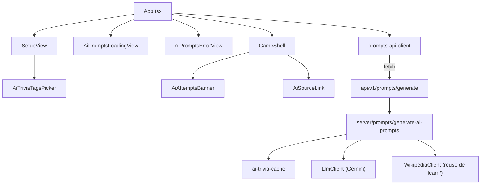
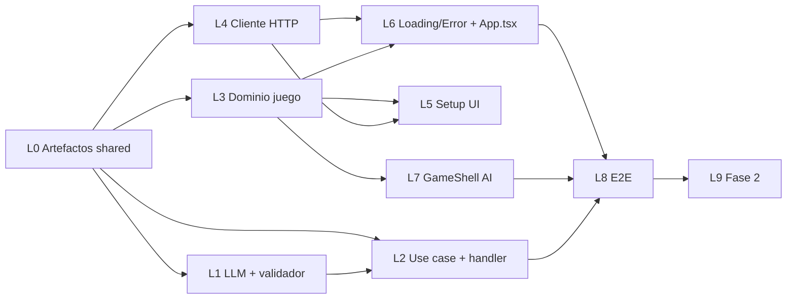
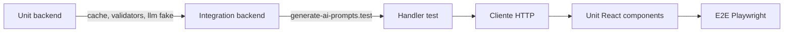

# Plan de implementación — Modo AI trivia (preguntas redactadas por LLM + tags temáticos)

**Estado:** propuesto para revisión y descomposición en tareas atómicas.
**Fecha:** 2026-05-20
**Idioma del documento:** español
**Audiencia:** agente de planificación (descomposición en tasks), desarrollo backend/frontend, QA.

**Referencias obligadas:**

- PRD vigente: [`./01-prd-modo-ai-trivia.md`](./01-prd-modo-ai-trivia.md)
- Decisión de approach IA + data retrieval: [`./00-decision-approach-ai-y-data-retrieval.md`](./00-decision-approach-ai-y-data-retrieval.md)
- Resumen backend: [`../00-decision-resumen-planificacion-backend.md`](../00-decision-resumen-planificacion-backend.md)
- Reglas: `.cursor/rules/core.mdc`, `.cursor/rules/privacy.mdc`, `.cursor/rules/dependency-security.mdc`
- Patrón a replicar (Wikipedia + caché + handler delgado): [`server/learn/`](../../../../server/learn/) y [`api/v1/countries/[iso2]/learn.ts`](../../../../api/v1/countries/%5Biso2%5D/learn.ts)

---

## 0. Visión rápida

Este plan **no redefine** los requisitos del PRD; los aterriza en:

- Rutas/contratos HTTP exactos.
- Árbol de módulos en `server/`, `shared/`, `src/` con responsabilidades atómicas.
- Estrategia de re-rolls (no hay queue real: todo dentro del request, con `MAX_REROLLS = 2`).
- Estrategia híbrida de precarga (toda la respuesta llega junta del backend; el frontend "simula" el background con una promesa pendiente).
- Orden topológico de tareas, agrupadas en lotes que se pueden ejecutar en paralelo.
- Estrategia de tests por capa.

**Fases** (las define el PRD §6.1):

- **Fase 1** — todo lo de este plan: backend en `vercel dev` + frontend integrado + tests Vitest/Playwright con mocks.
- **Fase 2** — rate limit reutilizado, deploy Vercel, métricas, smoke HTTPS. Cubierta brevemente al final.

**Decisiones tácticas tomadas en este plan** (sin alterar el PRD):

- **RF-F07** (qué hacer si quedan 0 tags concretos seleccionados): **reset implícito a `todas`**. Más simple para el usuario, evita botón "Empezar" deshabilitado por una transición de UI, y cumple "no menos de 1 tag activo".
- **`MAX_REROLLS`** se define como constante en `server/prompts/ai-trivia-constants.ts` (no en `shared/`, porque solo aplica al servidor).
- **`PRELOAD_THRESHOLD = 3`** se define como constante de cliente en `src/services/ai-trivia-rules.ts` (junto a `MAX_AI_ATTEMPTS`).
- **`INSUFFICIENT_GROUNDING_BATCH`** se incluye como código de error v1 (PRD §7 lo lista; lo formalizamos).

---

## 1. API endpoint design

### 1.1 Ruta

`POST /api/v1/prompts/generate`

Archivo del handler: [`api/v1/prompts/generate.ts`](../../../../api/v1/prompts/generate.ts) (nuevo).

### 1.2 Request body

```ts
interface AiPromptsRequest {
  readonly items: ReadonlyArray<{ readonly iso2: string }>
  readonly tags: readonly string[]            // [] = "cualquier tag del catálogo"
  readonly locale: 'es' | 'en'
  readonly seed?: number                       // determinismo de tag-picker en tests
}
```

**Validaciones del handler** (no del use case, esas viven en `server/prompts/validate-request.ts`):

- `method === 'POST'` → caso contrario `405` con `{ error: { code: 'INTERNAL_ERROR' } }` (mismo patrón que `learn.ts`).
- `Content-Type: application/json`. Si el body no parsea → `400 INVALID_REQUEST`.
- Shape mínimo: `items` array no vacío, `tags` array (puede ser vacío), `locale` string.

**Validaciones del use case** (`server/prompts/validate-ai-prompts-request.ts`):

- `items.length` entre 1 y 50 → caso contrario `400 INVALID_REQUEST`.
- `locale ∈ {'es', 'en'}` → caso contrario `400 INVALID_LOCALE`.
- Cada `iso2` debe existir en el catálogo (`server/learn/countries-catalog.ts`) → si alguno no existe → `400 INVALID_REQUEST` con mensaje (no expone qué iso2; logs server sí).
- Cada `tag` enviado debe pertenecer a `AI_TRIVIA_TAGS` del catálogo (`shared/ai-trivia-tag-dictionary.json`) → caso contrario `400 INVALID_TAG`.

### 1.3 Response body (éxito)

```ts
interface AiPromptsResponse {
  readonly items: readonly AiPromptItem[]      // puede ser más corto que request.items
}

interface AiPromptItem {
  readonly iso2: string
  readonly tag: AiTriviaTagId
  readonly riddle: string
  readonly difficulty: 'easy' | 'medium' | 'hard'
  readonly source: AiPromptSource
}

interface AiPromptSource {
  readonly title: string
  readonly locale: 'es' | 'en'
  readonly url: string                          // compuesta server-side
}
```

- `200 OK` siempre que el endpoint no falle. Que `items.length < request.items.length` **no** es error HTTP.
- Si tras re-rolls **todo** el batch queda vacío: `503 INSUFFICIENT_GROUNDING_BATCH` (el cliente lo mapea a `AiPromptsErrorView`).

### 1.4 Errores estables (PRD RF-B48 + §7)

| code                              | HTTP | Cuándo                                                       |
|-----------------------------------|------|--------------------------------------------------------------|
| `INVALID_REQUEST`                 | 400  | Body malformado, `items` vacío o `> 50`, `iso2` desconocido. |
| `INVALID_LOCALE`                  | 400  | `locale` no es `es`/`en`.                                    |
| `INVALID_TAG`                     | 400  | `tag` fuera del catálogo.                                    |
| `LLM_RATE_LIMITED`                | 429  | El proveedor responde 429 incluso tras 1 reintento de red.   |
| `LLM_UNAVAILABLE`                 | 503  | Proveedor caído / timeout / `GEMINI_API_KEY` ausente.        |
| `INSUFFICIENT_GROUNDING_BATCH`    | 503  | Todos los items fueron rechazados por validación/re-rolls.   |
| `RATE_LIMITED`                    | 429  | Fase 2 — middleware reutilizado de `learn/`.                 |
| `INTERNAL_ERROR`                  | 500  | Cualquier otro fallo no clasificado.                         |

Shape uniforme: `{ error: { code, message } }`, idéntico a `learn/`.

### 1.5 Validación server-side V1–V8 (referencia del approach B)

Ejecución por ítem, en orden, con cortocircuito al primer fallo. Detalle en el PRD §4.3 y la decisión §5.

| #  | Regla                                       | Implementación                                                                 |
|----|---------------------------------------------|---------------------------------------------------------------------------------|
| V1 | `expected_iso2 === request.iso2`            | Comparación string (case-sensitive tras normalización a uppercase).             |
| V2 | Riddle sin palabras prohibidas              | Match case-insensitive sobre `shared/country-forbidden-terms.json` (es + en).   |
| V3 | Longitud 20–280                              | `riddle.trim().length`.                                                          |
| V4 | Idioma de `riddle` === `locale`              | Heurística: stopwords + regex de tildes (es) / sufijos comunes (en).             |
| V5 | Artículo existe en `{src.locale}.wikipedia.org` | Reuso de [`createWikipediaClient()`](../../../../server/learn/wikipedia-client.ts) con un método nuevo `articleExists(...)`. |
| V6 | Artículo menciona país                       | Nuevo método `articleMentionsCountry(...)` en `WikipediaClient` (links/categorías). Cacheado por `(title, locale, iso2)`. |
| V7 | `valid !== false`                            | Self-check del modelo.                                                          |
| V8 | `difficulty ∈ {easy, medium, hard}`          | Enum check.                                                                     |

Cada validación que falla emite log estructurado: `{ rule: 'V5', iso2, tag, locale }` (sin `riddle`).

### 1.6 Composición de `source.url`

Se hace server-side, en `generate-ai-prompts.ts`, post-validación:

```ts
const url = `https://${source.locale}.wikipedia.org/wiki/${encodeURIComponent(source.title)}`
```

Esto cubre RNF-S05 (HTTPS), RNF-S06 (XSS) y mantiene al frontend ignorante del esquema.

### 1.7 Plantilla del flujo del handler

Mismo esqueleto que [`api/v1/countries/[iso2]/learn.ts`](../../../../api/v1/countries/%5Biso2%5D/learn.ts):

```12:64:api/v1/countries/[iso2]/learn.ts
export default async function handler(
  req: VercelRequest,
  res: VercelResponse,
): Promise<void> {
  const allowedOrigins = parseAllowedOrigins()
  if (handleCorsPreflightIfNeeded(req, res, allowedOrigins)) return
  applyCorsHeaders(req, res, allowedOrigins)
  if (applyLearnRateLimitIfNeeded(req, res)) return
  // ... method check, parse iso2/locale ...
  const result = await handleLearnGet(iso2, locale, getDefaultLearnDeps())
  if (result.ok) {
    sendJson(res, 200, result.data)
    return
  }
  sendJson(res, result.httpStatus, { error: result.error })
}
```

Para el nuevo handler:

- Reusamos `parseAllowedOrigins`, `handleCorsPreflightIfNeeded`, `applyCorsHeaders`, `sendJson`.
- Agregamos un nuevo helper `applyPromptsRateLimitIfNeeded` (parametrizable, ver §2.5).
- Delegamos a `handleAiPromptsPost(body, getDefaultPromptsDeps())` (espejo de `handleLearnGet`).

---

## 2. Arquitectura de servicios (`server/prompts/`)

### 2.1 Árbol del módulo (nuevo)

```
server/prompts/
├── generate-ai-prompts.ts             # caso de uso (orquestador, puro)
├── validate-ai-prompts-request.ts     # parseo + checks de body (allowlist iso2/tag/locale)
├── prompts-deps.ts                    # interfaces LlmClient, AiTriviaCache, deps del use case
├── ai-trivia-cache.ts                 # in-memory por (iso2,tag,locale), TTL 30d
├── tag-picker.ts                      # selección random con seed opcional
├── prompt-blueprint.ts                # builder del prompt blindado (texto + JSON schema)
├── forbidden-terms.ts                 # lookup en shared/country-forbidden-terms.json
├── validate-ai-response.ts            # V1–V8 (cada función exportada por separado)
├── llm-client-gemini.ts               # impl con fetch nativo a Gemini Flash REST
├── llm-client-fake.ts                 # impl para tests / vercel dev sin API key
├── ai-trivia-constants.ts             # MAX_REROLLS, TTLs, timeouts
├── create-default-prompts-deps.ts     # factory (singleton de caché, decide cliente real vs fake)
├── ai-trivia-logger.ts                # contadores RNF-T07 sin PII
└── *.test.ts
```

Estos archivos materializan PRD §6.2 con nombres concretos. **Nota:** el `WikipediaClient` se sigue importando desde `server/learn/`, no se duplica.

### 2.2 Tipos compartidos (`shared/`)

Nuevos archivos:

```
shared/
├── ai-trivia-api.ts                   # DTOs HTTP + códigos error + result helpers
├── ai-trivia-tags-schema.ts           # AiTriviaTagId (union derivado), AI_TRIVIA_TAGS, getTagPromptHint()
├── ai-trivia-tag-dictionary.json      # catálogo cerrado v1 (id, labels.es/en, promptHint.es/en)
└── country-forbidden-terms.json       # artefacto generado por script
```

`shared/ai-trivia-api.ts` (referencia):

```ts
import type { AppLocale } from './app-locale.js'
import type { AiTriviaTagId } from './ai-trivia-tags-schema.js'

export type AiPromptsApiErrorCode =
  | 'INVALID_REQUEST'
  | 'INVALID_LOCALE'
  | 'INVALID_TAG'
  | 'LLM_UNAVAILABLE'
  | 'LLM_RATE_LIMITED'
  | 'INSUFFICIENT_GROUNDING_BATCH'
  | 'RATE_LIMITED'
  | 'INTERNAL_ERROR'

export interface AiPromptsRequest {
  readonly items: ReadonlyArray<{ readonly iso2: string }>
  readonly tags: readonly AiTriviaTagId[]
  readonly locale: AppLocale
  readonly seed?: number
}

export interface AiPromptSource {
  readonly title: string
  readonly locale: AppLocale
  readonly url: string
}

export interface AiPromptItem {
  readonly iso2: string
  readonly tag: AiTriviaTagId
  readonly riddle: string
  readonly difficulty: 'easy' | 'medium' | 'hard'
  readonly source: AiPromptSource
}

export interface AiPromptsResponse {
  readonly items: readonly AiPromptItem[]
}

export type AiPromptsResult =
  | { readonly ok: true; readonly data: AiPromptsResponse }
  | { readonly ok: false; readonly error: { code: AiPromptsApiErrorCode; message: string }; readonly httpStatus: number }

export function aiPromptsFailure(code: AiPromptsApiErrorCode, message: string): AiPromptsResult
export function aiPromptsErrorHttpStatus(code: AiPromptsApiErrorCode): number
```

Y `shared/ai-trivia-tags-schema.ts`:

```ts
import tagDictionary from './ai-trivia-tag-dictionary.json' with { type: 'json' }

export type AiTriviaTagId =
  | 'historia' | 'politica' | 'geografia' | 'flora-y-fauna'
  | 'cultura-general' | 'musica' | 'literatura' | 'cine' | 'deportes'

export interface AiTriviaTagEntry {
  readonly id: AiTriviaTagId
  readonly labels: { readonly es: string; readonly en: string }
  readonly promptHint: { readonly es: string; readonly en: string }
}

export const AI_TRIVIA_TAGS: readonly AiTriviaTagEntry[] = tagDictionary as readonly AiTriviaTagEntry[]
export const AI_TRIVIA_TAG_IDS: readonly AiTriviaTagId[] = AI_TRIVIA_TAGS.map((t) => t.id)
export function isAiTriviaTagId(value: string): value is AiTriviaTagId { /* ... */ }
export function getTagEntry(id: AiTriviaTagId): AiTriviaTagEntry { /* ... */ }
```

Re-exportar en `shared/index.ts`.

### 2.3 Interfaces (`server/prompts/prompts-deps.ts`)

Espejo de [`server/learn/learn-deps.ts`](../../../../server/learn/learn-deps.ts):

```ts
import type { AppLocale } from '../../shared/app-locale.js'
import type { AiTriviaTagId } from '../../shared/ai-trivia-tags-schema.js'
import type { AiPromptItem } from '../../shared/ai-trivia-api.ts'
import type { WikipediaClient } from '../learn/learn-deps.js'

export interface LlmGenerateInputItem {
  readonly iso2: string
  readonly tag: AiTriviaTagId
}

export interface LlmGenerateInput {
  readonly items: readonly LlmGenerateInputItem[]
  readonly locale: AppLocale
  readonly attempt: 1 | 2 | 3            // re-roll attempt (1 = primera llamada)
}

export type LlmGenerateOutputItem =
  | {
      readonly kind: 'ok'
      readonly iso2: string
      readonly tag: AiTriviaTagId
      readonly riddle: string
      readonly expectedIso2: string
      readonly justification: string
      readonly claimedSourceTitle: string
      readonly claimedSourceLocale: AppLocale
      readonly difficulty: 'easy' | 'medium' | 'hard'
      readonly valid: boolean
    }
  | { readonly kind: 'insufficient_grounding'; readonly iso2: string; readonly tag: AiTriviaTagId }

export interface LlmGenerateOutput {
  readonly items: readonly LlmGenerateOutputItem[]
}

export type LlmGenerateResult =
  | { readonly ok: true; readonly data: LlmGenerateOutput }
  | { readonly ok: false; readonly code: 'LLM_UNAVAILABLE' | 'LLM_RATE_LIMITED' }

export interface LlmClient {
  generateRiddles(input: LlmGenerateInput): Promise<LlmGenerateResult>
}

export interface AiTriviaCacheKey {
  readonly iso2: string
  readonly tag: AiTriviaTagId
  readonly locale: AppLocale
}

export interface AiTriviaCache {
  get(key: AiTriviaCacheKey): AiPromptItem | undefined
  set(key: AiTriviaCacheKey, item: AiPromptItem): void
}

export interface GenerateAiPromptsDeps {
  readonly llmClient: LlmClient
  readonly wikipediaClient: WikipediaClient      // reusado de learn/
  readonly cache: AiTriviaCache
  readonly now: () => number                     // determinista en tests
  readonly random: () => number                  // tag-picker seedable
}
```

### 2.4 Flujo del use case (`generate-ai-prompts.ts`)

Pseudocódigo del orquestador (puro, sin red salvo a través de deps):

```ts
export async function generateAiPrompts(
  request: AiPromptsRequest,
  deps: GenerateAiPromptsDeps,
): Promise<AiPromptsResult> {
  const validated = validateAiPromptsRequest(request)
  if (!validated.ok) return validated

  const itemsWithTags = assignTagsToItems(validated.items, validated.tags, deps.random)

  const results: AiPromptItem[] = []
  const cacheMisses: ResolvedItem[] = []
  for (const itemWithTag of itemsWithTags) {
    const cached = deps.cache.get(itemWithTag)
    if (cached) {
      results.push(cached)
      continue
    }
    cacheMisses.push(itemWithTag)
  }

  if (cacheMisses.length === 0) {
    return { ok: true, data: { items: results } }
  }

  const validated2 = await callLlmWithRerolls(cacheMisses, validated.locale, deps)
  if (!validated2.ok) return validated2

  for (const validItem of validated2.items) {
    deps.cache.set(validItem, validItem)
    results.push(validItem)
  }

  if (results.length === 0) {
    return aiPromptsFailure('INSUFFICIENT_GROUNDING_BATCH', 'Todos los items fueron descartados')
  }

  return { ok: true, data: { items: orderByRequest(results, request.items) } }
}
```

Donde `callLlmWithRerolls`:

```ts
async function callLlmWithRerolls(
  misses: ResolvedItem[],
  locale: AppLocale,
  deps: GenerateAiPromptsDeps,
): Promise<{ ok: true; items: AiPromptItem[] } | LlmFailure> {
  let pending = misses
  const validItems: AiPromptItem[] = []
  for (let attempt = 1; attempt <= MAX_REROLLS + 1; attempt += 1) {
    if (pending.length === 0) break
    const llmResult = await deps.llmClient.generateRiddles({ items: pending, locale, attempt })
    if (!llmResult.ok) return llmResult                   // LLM_UNAVAILABLE / LLM_RATE_LIMITED
    const partition = await validateBatch(llmResult.data.items, locale, deps)
    validItems.push(...partition.valid)
    pending = partition.invalid                            // se vuelven a pedir con attempt+1
    if (partition.failureRate > CIRCUIT_BREAKER_RATIO) break // RNF-P04
  }
  return { ok: true, items: validItems }
}
```

`validateBatch` corre V1–V8 con un cache interno de "artículo menciona país" para reusar entre re-rolls (RF-B25 + RNF-P05).

### 2.5 Caché (`ai-trivia-cache.ts`)

Idéntico al patrón de [`server/learn/learn-cache.ts`](../../../../server/learn/learn-cache.ts):

```ts
const DEFAULT_TTL_MS = 30 * 24 * 60 * 60 * 1000

export function createAiTriviaCache(options: { ttlMs?: number; now?: () => number } = {}): AiTriviaCache {
  // Map<`${iso2}:${tag}:${locale}`, { item, expiresAt }>
}
```

Singleton en `create-default-prompts-deps.ts` (mismo patrón que `getDefaultLearnDeps`), con `resetDefaultPromptsDepsForTests()` para Vitest.

### 2.6 Adaptador Gemini (`llm-client-gemini.ts`)

- `fetch` nativo a `https://generativelanguage.googleapis.com/v1beta/models/gemini-3.1-flash-lite:generateContent?key=${apiKey}` (la URL exacta y el modelo se documentan al ejecutar, **no se hardcodea ahora**; al menos un constante exportada). El default actual es `gemini-3.1-flash-lite` (el más barato de la familia Gemini 3 para texto).
- `process.env.GEMINI_API_KEY`. Si está ausente o vacío: la factory devuelve un `LlmClient` que retorna siempre `{ ok: false, code: 'LLM_UNAVAILABLE' }`. No tira excepción en bootstrap.
- Timeout 15 s con `AbortController` (existe patrón parecido en `wikipedia-http.ts`).
- 1 reintento de red ante 5xx/network error.
- Mapea respuestas no-JSON o JSON inválido a `LLM_UNAVAILABLE`.
- Logs: solo `{ iso2[], tag[], locale, attempt, latencyMs, status }`. Nunca el body crudo del modelo.

### 2.7 Adaptador fake (`llm-client-fake.ts`)

- Acepta una función inyectada `(input) => LlmGenerateOutput` para tests.
- Tiene una variante "scripted" que lee desde un array de fixtures por `iso2`.
- Usado por defecto en `vercel dev` si `GEMINI_API_KEY` no está y `USE_FAKE_LLM === '1'` (decisión: por defecto el factory devuelve el fake-stub que falla con `LLM_UNAVAILABLE` para no enmascarar configs mal hechas; el modo "fake útil" se activa con env explícita).

### 2.8 Rate limit

Para no duplicar lógica, generalizamos [`api/_lib/apply-learn-rate-limit.ts`](../../../../api/_lib/apply-learn-rate-limit.ts):

- Renombrar internamente la key, manteniendo helper específico por path: nuevo archivo `api/_lib/apply-prompts-rate-limit.ts` que llama a `checkRateLimit('prompts:${ip}', ...)`. **Fase 2** lo activa; en fase 1 se respeta el flag `RATE_LIMIT_DISABLED=1` ya existente.

---

## 3. "Background jobs" / re-rolls / streaming híbrido

**No hay worker queue real.** El "background" del PRD está en dos lugares:

### 3.1 Re-rolls (backend, sincrónicos dentro del request)

- Implementados con un loop `for (attempt = 1; attempt <= MAX_REROLLS + 1; attempt++)` en `callLlmWithRerolls`.
- `MAX_REROLLS = 2` → máximo 3 llamadas al LLM por ítem inválido.
- Cortocircuito si la **tasa de fallo** del último intento supera 50% (RNF-P04).
- Cada re-roll **solo envía los ítems inválidos**, no el batch completo, para minimizar coste y latencia.
- El prompt en `attempt > 1` incluye en el `system` instrucción reforzada: *"En el intento anterior tu respuesta para `iso2=XX, tag=YY` violó la regla V{n}: <texto>. Esta vez evítalo."*

### 3.2 Estrategia híbrida de precarga (frontend)

PRD RF-F23. El endpoint devuelve **toda la respuesta junta** (no es streaming en v1). El frontend simula el "background":

- `prompts-api-client.generateAiPrompts(...)` devuelve `Promise<AiPromptsResponse>`.
- El componente `AiPromptsLoadingView` espera **al menos** `PRELOAD_THRESHOLD = 3` ítems válidos antes de habilitar el inicio de la partida. Como la promesa entrega los items todos juntos, en la práctica espera hasta el `await` completo y luego cuenta.
- **Compatibilidad con streaming futuro:** la API del cliente HTTP es `(input, onProgress?: (count) => void) => Promise<...>` para que cuando v2 entregue items en stream, el motor de juego no cambie. En v1, `onProgress` se llama una sola vez al final con el total.

### 3.3 Cancelación

- `prompts-api-client.generateAiPrompts(input, { signal })` acepta `AbortSignal`.
- Si el usuario vuelve a Setup mid-loading → `AbortController.abort()` en cleanup del effect; el backend ya cacheó los items que pudo validar (RF-B45 §7 "Usuario cierra la pestaña").

---

## 4. Cambios al dominio compartido (`src/`)

### 4.1 `src/types/domain.ts`

- `QuestionMode = 'country' | 'capital' | 'ai'` (PRD RF-D01).
- Nuevo `GameConfig.tags?: readonly AiTriviaTagId[]` (PRD RF-D02).
- Nuevo `Round.attempts?: readonly AiAttempt[]` y `Round.aiSource?: AiPromptSource` (PRD RF-D05, RF-D07).
- Nueva interface `AiAttempt`:

```ts
export interface AiAttempt {
  readonly playerId: string
  readonly selectedCountryCode: IsoCountryCode
  readonly isCorrect: boolean
  readonly attemptedAtISO: string
  readonly scoreDelta: number
}
```

### 4.2 `src/services/ai-trivia-rules.ts` (nuevo)

```ts
export const MAX_AI_ATTEMPTS = 3
export const PRELOAD_THRESHOLD = 3

export function getAiScoreForAttempt(attemptNumber: 1 | 2 | 3): 1 | 0.5 | 0.25 {
  if (attemptNumber === 1) return 1
  if (attemptNumber === 2) return 0.5
  return 0.25
}
```

Re-exportado vía `src/services/index.ts`.

### 4.3 `src/services/game-round-service.ts` — extensión de `submitRoundGuess`

Lógica nueva (PRD RF-D08/D09), por bloques claros:

1. Si `session.config.questionMode !== 'ai'` → comportamiento actual sin cambios (RF-D10).
2. Si es AI:
   - Lee `currentRound.attempts ?? []`.
   - Construye `nextAttempts = [...attempts, { playerId, selectedCountryCode, isCorrect, attemptedAtISO, scoreDelta: ... }]`.
   - **Si `isCorrect`** → cierra ronda: `guess = { ... }`, aplica `scoreDelta = getAiScoreForAttempt(attempts.length + 1)`, `correctAnswers++`.
   - **Si `!isCorrect` y `attempts.length + 1 < MAX_AI_ATTEMPTS`** → ronda sigue abierta (`guess` no se asigna), turn engine devuelve el **mismo** `playerId` (porque el turn engine ya lo hace si `guess` está ausente).
   - **Si `!isCorrect` y `attempts.length + 1 === MAX_AI_ATTEMPTS`** → ronda se cierra fallida: `guess.isCorrect = false`, `scoreDelta = 0`, `wrongAnswers++`.

3. `applyAnswerToPlayer` (en `scoring.ts`) gana una variante o un parámetro opcional: en lugar de `+10 / -5` (PRODUCT_RULES), si el `scoreDelta` está provisto, lo usa directamente. Refactor minimal:

```ts
export function applyAnswerToPlayer(
  player: Player,
  isCorrect: boolean,
  scoreDelta?: number,
): Player {
  const deltaPoints = scoreDelta ?? (isCorrect
    ? PRODUCT_RULES.scoring.correctAnswerPoints
    : PRODUCT_RULES.scoring.wrongAnswerPoints)
  // ... resto igual
}
```

4. `advanceToNextRoundOrFinish` **no cambia** (sigue mirando `currentRound.guess`).

### 4.4 `src/services/validate-config.ts`

- Si `config.questionMode === 'ai'`:
  - Falla con `messageKey: 'validation.config.aiRequiresStrict'` si `antiCheatMode !== 'strict'` (PRD RF-D03).
  - Falla con `messageKey: 'validation.config.invalidTag'` si algún tag está fuera del catálogo.
- Sin regresión para modos `country`/`capital`.

### 4.5 `src/features/setup/setup-config-schema.ts`

Actualizar Zod schema:

```ts
const questionModeSchema = z.enum(['country', 'capital', 'ai'])

export const setupConfigSchema = z.object({
  // ... existing fields
  questionMode: questionModeSchema,
  tags: z.array(z.string()).optional(),
}).refine((cfg) => {
  if (cfg.questionMode === 'ai' && cfg.antiCheatMode !== 'strict') return false
  return true
}, { message: 'schema.aiRequiresStrict' })
.refine((cfg) => {
  if (cfg.questionMode !== 'ai') return true
  return (cfg.tags ?? []).every(isAiTriviaTagId)
}, { message: 'schema.invalidTag' })
```

---

## 5. Frontend component breakdown

### 5.1 Cliente HTTP — `src/services/prompts-api-client.ts`

Espejo de [`src/services/learn-api-client.ts`](../../../../src/services/learn-api-client.ts):

```ts
export async function generateAiPrompts(
  input: AiPromptsRequest,
  options?: { signal?: AbortSignal; fetchImpl?: typeof fetch },
): Promise<{ ok: true; data: AiPromptsResponse } | { ok: false; error: ApiErrorPayload }>
```

- `buildAiPromptsUrl(baseUrl)` puro y testable.
- `parseAiPromptsResponse(body)` con narrowing defensivo (cada campo opcional se valida).
- Allowlist de error codes (`AI_PROMPTS_API_ERROR_CODES`) en el cliente.
- Fallback de red: `{ code: 'LLM_UNAVAILABLE', message: 'Network request failed' }`.

### 5.2 Picker de tags — `src/features/setup/AiTriviaTagsPicker.tsx`

- Props: `value: AiTriviaTagId[] | 'all'`, `onChange(value)`, `locale`.
- Render: `<fieldset role="group">` con `Badge`/chip toggleable por tag (de `AI_TRIVIA_TAGS`), más chip `todas` con label i18n.
- Comportamiento:
  - Click en `todas` → onChange `'all'`.
  - Click en cualquier otro tag → onChange con set toggled (y deshabilita `'all'`).
  - Si el set queda vacío → onChange `'all'` (decisión §0).
- Accesibilidad: cada chip es un `<button role="checkbox" aria-checked>` con foco visible (RNF-A01).
- Mapeo en App.tsx: `value === 'all' ? [] : value` cuando se envía a la API (RF-F05).

### 5.3 `SetupView` — modificaciones

[`src/features/setup/SetupView.tsx`](../../../../src/features/setup/SetupView.tsx) ya tiene `questionModeOptions` derivado por `useMemo`. Cambios:

1. Añadir `['ai', 'modeAi']` a `questionModeOptions`.
2. Si `questionMode === 'ai'`: renderizar `<AiTriviaTagsPicker />` debajo del `FieldRadioGroup` de question mode.
3. Si `questionMode === 'ai'`: forzar `antiCheatMode = 'strict'` y pasar a `FieldRadioGroup` de anti-cheat un prop `disabledValues=['normal']` (extender el componente; ya soporta tone neutral). Mostrar `<Alert tone='info'>` con `t('setup.antiCheatLockedByAi')`.
4. Props nuevos: `selectedTags`, `onTagsChange`.

### 5.4 Vistas de loading/error — `src/features/game/`

- `AiPromptsLoadingView.tsx`:
  - `role="status"`, `aria-live="polite"`, copy `t('ai.loading.preparingQuestions')`.
  - Botón "Cancelar" (opcional) que dispara `onCancel()` → vuelve a Setup.
- `AiPromptsErrorView.tsx`:
  - Props: `errorCode: AiPromptsApiErrorCode`, `onRetry()`, `onSwitchToStandard()`.
  - Renderiza mensaje traducido via `translateApiErrorCode` (extender ese helper con los códigos AI).
  - Dos botones primarios (RF-F60).

### 5.5 Mecánica de intentos durante partida — `src/features/game/`

Cambios a [`src/features/game/GameShell.tsx`](../../../../src/features/game/GameShell.tsx):

1. Calcular `isAiMode = session.config.questionMode === 'ai'`.
2. Calcular `attempts = activeRound?.attempts ?? []` y `attemptsLeft = MAX_AI_ATTEMPTS - attempts.length`.
3. Render del prompt:
   - Si `isAiMode`: mostrar `<p data-testid='round-prompt'>{activeRound.prompt}</p>` sin prefijo `promptCountry`/`promptCapital` (el riddle es la pregunta entera).
   - Si no: comportamiento actual.
4. Nuevo componente `AiAttemptsBanner.tsx` (`src/features/game/`):
   - Visible solo si `isAiMode && attempts.length > 0 && !roundGuess`.
   - `role="status"`, `aria-live="polite"`, copy `t('ai.feedback.tryAgain', { attemptsLeft })`.
5. Nuevo componente `AiSourceLink.tsx` (`src/features/game/`):
   - Visible solo si `isAiMode && roundGuess && activeRound.aiSource`.
   - Renderiza `<a href={aiSource.url} target='_blank' rel='noopener noreferrer' aria-label={t('ai.source.linkAria', { title })}>{aiSource.title}</a>`.
6. **No** se renderiza el link mientras `!roundGuess` (RF-F43).

### 5.6 Integración en `App.tsx` / `startGameWithConfig`

Refactor del actual `startGameWithConfig` (líneas 93–123 de [`App.tsx`](../../../../src/App.tsx)):

```ts
async function startGameWithConfig(config: GameConfig): Promise<void> {
  // 1) createGameSession (existente)
  // 2) buildQuestionPool (existente, sin cambios)
  // 3) Si config.questionMode === 'ai':
  //    setCurrentView('ai-loading')
  //    const result = await generateAiPrompts({
  //      items: pool.selectedQuestions.map(q => ({ iso2: q.answerCountryCode })),
  //      tags: config.tags ?? [],
  //      locale: appLocale,
  //    }, { signal: abortRef.current.signal })
  //    if (!result.ok) { setCurrentView('ai-error'); setAiError(result.error); return }
  //    if (result.data.items.length === 0) { /* INSUFFICIENT */ }
  //    const aiPool = mapAiItemsToPool(result.data.items, pool.selectedQuestions)
  //    const playingSession = beginPlayingSession(session, aiPool)
  //    if (result.data.items.length < pool.selectedQuestions.length) {
  //      setReducedCountToast(...)
  //    }
  // 4) Si no AI: comportamiento actual
}
```

Funciones helper nuevas en `src/services/`:

- `mapAiItemsToPool(items: AiPromptItem[], poolItems: QuestionPoolItem[]): QuestionPoolItemWithAi[]` (donde `QuestionPoolItemWithAi` extiende `QuestionPoolItem` con `aiSource?: AiPromptSource`; `prompt = item.riddle`).
- Extender `beginPlayingSession` para propagar `aiSource` al `Round` si existe (no rompe los otros modos).

Nuevo `AppView`: `'ai-loading' | 'ai-error'` además de los 4 actuales.

### 5.7 i18n

Nuevas claves (en `src/i18n/resources/{es,en}.ts`):

```
setup.modeAi
setup.aiTagsLegend
setup.aiTagsAllLabel
setup.antiCheatLockedByAi
setup.tagLabel.<tagId>           # generado dinámicamente desde el catálogo

game.ai.feedback.tryAgain        # "No, prueba otra vez. Te quedan {{attemptsLeft}}."
game.ai.source.linkLabel         # "Fuente: {{title}}"
game.ai.source.linkAria

ai.loading.preparingQuestions
ai.error.title
ai.error.retry
ai.error.switchToStandard
ai.notice.reducedQuestionCount

errors.INVALID_TAG
errors.LLM_UNAVAILABLE
errors.LLM_RATE_LIMITED
errors.INSUFFICIENT_GROUNDING_BATCH

validation.config.aiRequiresStrict
validation.config.invalidTag
```

Las labels de cada tag se leen **del propio JSON** (no se hardcodean en `es.ts`/`en.ts`): cumplen RNF-E03 (añadir tag = solo tocar JSON).

### 5.8 Diagrama de componentes



---

## 6. Implementation order + dependencias entre tareas

Las tareas están agrupadas en **lotes** (`L0`..`L7`); dentro de cada lote, las tareas pueden ejecutarse en paralelo. Cada lote es prerequisito del siguiente.

### Lote L0 — Artefactos compartidos (sin lógica)

| ID  | Tarea                                                                                  | Dependencias |
|-----|----------------------------------------------------------------------------------------|--------------|
| L0-1 | Crear `shared/ai-trivia-tag-dictionary.json` con los 9 tags + labels es/en + promptHints (PRD RF-B01). | —            |
| L0-2 | Crear `shared/ai-trivia-tags-schema.ts` (PRD RF-B02). Re-export en `shared/index.ts`.        | L0-1         |
| L0-3 | Script `scripts/build-country-forbidden-terms.mjs` siguiendo patrón de [`build-wikipedia-sitelinks.mjs`](../../../../scripts/build-wikipedia-sitelinks.mjs) (PRD RF-B03/B04). | —            |
| L0-4 | Ejecutar L0-3 y commitear `shared/country-forbidden-terms.json`. | L0-3         |
| L0-5 | Crear `shared/ai-trivia-api.ts` con DTOs + helpers de error. Re-export en `shared/index.ts`. | L0-2         |
| L0-6 | Test de integridad para `country-forbidden-terms.json`: todos los iso2 del catálogo presentes, sin strings vacíos. | L0-4         |

### Lote L1 — Adaptador LLM + validador (lógica pura, sin endpoint)

| ID  | Tarea                                                                                | Dependencias |
|-----|--------------------------------------------------------------------------------------|--------------|
| L1-1 | `server/prompts/prompts-deps.ts` con interfaces `LlmClient`, `AiTriviaCache`, deps. | L0-5         |
| L1-2 | `server/prompts/ai-trivia-cache.ts` + tests (TTL, miss, hit, expiración).            | L1-1         |
| L1-3 | `server/prompts/tag-picker.ts` con `random` inyectable + tests (determinismo).       | L0-2         |
| L1-4 | `server/prompts/prompt-blueprint.ts`: builder de texto + JSON schema enviado al LLM. | L0-1, L0-2   |
| L1-5 | `server/prompts/forbidden-terms.ts`: lookup por iso2 con normalización Unicode-NFC + case-insensitive. | L0-4         |
| L1-6 | `server/prompts/validate-ai-response.ts`: V1, V2, V3, V4, V7, V8 (excluye V5/V6 por ahora). Tests unitarios por regla. | L1-5         |
| L1-7 | Extender `server/learn/wikipedia-client.ts` o agregar `server/prompts/wikipedia-grounding-client.ts` con `articleExists()` y `articleMentionsCountry()` + caché por `(title, locale, iso2)`. | —            |
| L1-8 | `server/prompts/validate-ai-response.ts` ahora incluye V5/V6 usando dep `WikipediaClient`. Tests con mock. | L1-6, L1-7   |
| L1-9 | `server/prompts/llm-client-fake.ts` + tests del fake. | L1-1         |

### Lote L2 — Use case + handler

| ID   | Tarea                                                                                | Dependencias |
|------|--------------------------------------------------------------------------------------|--------------|
| L2-1 | `server/prompts/ai-trivia-constants.ts` con `MAX_REROLLS`, `CIRCUIT_BREAKER_RATIO`, TTLs. | L0-5         |
| L2-2 | `server/prompts/validate-ai-prompts-request.ts`: shape, allowlist iso2/tag/locale, `items` size. + tests. | L0-2, L0-5   |
| L2-3 | `server/prompts/generate-ai-prompts.ts`: orquesta cache → batch → validate → re-roll → cache write. + tests con `llm-client-fake`. Cubre: cache hit/miss, validaciones V1–V8, selección random de tag (seed), re-roll cap, items omitidos, `INSUFFICIENT_GROUNDING_BATCH`. (RNF-T01) | L1-2,L1-3,L1-6,L1-8,L1-9, L2-1, L2-2 |
| L2-4 | `server/prompts/ai-trivia-logger.ts`: contadores `ai_trivia.*` sin PII. | L2-3         |
| L2-5 | `server/prompts/llm-client-gemini.ts` con `fetch` nativo, timeout 15s, 1 reintento, mapeo a `LlmGenerateResult`. + tests con `fetch` mock. | L1-1         |
| L2-6 | `server/prompts/create-default-prompts-deps.ts` (factory + singleton cache + `resetDefaultPromptsDepsForTests`). | L1-2, L2-5, L1-7 |
| L2-7 | `api/_lib/handle-ai-prompts-post.ts` (espejo de `handle-learn-get.ts`). | L2-3         |
| L2-8 | `api/_lib/apply-prompts-rate-limit.ts` (mismo patrón que `apply-learn-rate-limit.ts`). | —            |
| L2-9 | `api/v1/prompts/generate.ts` (handler delgado: CORS + parse body + delegate + map). | L2-6, L2-7, L2-8 |
| L2-10 | Smoke local `vercel dev` con `curl` documentado en README de la iteración. | L2-9         |

### Lote L3 — Dominio compartido del juego

| ID   | Tarea                                                                                | Dependencias |
|------|--------------------------------------------------------------------------------------|--------------|
| L3-1 | Extender `src/types/domain.ts`: `QuestionMode = … \| 'ai'`, `GameConfig.tags?`, `Round.attempts?`, `Round.aiSource?`, `AiAttempt`. | L0-2, L0-5   |
| L3-2 | `src/services/ai-trivia-rules.ts` con `MAX_AI_ATTEMPTS`, `PRELOAD_THRESHOLD`, `getAiScoreForAttempt`. + tests. | —            |
| L3-3 | Refactor `src/services/scoring.ts`: aceptar `scoreDelta?: number` opcional sin regresión. + tests. | —            |
| L3-4 | Extender `src/services/game-round-service.ts/submitRoundGuess` para modo AI (3 intentos, scoring escalonado, turno preservado). + tests dedicados `submit-round-guess-ai.test.ts`. (RNF-T02) | L3-1, L3-2, L3-3 |
| L3-5 | Extender `src/services/validate-config.ts` con regla `aiRequiresStrict` + tag allowlist. + tests. | L3-1, L0-2   |
| L3-6 | Actualizar `src/features/setup/setup-config-schema.ts` (Zod) con `'ai'` y refinements. + tests. | L3-1         |

### Lote L4 — Cliente HTTP frontend

| ID   | Tarea                                                                                | Dependencias |
|------|--------------------------------------------------------------------------------------|--------------|
| L4-1 | `src/services/prompts-api-client.ts` + parseo defensivo + `buildAiPromptsUrl` + `AbortSignal`. (RNF-T04) | L0-5         |
| L4-2 | Re-export desde `src/services/index.ts`. Tests del cliente. | L4-1         |
| L4-3 | Extender `src/i18n/translate-api-error.ts` para los códigos `LLM_UNAVAILABLE`, etc. | L0-5         |

### Lote L5 — Componentes de Setup

| ID   | Tarea                                                                                | Dependencias |
|------|--------------------------------------------------------------------------------------|--------------|
| L5-1 | `src/features/setup/AiTriviaTagsPicker.tsx` + tests (exclusividad `todas`, accesibilidad, callback). | L0-2         |
| L5-2 | Extender `SetupView.tsx`: tercer modo, picker condicional, forzado de strict (visual + i18n). + tests. | L5-1, L3-6   |
| L5-3 | Actualizar i18n `setup.*` con `modeAi`, `aiTagsLegend`, `aiTagsAllLabel`, `antiCheatLockedByAi`. | —            |

### Lote L6 — Loading/error + integración en App.tsx

| ID   | Tarea                                                                                | Dependencias |
|------|--------------------------------------------------------------------------------------|--------------|
| L6-1 | `src/features/game/AiPromptsLoadingView.tsx` + tests. | —            |
| L6-2 | `src/features/game/AiPromptsErrorView.tsx` + tests (botones, mapeo de error). | L4-3         |
| L6-3 | Helper `src/services/map-ai-items-to-pool.ts` + tests. | L3-1         |
| L6-4 | Extender `beginPlayingSession` para propagar `aiSource` al `Round` (sin regresión). + tests. | L3-1         |
| L6-5 | Refactor `App.tsx/startGameWithConfig` async + nuevos `AppView` `'ai-loading' \| 'ai-error'` + `AbortController` + manejo de cancelación. | L4-1, L6-1, L6-2, L6-3, L6-4 |
| L6-6 | Toast `ai.notice.reducedQuestionCount` cuando `response.items.length < requested`. | L6-5         |

### Lote L7 — Mecánica de partida AI

| ID   | Tarea                                                                                | Dependencias |
|------|--------------------------------------------------------------------------------------|--------------|
| L7-1 | `src/features/game/AiAttemptsBanner.tsx` + tests (visible con intentos restantes, oculto al cerrar ronda). | L3-2         |
| L7-2 | `src/features/game/AiSourceLink.tsx` + tests (visible solo al cerrar ronda, atributos de seguridad). | —            |
| L7-3 | Integrar ambos en `GameShell.tsx` con render condicional por `isAiMode`. + tests. | L7-1, L7-2, L3-4 |
| L7-4 | Actualizar i18n `game.ai.*`, `ai.loading.*`, `ai.error.*`, `errors.*`, `validation.config.*`. | —            |

### Lote L8 — Tests end-to-end (Playwright)

| ID   | Tarea                                                                                | Dependencias |
|------|--------------------------------------------------------------------------------------|--------------|
| L8-1 | Playwright spec `ai-trivia-flow.spec.ts` con mock de `/v1/prompts/generate`: Setup AI → tags → loading → ronda → 2 fallos → acierto → cartel con link → siguiente → fin. (RNF-T05) | L6-5, L7-3   |
| L8-2 | Playwright spec de regresión: flujo `country` y `capital` sin cambios funcionales. (RNF-T06) | —            |
| L8-3 | Smoke de CI: verificar que `dist/` no contiene `GEMINI_API_KEY` (grep en pipeline). (RNF-I05) | L6-5         |

### Lote L9 — Fase 2 (separable de v1)

| ID   | Tarea                                                                                |
|------|--------------------------------------------------------------------------------------|
| L9-1 | Activar `applyPromptsRateLimitIfNeeded` por defecto en `preview`/`production`.       |
| L9-2 | Configurar `GEMINI_API_KEY` y `ALLOWED_ORIGINS` en Vercel; smoke HTTPS.              |
| L9-3 | Verificar métricas `ai_trivia.*` en logs Vercel; revisar `fallback_used_ratio`.      |

### Diagrama de dependencias (alto nivel)



---

## 7. Testing strategy por capa

### 7.1 Backend (`server/prompts/*.test.ts`)

Framework: **Vitest** (ya configurado en `vitest.config.ts`; include `server/**/*.test.ts`).

| Archivo                                | Cobertura                                                                                                    |
|----------------------------------------|--------------------------------------------------------------------------------------------------------------|
| `ai-trivia-cache.test.ts`              | Hit/miss, expiración por `now()` inyectado, claves distintas para `(iso2,tag,locale)` distintos.            |
| `tag-picker.test.ts`                   | `tags: []` → cualquier tag del catálogo; subset → solo dentro del subset; `seed` produce mismo output.       |
| `forbidden-terms.test.ts`              | Case-insensitive, Unicode-NFC, locales es/en, fallback si iso2 desconocido.                                  |
| `validate-ai-response.test.ts`         | Un test por regla V1..V8 con un caso pass + un caso fail; matriz cruzada para asegurar que falla la regla correcta. |
| `wikipedia-grounding-client.test.ts`   | Mock de `fetch` Wikipedia: `articleExists` true/false/`missing`; `articleMentionsCountry` por links/categorías; caché interno reutilizado. |
| `generate-ai-prompts.test.ts`          | Cache hit puro → cero llamadas LLM. Cache miss → llamada LLM con fake; un item inválido provoca re-roll; tras 2 re-rolls inválidos → item omitido; batch entero inválido → `INSUFFICIENT_GROUNDING_BATCH`. Selección random determinista con seed. (RNF-T01) |
| `llm-client-gemini.test.ts`            | Mock de `fetch`: 200 OK → parseo correcto; 429 → `LLM_RATE_LIMITED`; 5xx → `LLM_UNAVAILABLE` tras 1 reintento; timeout → `LLM_UNAVAILABLE`; sin `GEMINI_API_KEY` → factory devuelve cliente que falla con `LLM_UNAVAILABLE`. |
| `validate-ai-prompts-request.test.ts`  | `items > 50` → `INVALID_REQUEST`; iso2 desconocido → `INVALID_REQUEST`; tag fuera de catálogo → `INVALID_TAG`; locale inválido → `INVALID_LOCALE`. |

### 7.2 Handler API (`api/v1/prompts/generate.test.ts`)

- Smoke CORS (preflight `OPTIONS`).
- 405 si no es POST.
- 400 si body no parsea.
- 200 con body válido (con dep stub).
- Mapping de error → HTTP status correcto.

Mismos patrones que `api/v1/health.test.ts` y `api/_lib/cors.test.ts`.

### 7.3 Dominio (`src/services/*.test.ts`)

| Archivo                                  | Cobertura                                                                                                              |
|------------------------------------------|------------------------------------------------------------------------------------------------------------------------|
| `ai-trivia-rules.test.ts`                | `getAiScoreForAttempt(1/2/3)` = 1/0.5/0.25; constantes exportadas.                                                     |
| `scoring.test.ts` (extender)             | `scoreDelta` override no rompe el path por defecto.                                                                    |
| `submit-round-guess-ai.test.ts` (nuevo)  | 1er intento correcto/incorrecto; 2º correcto/incorrecto; 3er correcto/incorrecto; turn engine mantiene mismo player; mismo país repetido cuenta como nuevo intento; modo no-AI sin cambios. (RNF-T02) |
| `validate-config.test.ts` (extender)     | `ai + normal` → falla con `aiRequiresStrict`; `ai + strict + valid tags` → ok; `ai + tag fuera del catálogo` → falla. |
| `setup-config-schema.test.ts` (extender) | Zod refinements del modo AI.                                                                                           |
| `map-ai-items-to-pool.test.ts`           | Mapeo correcto + items omitidos (response más corto que pool) + `aiSource` propagado.                                   |

### 7.4 Cliente HTTP (`src/services/prompts-api-client.test.ts`)

- Éxito con response válida.
- Mapeo de cada error code (whitelist).
- Network error → `LLM_UNAVAILABLE`.
- `AbortSignal` aborta correctamente.
- `parseAiPromptsResponse` rechaza shapes inválidas.

(RNF-T04)

### 7.5 Componentes frontend (Vitest + Testing Library)

| Archivo                                    | Cobertura                                                                                |
|--------------------------------------------|------------------------------------------------------------------------------------------|
| `AiTriviaTagsPicker.test.tsx`              | Render dinámico desde JSON; `todas` mutuamente excluyente; reset a `todas` al quedar vacío; keyboard nav. |
| `setup-view.test.tsx` (extender)           | Tercer modo aparece; picker visible solo en modo AI; anti-cheat lock visual; mensaje i18n. (RNF-T03) |
| `AiPromptsLoadingView.test.tsx`            | `role="status"`, copy traducido, botón cancelar opcional.                                |
| `AiPromptsErrorView.test.tsx`              | Renderiza mensaje por código; ambos botones disparan handlers.                            |
| `AiAttemptsBanner.test.tsx`                | Visible con `attempts.length > 0 && !guess`; oculto al cerrar ronda.                      |
| `AiSourceLink.test.tsx`                    | Atributos de seguridad (`target=_blank`, `rel=noopener noreferrer`); `aria-label`; URL HTTPS Wikipedia. |
| `GameShell.test.tsx` (extender)            | Modo AI: link no aparece durante intentos; aparece al cerrar; sin regresión `country`/`capital`. |

### 7.6 E2E (Playwright)

- `ai-trivia-flow.spec.ts` (RNF-T05): mock `fetch` a `/api/v1/prompts/generate` con 3 items válidos; flujo completo Setup → loading → ronda → 2 fallos → acierto → cartel + link → fin.
- `country-regression.spec.ts` (RNF-T06): modos `country` y `capital` sin cambios.
- CI smoke (RNF-I05): grep `GEMINI_API_KEY` en `dist/` debe estar vacío.

### 7.7 Resumen por capa



---

## 8. Variables de entorno y deploy

### 8.1 Servidor

| Variable                  | Dónde                | Notas                                                                                  |
|---------------------------|----------------------|----------------------------------------------------------------------------------------|
| `GEMINI_API_KEY`          | Vercel + `.env.local` | Server-only. Ausencia → fallback a fake-stub que falla con `LLM_UNAVAILABLE`.          |
| `ALLOWED_ORIGINS`         | Vercel + `.env.local` | Coma-separado, ya existente.                                                            |
| `RATE_LIMIT_*`            | Vercel               | Ya existentes para `learn/`; aplican igual.                                             |
| `USE_FAKE_LLM`            | `.env.local` (opt-in) | `'1'` → factory devuelve `llm-client-fake` con fixtures (útil para `vercel dev` sin key). |

### 8.2 Cliente

| Variable                  | Notas                                                                                  |
|---------------------------|----------------------------------------------------------------------------------------|
| `VITE_API_BASE_URL`       | Ya existente; documentado en `.env.example`.                                            |

### 8.3 `.env.example`

Agregar líneas (sin valores) para `GEMINI_API_KEY` y `USE_FAKE_LLM`, con comentario explicando que la key no se commitea y solo va en server-side.

---

## 9. Riesgos del plan (no del producto)

| Riesgo                                                                 | Mitigación dentro del plan                                                                       |
|------------------------------------------------------------------------|--------------------------------------------------------------------------------------------------|
| Acoplar `WikipediaClient` de `learn/` rompe sus tests al agregar V5/V6 | Agregar los métodos como **opcionales** en la interfaz `WikipediaClient` (o un sub-interface `WikipediaGroundingClient` aparte). |
| El refactor de `applyAnswerToPlayer` rompe scoring de country/capital  | `scoreDelta` es opcional con default = `PRODUCT_RULES.scoring.*`. Tests existentes deben pasar. |
| `startGameWithConfig` se vuelve async y rompe llamadas existentes      | Wrapper sync (`void startGameWithConfig(...)`) en handlers; tipar el retorno como `Promise<void>`. |
| Tags labels desincronizadas entre JSON y i18n                           | Componentes leen directamente el JSON (no duplicar en `es.ts`/`en.ts`).                          |
| Fixture `llm-client-fake` muy grande                                    | Mantener un único fixture por tag/locale en `server/prompts/__fixtures__/` (no por iso2).         |
| Tests Playwright dependen de timings reales del backend                  | El mock de `fetch` controla la respuesta y el timing; los tests no llaman a `vercel dev`.         |

---

## 10. Definición de done de este plan

Antes de avanzar a "descomposición en tasks", el plan se considera "listo" si:

- [ ] El usuario aprueba las decisiones de §0 (reset implícito a `todas`; ubicación de `MAX_REROLLS`/`PRELOAD_THRESHOLD`; inclusión de `INSUFFICIENT_GROUNDING_BATCH`).
- [ ] Los tipos en §1.2, §1.3, §2.2, §2.3 se aceptan como contratos congelados.
- [ ] La granularidad de tareas L0–L9 se considera adecuada para una task list 1:1.
- [ ] El árbol de archivos nuevos (§2.1 y §5) es el esperado o se piden ajustes ahora.

---

## 11. Apéndice — Checklist rápido de archivos nuevos

**`shared/`**

- `ai-trivia-tag-dictionary.json`
- `ai-trivia-tags-schema.ts`
- `ai-trivia-api.ts`
- `country-forbidden-terms.json`
- (modificar) `index.ts`

**`scripts/`**

- `build-country-forbidden-terms.mjs`

**`server/prompts/`**

- `ai-trivia-cache.ts` (+ test)
- `ai-trivia-constants.ts`
- `ai-trivia-logger.ts`
- `create-default-prompts-deps.ts`
- `forbidden-terms.ts` (+ test)
- `generate-ai-prompts.ts` (+ test)
- `llm-client-fake.ts` (+ test)
- `llm-client-gemini.ts` (+ test)
- `prompts-deps.ts`
- `prompt-blueprint.ts` (+ test)
- `tag-picker.ts` (+ test)
- `validate-ai-prompts-request.ts` (+ test)
- `validate-ai-response.ts` (+ test)
- `wikipedia-grounding-client.ts` (+ test)  *o bien extender* `server/learn/wikipedia-client.ts`

**`api/`**

- `_lib/apply-prompts-rate-limit.ts` (+ test)
- `_lib/handle-ai-prompts-post.ts`
- `v1/prompts/generate.ts` (+ test)

**`src/`**

- `services/ai-trivia-rules.ts` (+ test)
- `services/map-ai-items-to-pool.ts` (+ test)
- `services/prompts-api-client.ts` (+ test)
- `features/setup/AiTriviaTagsPicker.tsx` (+ test)
- `features/game/AiAttemptsBanner.tsx` (+ test)
- `features/game/AiSourceLink.tsx` (+ test)
- `features/game/AiPromptsLoadingView.tsx` (+ test)
- `features/game/AiPromptsErrorView.tsx` (+ test)
- (modificar) `types/domain.ts`
- (modificar) `services/game-round-service.ts` + nuevo test `submit-round-guess-ai.test.ts`
- (modificar) `services/scoring.ts`
- (modificar) `services/validate-config.ts`
- (modificar) `features/setup/SetupView.tsx`
- (modificar) `features/setup/setup-config-schema.ts`
- (modificar) `features/game/GameShell.tsx`
- (modificar) `App.tsx`
- (modificar) `i18n/resources/{es,en}.ts`
- (modificar) `i18n/translate-api-error.ts`

**Playwright**

- `e2e/ai-trivia-flow.spec.ts`
- (modificar) regresión `country`/`capital`.

---

## 12. Historial

| Fecha       | Cambio                                          |
|-------------|-------------------------------------------------|
| 2026-05-20  | Plan inicial derivado del PRD `01-prd-...` y la decisión de approach. |
