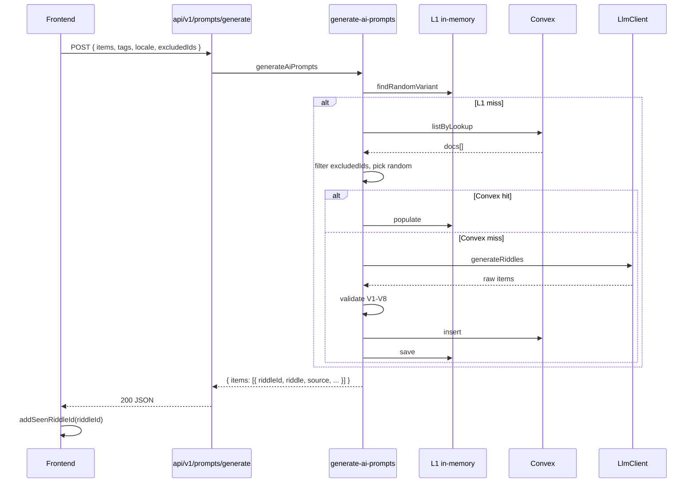

# PRD — Persistencia de riddles en Convex (modo AI trivia)

**Estado:** aprobado para descomposición en plan/tasks
**Fecha:** 2026-05-23
**Idioma del documento:** español
**Audiencia:** desarrollo (backend y frontend), QA, planificación de tareas

**Referencias obligadas:**

- Decisión de approach (cerrada): [`./00-decision-persistencia-riddles-convex.md`](./00-decision-persistencia-riddles-convex.md) — D1–D9
- PRD del modo AI trivia (vigente salvo persistencia): [`../modo-ai-trivia/01-prd-modo-ai-trivia.md`](../modo-ai-trivia/01-prd-modo-ai-trivia.md)
- Setup Convex + Vercel: [`../convex-setup/00-entorno-convex-vercel.md`](../convex-setup/00-entorno-convex-vercel.md)
- Reglas del repo: `.cursor/rules/docs-tasks-conventions.mdc`, `.cursor/rules/core.mdc`, `.cursor/rules/privacy.mdc`, `.cursor/rules/api-conventions.mdc`, `.cursor/rules/database-conventions.mdc`

---

## 0. Cambios respecto a iteraciones previas

| Origen | Decisión previa | Estado en esta iteración |
|--------|-----------------|--------------------------|
| `modo-ai-trivia/01-prd` §2 *Persistencia* | No hay DB; caché in-memory compartida con `learn/` | **Sustituida:** tabla `riddles` en Convex; L1 in-memory opcional (D6). `learn/` no migra (D1). |
| `modo-ai-trivia/01-prd` §2 *Caché servidor* | Clave `aiTrivia:iso2:tag:locale`, TTL 30 días | **Sustituida:** índice `by_lookup` en Convex; sin TTL (D3). Múltiples variantes por trio (D2). |
| `modo-ai-trivia/01-prd` RF-B43..B45 | Cache-first 1:1, TTL 30 días, URL armada en respuesta | **Sustituidas** por RF-B60..B68 de este PRD. |
| `modo-ai-trivia/01-prd` RF-B46 | `AiPromptItem` sin `riddleId` | **Extendido:** campo obligatorio `riddleId` (RF-B66). |
| `modo-ai-trivia/01-prd` RNF-E06 | Edge Config / KV en fase 2 | **Cumplida** con Convex + puerto `RiddleRepository`. |
| `modo-ai-trivia/01-prd` §8.1 | DB fuera de alcance | **Entra al alcance** de esta iteración. |
| `shared/ai-trivia-api.ts` | Request sin `excludedIds` | **Extendido** (RF-B61, RF-F70..F72). |

Todo lo no listado aquí (validaciones V1–V8, `LlmClient`, UI de tags, 3 intentos, scoring, rate limit por IP) **sigue vigente** en el PRD del modo AI trivia.

---

## 1. Resumen

Esta iteración **reemplaza la caché in-memory con TTL** del endpoint `POST /v1/prompts/generate` por **persistencia en Convex** de riddles ya validados (approach B del modo AI trivia). El catálogo crece con el uso: cada `(iso2, tag, locale)` puede tener **varias variantes** (documentos distintos). El jugador no repite riddles en el mismo dispositivo gracias a **`excludedIds`** en `localStorage`.

**No cambia:** generación LLM, validaciones V1–V8, flujo de juego, Setup, scoring, rate limit por IP.

**Sí cambia:** capa de almacenamiento (`RiddleRepository`), esquema Convex, contrato HTTP (request/response), cliente HTTP y mapeo a `Round` (incluye `riddleId` para dedupe).

---

## 2. Decisiones de producto (cerradas)

| Tema | Decisión | Ref. |
|------|----------|------|
| Scope | Solo modo AI trivia; `learn/` sin cambios | D1 |
| Almacén | Convex tabla `riddles`; L1 in-memory por proceso | D2, D5, D6 |
| Expiración | Persistencia indefinida; sin TTL ni cron | D3 |
| Dedupe | Cliente: `localStorage` + `excludedIds` en request | D4 |
| Re-validación | No on-read en v1 | D7 |
| Rate limit | Sin cambios (IP, bucket `prompts:`) | D9 |
| Selección de variante | Aleatorio uniforme entre documentos con `_id ∉ excludedIds` | Este PRD §2.1 |
| `validationVersion` v1 | Constante `1` en server al persistir | Este PRD §2.2 |
| `justification` | Solo en Convex; **nunca** en respuesta API ni bundle | D2, RNF-S02 |

### 2.1 Selección entre variantes

Para cada `(iso2, tag, locale)` del batch:

1. Consultar L1, luego Convex (`by_lookup`), obteniendo candidatos cuyo `_id` no esté en `excludedIds`.
2. Si hay ≥ 1 candidato → elegir **uno al azar** (mismo RNG que tag assignment si hay `seed`; si no, `Math.random` del deps).
3. Si no hay candidatos → **miss** → LLM + validación + `save` (nueva fila en Convex + L1).

No hay límite de variantes por trio en v1 (solo límites de Convex free tier en la práctica).

### 2.2 Versión de validación

- `AI_TRIVIA_VALIDATION_VERSION = 1` exportada desde `server/prompts/ai-trivia-constants.ts`.
- Todo riddle persistido lleva `validationVersion: 1`.
- Un bump futuro (v2) implica job batch o invalidación manual; **fuera de alcance v1** (D7).

---

## 3. User stories

### US-01 — Riddles que sobreviven al deploy

**Como** operador,
**quiero** que los riddles validados persistan entre invocaciones y deploys de Vercel,
**para** reducir llamadas al LLM y latencia en partidas repetidas.

### US-02 — No repetir la misma adivinanza en el mismo dispositivo

**Como** jugador que ya jugó varias partidas en modo AI,
**quiero** que el juego evite mostrarme riddles que ya vi,
**para** que la experiencia no se sienta repetitiva.

### US-03 — Variantes nuevas cuando agoté las vistas

**Como** jugador que ya vio todas las variantes guardadas para un país/tag,
**quiero** que el sistema genere una nueva adivinanza,
**para** poder seguir jugando sin quedarme bloqueado.

### US-04 — Misma API para el frontend

**Como** desarrollador frontend,
**quiero** seguir usando `POST /v1/prompts/generate` sin Convex en el bundle,
**para** no exponer credenciales ni acoplar el cliente a otro proveedor.

---

## 4. Requisitos funcionales y criterios de aceptación

**Convenciones de ID:** `RF-B##` backend/Convex, `RF-F##` frontend, `RF-I##` integración. Los RF del PRD AI trivia con prefijo igual **siguen vigentes** salvo los explícitamente sustituidos por RF-B60+.

---

### 4.1 Backend — Esquema Convex (`convex/`)

| ID | Requisito | Criterios de aceptación |
|----|-----------|-------------------------|
| RF-B60 | **Tabla `riddles`** | `convex/schema.ts` define tabla `riddles` con campos de D2: `iso2`, `tag`, `locale`, `riddle`, `source` (objeto con `origin`, `url`, `title`, `locale`), `difficulty`, `justification`, `llmProvider`, `validationVersion`, `createdAt`. Validadores Convex (`v.string()`, `v.union`, etc.). |
| RF-B61 | **Índice `by_lookup`** | Índice sobre `['iso2', 'tag', 'locale']` para listar variantes de un trio. |
| RF-B62 | **Índice `by_origin`** | Índice sobre `['source.origin', 'createdAt']` para auditoría (D2). |
| RF-B63 | **Queries/mutations mínimas** | En `convex/riddles.ts` (o equivalente): `listByLookup(iso2, tag, locale)` → documentos; `insert(doc)` → `_id`. Sin lógica de negocio (validación V1–V8 queda en `server/prompts/`). |
| RF-B64 | **URL Wikipedia persistida** | Al persistir, `source.url` se construye **una vez** con la misma regla que hoy usa `generate-ai-prompts.ts` (`https://{locale}.wikipedia.org/wiki/{encodeURIComponent(title.replace(/ /g, '_'))}`), HTTPS, dominio `*.wikipedia.org`. En cache hit, la respuesta API usa **ese** `url` guardado (no recalcular). |
| RF-B65 | **`source.origin`** | Siempre `"wikipedia"` en v1. |
| RF-B66 | **Deploy Convex en Vercel** | Documentado en plan/deploy: Build Command `npx convex deploy --cmd 'npm run build'` cuando esta feature esté en `main`; `CONVEX_URL` y `CONVEX_DEPLOY_KEY` según `convex-setup/`. |

---

### 4.2 Backend — `RiddleRepository` y L1

| ID | Requisito | Criterios de aceptación |
|----|-----------|-------------------------|
| RF-B70 | **Puerto `RiddleRepository`** | `server/prompts/riddle-repository.ts` exporta interfaz con al menos: `findRandomVariant(input: FindVariantInput): Promise<StoredRiddle \| undefined>` y `save(input: SaveRiddleInput): Promise<string>` (retorna `riddleId`). `FindVariantInput` incluye `iso2`, `tag`, `locale`, `excludedIds`, `random`. |
| RF-B71 | **Adaptador Convex** | `riddle-repository-convex.ts` usa `ConvexHttpClient` + `CONVEX_URL` (solo servidor). Errores de red/Convex → código estable `CONVEX_UNAVAILABLE` (503) o se degrada según política acordada en plan (documentar: preferir fallar el batch si Convex cae en miss, no inventar riddle). |
| RF-B72 | **Adaptador in-memory (tests)** | `riddle-repository-in-memory.ts` implementa el mismo puerto para Vitest sin red. |
| RF-B73 | **L1 write-through** | `createRiddleRepositoryWithL1(inner)` (o equivalente): en `save`, escribe Convex luego L1; en `findRandomVariant`, L1 primero, luego Convex, populate L1 en hit. L1 **sin TTL** (proceso); al morir la Function, L1 se vacía. |
| RF-B74 | **Deprecar caché 1:1 con TTL** | `createAiTriviaCache` / `AI_TRIVIA_CACHE_TTL_MS` dejan de usarse en el camino productivo de `generate-ai-prompts`. Tests que dependían del TTL se migran a `RiddleRepositoryInMemory`. El archivo puede eliminarse o quedar solo si hay referencias legacy hasta el plan. |
| RF-B75 | **`GenerateAiPromptsDeps`** | El deps expone `riddleRepository: RiddleRepository` en lugar de (o además de, durante migración breve) `cache: AiTriviaCache`. Factory en `create-default-prompts-deps.ts` compone L1 + Convex. |

---

### 4.3 Backend — Orquestación y HTTP (sustituye RF-B43..B45 del PRD viejo)

| ID | Requisito | Criterios de aceptación |
|----|-----------|-------------------------|
| RF-B80 | **Request extendido** | Body acepta `excludedIds?: string[]` (opcional; default `[]`). Máximo `MAX_EXCLUDED_IDS = 500` ids; si se excede → `400 INVALID_REQUEST`. Cada id: string no vacía, longitud ≤ 64 (formato opaco Convex). |
| RF-B81 | **Cache-first por variante** | Por cada ítem del batch: `findRandomVariant` antes de LLM. Hit → no llama al proveedor para ese ítem. |
| RF-B82 | **Persistencia post-validación** | Tras V1–V8 OK, `save` con todos los campos de D2 + `llmProvider` activo + `validationVersion: AI_TRIVIA_VALIDATION_VERSION` + `createdAt: deps.now()`. |
| RF-B83 | **Response extendido** | Cada `AiPromptItem` incluye `riddleId: string` (el `_id` de Convex como string). `source` mantiene `{ title, locale, url }` (sin `origin` en API v1 — opcional añadir en v2). `justification` **ausente** del JSON de respuesta. |
| RF-B84 | **Métricas de capa** | Logger emite `cache_hit_l1`, `cache_hit_l2`, `cache_miss` (y deja de emitir solo `cache_hit_ratio` agregado sin desglose). Ver RNF-T10. |
| RF-B85 | **Código de error Convex** | `CONVEX_UNAVAILABLE` en `AiPromptsApiErrorCode`; HTTP 503; mensaje genérico al cliente. |

---

### 4.4 Frontend — Dedupe en cliente

| ID | Requisito | Criterios de aceptación |
|----|-----------|-------------------------|
| RF-F70 | **Almacén local** | `src/services/ai-trivia-seen-ids.ts` (o nombre equivalente) exporta `getSeenRiddleIds(locale)`, `addSeenRiddleId(locale, id)`, `clearSeenRiddleIds(locale)` opcional para debug. Clave: `aiTrivia:seenIds:<locale>` (D4). |
| RF-F71 | **Request con exclusión** | `prompts-api-client` envía `excludedIds: getSeenRiddleIds(locale)` en cada `generateAiPrompts`. |
| RF-F72 | **Registrar tras uso** | Tras mapear ítems a pool/rondas (o al cerrar la ronda que usó ese riddle), `addSeenRiddleId` con el `riddleId` del ítem. Política: registrar cuando el ítem entra al pool de la partida (mínimo: al asignar `Round.prompt`). |
| RF-F73 | **`Round` opcional `riddleId`** | `Round` puede llevar `readonly riddleId?: string` para trazabilidad; no obligatorio para UI v1. |
| RF-F74 | **Sin regresión modos estándar** | `country` / `capital` no leen ni escriben `aiTrivia:seenIds`. |

---

### 4.5 Integración (`shared/`)

| ID | Requisito | Criterios de aceptación |
|----|-----------|-------------------------|
| RF-I10 | **Tipos compartidos** | `shared/ai-trivia-api.ts`: `AiPromptsRequest` con `excludedIds?: readonly string[]`; `AiPromptItem` con `riddleId: string`. Parser del cliente rechaza respuestas sin `riddleId`. |
| RF-I11 | **`.env.example`** | Documenta `CONVEX_URL` (servidor) sin valores reales; referencia a `convex-setup/`. No añadir `VITE_CONVEX_*` al flujo del front. |

---

## 5. Requisitos no funcionales

### 5.1 Rendimiento

| ID | Requisito |
|----|-----------|
| RNF-P10 | Cache hit L1 o L2 completo (batch ≤ 10, sin LLM): **p95 ≤ 800 ms** (incluye round-trip Convex en L2). |
| RNF-P11 | Cache miss con LLM: misma meta que RNF-P01 del PRD AI trivia (**p95 ≤ 8 s** para batch inicial). |
| RNF-P12 | Query Convex por trio: una llamada `listByLookup` por miss candidato (o batch query si el plan optimiza); evitar N+1 sin límite en requests > 50 ítems. |

### 5.2 Seguridad y privacidad

| ID | Requisito |
|----|-----------|
| RNF-S10 | `CONVEX_URL` y credenciales Convex solo en env servidor; nunca `VITE_*` para escribir riddles. |
| RNF-S11 | `excludedIds` validados como opacos; el server no interpreta ni loguea la lista completa en producción (solo `excludedIds_count`). |
| RNF-S12 | `justification` no sale en API ni logs de producción (hereda RNF-S02 / RF-B15). |
| RNF-S13 | URLs en `source.url` solo `https://*.wikipedia.org/*` al persistir. |

### 5.3 Mantenibilidad

| ID | Requisito |
|----|-----------|
| RNF-E10 | Tipos de documento Convex alineados con `convex/_generated/dataModel.d.ts`; el adaptador importa `Doc<'riddles'>` o equivalente. |
| RNF-E11 | Tests de `generate-ai-prompts` usan `RiddleRepositoryInMemory`, no Convex live. |
| RNF-E12 | `commitear` `convex/_generated/` tras cambiar schema (ver `convex-setup/` §5). |

### 5.4 Observabilidad y pruebas

| ID | Requisito |
|----|-----------|
| RNF-T10 | Métricas: `ai_trivia.cache_hit_l1`, `ai_trivia.cache_hit_l2`, `ai_trivia.cache_miss`, `ai_trivia.convex_errors{code}`. Sin PII. |
| RNF-T11 | Vitest: `riddle-repository-in-memory.test.ts` (save + findRandomVariant + excludedIds); `generate-ai-prompts.test.ts` actualizado (hit L2, miss + save, excludedIds agota variantes → LLM). |
| RNF-T12 | Vitest: `ai-trivia-seen-ids.test.ts` (localStorage mock). |
| RNF-T13 | Vitest: `prompts-api-client.test.ts` envía/recibe `riddleId` y `excludedIds`. |
| RNF-T14 | Smoke: `npx convex run ping:health` + insert/list manual documentado en plan. |
| RNF-T15 | Playwright e2e AI trivia (mock): actualizar fixtures con `riddleId`; verificar que segundo request con `excludedIds` pide otro id si el mock devuelve catálogo. |
| RNF-T16 | Regresión `country`/`capital` e2e sin cambios. |

---

## 6. Arquitectura

### 6.1 Flujo (cache miss)



### 6.2 Archivos previstos

```
convex/
  schema.ts              # tabla riddles + índices
  riddles.ts             # listByLookup, insert

server/prompts/
  riddle-repository.ts
  riddle-repository-convex.ts
  riddle-repository-in-memory.ts
  riddle-repository-l1.ts          # decorador L1 (opcional archivo separado)
  create-default-prompts-deps.ts   # wire Convex + L1
  generate-ai-prompts.ts           # usa RiddleRepository
  # ai-trivia-cache.ts             # eliminar o dejar sin uso productivo

shared/
  ai-trivia-api.ts                 # excludedIds, riddleId

src/services/
  ai-trivia-seen-ids.ts
  prompts-api-client.ts            # excludedIds en request
  map-ai-items-to-pool.ts          # propagar riddleId si aplica
```

### 6.3 Forma persistida vs respuesta API

| Campo Convex | En respuesta `AiPromptItem` |
|--------------|----------------------------|
| `_id` | `riddleId` |
| `riddle` | `riddle` |
| `source.title`, `source.locale`, `source.url` | `source.{ title, locale, url }` |
| `difficulty` | `difficulty` |
| `iso2`, `tag` | `iso2`, `tag` |
| `justification`, `llmProvider`, `validationVersion`, `createdAt` | **no** |

---

## 7. Fuera de alcance (esta iteración)

Heredado de [`00-decision-persistencia-riddles-convex.md`](./00-decision-persistencia-riddles-convex.md) §15, más:

- Cambios en `server/learn/` o caché Wikipedia del modo aprendizaje.
- Endpoint admin HTTP de borrado/invalidación.
- Re-validación on-read o job `validationVersion`.
- Dedupe multi-device / auth.
- Exponer `origin` en `AiPromptSource` al cliente (opcional v2).
- Migración de datos desde caché in-memory antigua (no hay datos que migrar; arranque en frío).

---

## 8. Definición de Done

**Fase 1 — Implementación en repo + local**

- [ ] `convex/schema.ts` con `riddles` + índices; `convex/riddles.ts`; `_generated/` commiteado.
- [ ] `RiddleRepository` + adaptadores Convex e in-memory + L1.
- [ ] `generate-ai-prompts` integrado; tests Vitest verdes.
- [ ] `shared/ai-trivia-api.ts` con `riddleId` y `excludedIds`.
- [ ] Frontend: `ai-trivia-seen-ids`, cliente HTTP, registro de ids vistos.
- [ ] Métricas `cache_hit_l1` / `l2` / `miss` en logger.
- [ ] `.env.example` actualizado; smoke local con `npm run convex:dev` + `vercel dev` + `npx convex run ping:health`.
- [ ] Código muerto de `ai-trivia-cache` retirado o sin referencias productivas.

**Fase 2 — Deploy**

- [ ] Vercel Build con `npx convex deploy --cmd 'npm run build'` (si no estaba ya activo).
- [ ] `CONVEX_URL` en Preview/Production apuntando a deployment **prod** de Convex.
- [ ] Smoke HTTPS: segundo request con `excludedIds` devuelve otro `riddleId` cuando hay ≥ 2 variantes en Convex.

---

## 9. Orden sugerido de tareas (para `02-plan`)

1. **Convex:** `schema.ts` + `riddles.ts` + deploy dev + smoke `ping` / insert.
2. **`RiddleRepository`:** puerto + in-memory + tests.
3. **Adaptador Convex** + L1 decorador + factory en `create-default-prompts-deps`.
4. **`generate-ai-prompts`:** sustituir `deps.cache` por `riddleRepository`; métricas.
5. **`shared/` + handler:** validar `excludedIds`; respuesta con `riddleId`; `CONVEX_UNAVAILABLE`.
6. **Frontend:** `ai-trivia-seen-ids` + cliente + pool/rondas.
7. **Tests:** Vitest + Playwright fixtures; regresión modos estándar.
8. **Limpieza:** retirar `ai-trivia-cache` productivo; actualizar `convex-setup/` §6 con link a este PRD.
9. **Deploy Fase 2** (checklist breve en `03-deploy-riddle-storage.md` cuando exista).

---

## 10. Glosario

- **`riddleId`:** string opaco (`Id<'riddles'>`) devuelto al cliente para dedupe.
- **`excludedIds`:** ids que el cliente ya mostró; el server no los reutiliza si hay alternativas.
- **`StoredRiddle`:** forma interna del repositorio (incluye campos no expuestos al API).
- **Variante:** un documento `riddles` con el mismo `(iso2, tag, locale)` que otros pero distinto `_id` y texto.
