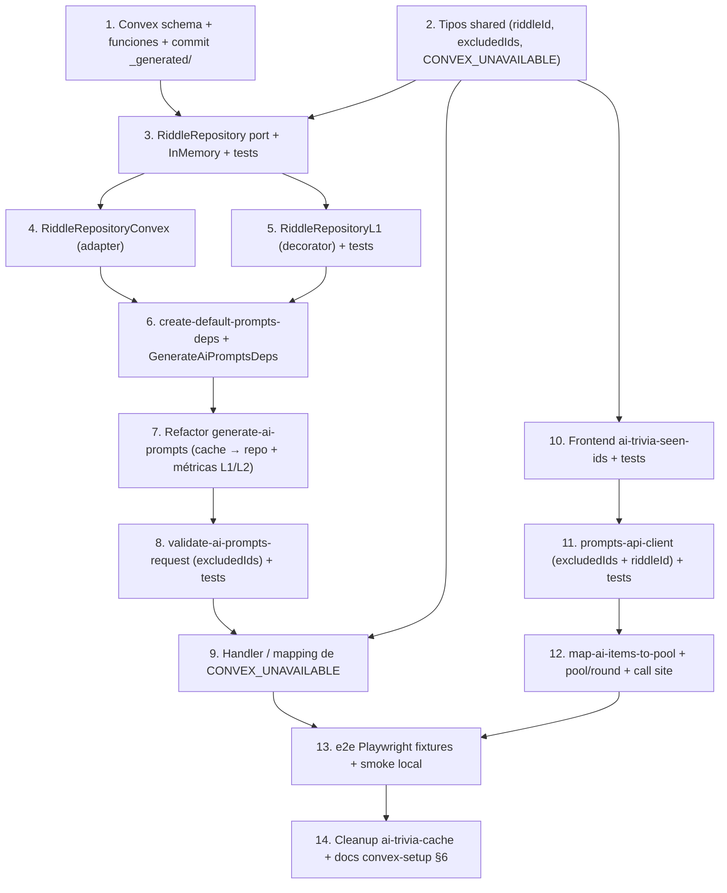

# Plan de implementación — Persistencia de riddles en Convex

Referencias: PRD [`docs/tasks/backend-related-features/riddle-storage-convex/01-prd-riddle-storage-convex.md`](docs/tasks/backend-related-features/riddle-storage-convex/01-prd-riddle-storage-convex.md), decisión [`00-decision-persistencia-riddles-convex.md`](docs/tasks/backend-related-features/riddle-storage-convex/00-decision-persistencia-riddles-convex.md), setup [`convex-setup/00-entorno-convex-vercel.md`](docs/tasks/backend-related-features/convex-setup/00-entorno-convex-vercel.md).

---

## 1. Database schema design (Convex)

### Archivo nuevo: [`convex/schema.ts`](convex/schema.ts) — sustituye el `defineSchema({})` actual.

Tabla `riddles` (D2 del PRD), una sola tabla, sin tablas auxiliares en v1.

```ts
import { defineSchema, defineTable } from 'convex/server'
import { v } from 'convex/values'

export default defineSchema({
  riddles: defineTable({
    iso2: v.string(),
    tag: v.string(),
    locale: v.union(v.literal('es'), v.literal('en')),
    riddle: v.string(),
    source: v.object({
      origin: v.literal('wikipedia'),
      url: v.string(),
      title: v.string(),
      locale: v.union(v.literal('es'), v.literal('en')),
    }),
    difficulty: v.union(v.literal('easy'), v.literal('medium'), v.literal('hard')),
    justification: v.string(),
    llmProvider: v.string(),
    validationVersion: v.number(),
    createdAt: v.number(),
  })
    .index('by_lookup', ['iso2', 'tag', 'locale'])
    .index('by_origin', ['source.origin', 'createdAt']),
})
```

- `_id` y `_creationTime` los genera Convex; usamos nuestro `createdAt` para auditoría.
- Índices `by_lookup` y `by_origin` (RF-B61, RF-B62).

### Archivo nuevo: [`convex/riddles.ts`](convex/riddles.ts)

Funciones mínimas (sin lógica de negocio) consumidas por el server (RF-B63):

```ts
import { v } from 'convex/values'
import { mutation, query } from './_generated/server.js'

export const listByLookup = query({
  args: {
    iso2: v.string(),
    tag: v.string(),
    locale: v.union(v.literal('es'), v.literal('en')),
  },
  handler: async (ctx, { iso2, tag, locale }) =>
    ctx.db
      .query('riddles')
      .withIndex('by_lookup', (q) =>
        q.eq('iso2', iso2).eq('tag', tag).eq('locale', locale),
      )
      .collect(),
})

export const insert = mutation({
  args: { /* todos los campos de la tabla, sin `_id` ni `_creationTime` */ },
  handler: async (ctx, doc) => ctx.db.insert('riddles', doc),
})
```

### Regenerar `_generated/` y commitearlo

Tras editar `schema.ts` / `riddles.ts`: correr `npm run convex:dev` (Terminal 1) una vez para regenerar `convex/_generated/api.d.ts` y `dataModel.d.ts`, y commitearlos (regla `convex-setup/` §5).

---

## 2. API endpoint design (cambios al contrato HTTP)

Ruta única: **`POST /api/v1/prompts/generate`** ([`api/v1/prompts/generate.ts`](api/v1/prompts/generate.ts) — no se renombra). Solo se extienden request, response y errores. Rate limit (`apply-prompts-rate-limit.ts`) y CORS sin cambios (D9).

### Request (extendido — RF-B80)

```jsonc
{
  "items": [{ "iso2": "AR" }],
  "tags": ["historia"],
  "locale": "es",
  "seed": 1234,
  "excludedIds": ["k73abc...", "k73def..."]  // NUEVO, opcional, default []
}
```

Validación adicional en [`server/prompts/validate-ai-prompts-request.ts`](server/prompts/validate-ai-prompts-request.ts):

- `excludedIds` opcional; si presente debe ser `string[]`.
- `excludedIds.length <= MAX_EXCLUDED_IDS` (nueva constante = `500`); si no → `400 INVALID_REQUEST`.
- Cada id: `typeof === 'string'`, no vacío, `length <= 64`; si no → `400 INVALID_REQUEST`.
- Dedupe internamente al `Set<string>` para evitar duplicados sin fallar.

### Response (extendido — RF-B83)

```jsonc
{
  "items": [
    {
      "riddleId": "k73abc...",  // NUEVO, obligatorio
      "iso2": "AR",
      "tag": "historia",
      "riddle": "...",
      "difficulty": "medium",
      "source": { "title": "...", "locale": "es", "url": "https://..." }
    }
  ]
}
```

`justification` y `origin` siguen sin salir al cliente en v1 (RNF-S12).

### Errores

Agregar `CONVEX_UNAVAILABLE` a [`shared/ai-trivia-api.ts`](shared/ai-trivia-api.ts) `AiPromptsApiErrorCode` y mapearlo a HTTP `503` en `aiPromptsErrorHttpStatus` (RF-B85). Mensaje genérico al cliente.

---

## 3. Service architecture (server)

```mermaid
flowchart LR
  Handler["api/v1/prompts/generate.ts"] --> HandleAi["handle-ai-prompts-post.ts"]
  HandleAi --> GenAi["generate-ai-prompts.ts"]
  GenAi -.deps.cache.-x OldCache["ai-trivia-cache.ts (deprecated)"]
  GenAi -->|deps.riddleRepository| Repo["RiddleRepository (port)"]
  Repo -.findRandomVariant + save.-> L1["RiddleRepositoryL1 (decorator)"]
  L1 --> Convex["RiddleRepositoryConvex"]
  L1 --> InMem["RiddleRepositoryInMemory (tests)"]
  Convex -->|ConvexHttpClient| ConvexCloud[("convex/riddles.ts")]
```

### 3.1 Puerto `RiddleRepository` — archivo nuevo [`server/prompts/riddle-repository.ts`](server/prompts/riddle-repository.ts)

```ts
import type { AppLocale } from '../../shared/app-locale.js'
import type { AiTriviaTagId } from '../../shared/ai-trivia-tags-schema.js'
import type { AiPromptDifficulty } from '../../shared/ai-trivia-api.js'

export interface StoredRiddleSource {
  readonly origin: 'wikipedia'
  readonly url: string
  readonly title: string
  readonly locale: AppLocale
}

export interface StoredRiddle {
  readonly id: string                    // _id de Convex como string opaco
  readonly iso2: string
  readonly tag: AiTriviaTagId
  readonly locale: AppLocale
  readonly riddle: string
  readonly source: StoredRiddleSource
  readonly difficulty: AiPromptDifficulty
  readonly justification: string
  readonly llmProvider: string
  readonly validationVersion: number
  readonly createdAt: number
}

export interface FindRandomVariantInput {
  readonly iso2: string
  readonly tag: AiTriviaTagId
  readonly locale: AppLocale
  readonly excludedIds: ReadonlySet<string>
  readonly random: () => number
}

export type FindRandomVariantOutcome =
  | { readonly kind: 'hit'; readonly riddle: StoredRiddle; readonly layer: 'l1' | 'l2' }
  | { readonly kind: 'miss' }
  | { readonly kind: 'unavailable' }   // mapea a CONVEX_UNAVAILABLE en orquestador

export interface SaveRiddleInput {
  readonly iso2: string
  readonly tag: AiTriviaTagId
  readonly locale: AppLocale
  readonly riddle: string
  readonly source: StoredRiddleSource
  readonly difficulty: AiPromptDifficulty
  readonly justification: string
  readonly llmProvider: string
  readonly validationVersion: number
  readonly createdAt: number
}

export interface RiddleRepository {
  findRandomVariant(input: FindRandomVariantInput): Promise<FindRandomVariantOutcome>
  save(input: SaveRiddleInput): Promise<StoredRiddle>
}
```

### 3.2 Adaptador in-memory (tests) — [`server/prompts/riddle-repository-in-memory.ts`](server/prompts/riddle-repository-in-memory.ts)

- `Map<string, StoredRiddle[]>` por clave `iso2|tag|locale`.
- `save` genera `id` opaco (`mem-${counter}`), append a la lista.
- `findRandomVariant` filtra por `excludedIds`, devuelve `{ kind: 'hit', layer: 'l2', riddle }` si hay candidatos (el "layer" reportado es `l2` desde el punto de vista del decorador L1).

### 3.3 Adaptador Convex — [`server/prompts/riddle-repository-convex.ts`](server/prompts/riddle-repository-convex.ts)

```ts
import { ConvexHttpClient } from 'convex/browser'
import { api } from '../../convex/_generated/api.js'
import type { Doc, Id } from '../../convex/_generated/dataModel.js'
// ...
export function createRiddleRepositoryConvex(opts: {
  convexUrl: string
}): RiddleRepository {
  const client = new ConvexHttpClient(opts.convexUrl)
  return {
    async findRandomVariant({ iso2, tag, locale, excludedIds, random }) {
      try {
        const docs = (await client.query(api.riddles.listByLookup, {
          iso2, tag, locale,
        })) as Doc<'riddles'>[]
        const candidates = docs.filter((d) => !excludedIds.has(d._id))
        if (candidates.length === 0) return { kind: 'miss' }
        const picked = candidates[Math.floor(random() * candidates.length)]
        return { kind: 'hit', layer: 'l2', riddle: docToStored(picked) }
      } catch {
        return { kind: 'unavailable' }
      }
    },
    async save(input) {
      const id = (await client.mutation(api.riddles.insert, input)) as Id<'riddles'>
      return { ...input, id }
    },
  }
}
```

- `Doc<'riddles'>` y `Id<'riddles'>` desde `convex/_generated/dataModel.js` (cumple RNF-E10).
- Errores de red: cualquier throw del `ConvexHttpClient` → `{ kind: 'unavailable' }` en `findRandomVariant`; en `save` propaga (la captura sucede en el orquestador y se loguea como `convex_errors`).

### 3.4 Decorador L1 — [`server/prompts/riddle-repository-l1.ts`](server/prompts/riddle-repository-l1.ts)

```ts
export function createRiddleRepositoryWithL1(inner: RiddleRepository): RiddleRepository {
  const l1 = new Map<string, StoredRiddle[]>()
  const key = (i: string, t: string, l: string) => `${i}|${t}|${l}`
  return {
    async findRandomVariant(input) {
      const bucket = l1.get(key(input.iso2, input.tag, input.locale)) ?? []
      const localCandidates = bucket.filter((r) => !input.excludedIds.has(r.id))
      if (localCandidates.length > 0) {
        const picked = localCandidates[Math.floor(input.random() * localCandidates.length)]
        return { kind: 'hit', riddle: picked, layer: 'l1' }
      }
      const outcome = await inner.findRandomVariant(input)
      if (outcome.kind === 'hit') {
        const arr = l1.get(key(outcome.riddle.iso2, outcome.riddle.tag, outcome.riddle.locale)) ?? []
        if (!arr.some((r) => r.id === outcome.riddle.id)) arr.push(outcome.riddle)
        l1.set(key(outcome.riddle.iso2, outcome.riddle.tag, outcome.riddle.locale), arr)
      }
      return outcome
    },
    async save(input) {
      const saved = await inner.save(input)
      const arr = l1.get(key(saved.iso2, saved.tag, saved.locale)) ?? []
      arr.push(saved)
      l1.set(key(saved.iso2, saved.tag, saved.locale), arr)
      return saved
    },
  }
}
```

- L1 **sin TTL** (D6), muere con el proceso.
- Reporta `layer: 'l1'` cuando hay candidato local; cuando va a Convex, devuelve el `layer` del inner (típicamente `'l2'`).

### 3.5 Wiring — modificar [`server/prompts/create-default-prompts-deps.ts`](server/prompts/create-default-prompts-deps.ts)

- Quitar `createAiTriviaCache` (RF-B74).
- Crear `sharedRepository` con `createRiddleRepositoryWithL1(createRiddleRepositoryConvex({ convexUrl: process.env.CONVEX_URL }))`.
- Si `CONVEX_URL` falta: lanzar al primer uso un error claro (`Missing CONVEX_URL`) — captura ya cubre el caso vía `kind: 'unavailable'` pero queremos diagnóstico explícito en local.
- `resetDefaultPromptsDepsForTests()` resetea el repo compartido.

### 3.6 Tipos de `GenerateAiPromptsDeps` — modificar [`server/prompts/prompts-deps.ts`](server/prompts/prompts-deps.ts)

- Reemplazar `readonly cache: AiTriviaCache` por `readonly riddleRepository: RiddleRepository`.
- Mantener `AiTriviaCache` exportado durante la migración para no romper imports legacy (luego se elimina en paso 8).

### 3.7 Orquestación — modificar [`server/prompts/generate-ai-prompts.ts`](server/prompts/generate-ai-prompts.ts)

Cambios concretos (RF-B81..B84):

1. En lugar de `deps.cache.get(...)`, llamar `deps.riddleRepository.findRandomVariant({ iso2, tag, locale, excludedIds, random })` por cada `(iso2, tag)` del batch.
2. Si `outcome.kind === 'unavailable'` → cortocircuito: marcar todo el batch como `unavailable` y devolver `aiPromptsFailure('CONVEX_UNAVAILABLE', '...')` (similar al patrón LLM_UNAVAILABLE actual).
3. Si `outcome.kind === 'hit'` → mapear `StoredRiddle` → `AiPromptItem` (incluye `riddleId: stored.id`); emitir `cache_hit_l1` o `cache_hit_l2` según `outcome.layer`.
4. Si `outcome.kind === 'miss'` → el item entra a `cacheMisses` y se procesa como hoy (LLM + validación V1–V8).
5. Tras V1–V8 OK, en vez de `deps.cache.set(...)` llamar `deps.riddleRepository.save({ ...campos, llmProvider, validationVersion: AI_TRIVIA_VALIDATION_VERSION, createdAt: deps.now() })`. La URL Wikipedia se calcula **en `save`** (o antes, en el orquestador) con la misma regla actual de `buildAiPromptItem` (RF-B64). El `StoredRiddle` retornado da el `riddleId` para la respuesta.
6. Construir `AiPromptItem` con el nuevo campo `riddleId` (RF-B83) y excluir `justification`.

### 3.8 Constantes — modificar [`server/prompts/ai-trivia-constants.ts`](server/prompts/ai-trivia-constants.ts)

- Agregar `export const AI_TRIVIA_VALIDATION_VERSION = 1` (PRD §2.2).
- Agregar `export const MAX_EXCLUDED_IDS = 500` (RF-B80).
- Marcar `AI_TRIVIA_CACHE_TTL_MS` como deprecated en comentario; lo elimina el paso 8 cuando ya no haya referencias.

### 3.9 Métricas — modificar [`server/prompts/ai-trivia-logger.ts`](server/prompts/ai-trivia-logger.ts)

- Reemplazar `recordCacheHit` por `recordCacheHitL1` / `recordCacheHitL2` (RNF-T10).
- Agregar `recordConvexError(code)`.
- Mantener `recordCacheMiss` (sigue válido).

---

## 4. Background job design

**No hay jobs ni workers en v1** (D3, D7). Decisiones explícitas:

- Sin TTL → sin cron de expiración.
- Sin re-validación on-read → sin job batch de `validationVersion`.
- Sin rate-limit en Convex → sigue el motor in-memory de `apply-prompts-rate-limit.ts` (D9).
- Invalidación manual: desde Convex Dashboard (`db.delete`) según D7.

`validationVersion` queda persistido en cada documento para habilitar un job batch **en v2** sin migración de schema; no se construye en esta iteración.

---

## 5. Frontend component breakdown

No se crean componentes React nuevos. Cambios en servicios + un mapper.

### 5.1 Nuevo servicio — [`src/services/ai-trivia-seen-ids.ts`](src/services/ai-trivia-seen-ids.ts) (RF-F70)

```ts
import type { AppLocale } from '../i18n/app-locale'

const KEY_PREFIX = 'aiTrivia:seenIds:'
const MAX_PER_LOCALE = 500  // alineado con MAX_EXCLUDED_IDS del server

export function getSeenRiddleIds(locale: AppLocale): readonly string[] {
  try {
    const raw = localStorage.getItem(`${KEY_PREFIX}${locale}`)
    if (!raw) return []
    const parsed = JSON.parse(raw) as unknown
    if (!Array.isArray(parsed)) return []
    return parsed.filter((v): v is string => typeof v === 'string').slice(-MAX_PER_LOCALE)
  } catch {
    return []
  }
}

export function addSeenRiddleId(locale: AppLocale, id: string): void {
  if (!id) return
  const current = getSeenRiddleIds(locale)
  if (current.includes(id)) return
  const next = [...current, id].slice(-MAX_PER_LOCALE)
  try { localStorage.setItem(`${KEY_PREFIX}${locale}`, JSON.stringify(next)) } catch {}
}

export function clearSeenRiddleIds(locale: AppLocale): void {
  try { localStorage.removeItem(`${KEY_PREFIX}${locale}`) } catch {}
}
```

- `try/catch` defensivo: SSR, modo privado, quota llena.
- Cap a 500 entradas (window deslizante) para no crecer indefinido.

### 5.2 Cliente HTTP — modificar [`src/services/prompts-api-client.ts`](src/services/prompts-api-client.ts) (RF-F71, RF-I10)

- `FetchAiPromptsInput`: añadir `readonly excludedIds?: readonly string[]`.
- En el `body` del POST: `...(excludedIds && excludedIds.length > 0 ? { excludedIds } : {})`.
- En `parseItem`: requerir `record.riddleId` string no vacía; rechazar si falta (RF-I10).
- Devolver `AiPromptItem` con `riddleId` (extender el tipo).

### 5.3 Tipo `AiPromptItem` — modificar [`shared/ai-trivia-api.ts`](shared/ai-trivia-api.ts)

```ts
export interface AiPromptItem {
  readonly riddleId: string  // NUEVO
  readonly iso2: string
  readonly tag: AiTriviaTagId
  readonly riddle: string
  readonly difficulty: AiPromptDifficulty
  readonly source: AiPromptSource
}

export interface AiPromptsRequest {
  // ...
  readonly excludedIds?: readonly string[]  // NUEVO
}
```

### 5.4 Mapper pool — modificar [`src/services/map-ai-items-to-pool.ts`](src/services/map-ai-items-to-pool.ts)

- Propagar `riddleId` al `QuestionPoolItem` (campo opcional `aiRiddleId?: string`) (RF-F73).

### 5.5 `QuestionPoolItem` y `Round` — modificar [`src/services/build-question-pool.ts`](src/services/build-question-pool.ts) + tipos de round

- Añadir `readonly aiRiddleId?: string` a `QuestionPoolItem`.
- En el flujo donde se arma `Round` (`game-round-service.ts`), propagar `riddleId` opcional.

### 5.6 Punto de registro — modificar el punto donde se asignan las rondas AI

- Localizar el caller que arma la sesión AI (probablemente en [`src/services/game-session-service.ts`](src/services/game-session-service.ts) o donde se invoca `fetchAiPrompts`); tras éxito, **iterar `data.items` y llamar `addSeenRiddleId(locale, item.riddleId)` antes de armar el pool**. Política recomendada (PRD §4.4 RF-F72): registrar cuando el item entra al pool, no cuando se cierra la ronda, para que un nuevo request inmediato ya excluya.
- El call site del fetch debe pasar `excludedIds: getSeenRiddleIds(locale)`.

---

## 6. Implementation order with dependencies



Esto reordena ligeramente el orden sugerido del PRD §9 para reducir reescritura de tests intermedios (los tests del repo se escriben **antes** del refactor del orquestador).

---

## 7. Testing strategy

| Capa | Tipo | Archivo | Cubre |
|------|------|---------|-------|
| Convex schema | manual + smoke | `npx convex run ping:health` + dashboard | Validators OK; insert/list desde Dashboard |
| `RiddleRepositoryInMemory` | Vitest unit | nuevo `riddle-repository-in-memory.test.ts` | save → findRandomVariant; respeta excludedIds; múltiples variantes; random distribution |
| `RiddleRepositoryConvex` | sin live test | — | Solo typecheck (importa `api`, `Doc<'riddles'>`); cubierto end-to-end por smoke RNF-T14 |
| `RiddleRepositoryL1` | Vitest unit | nuevo `riddle-repository-l1.test.ts` | hit local sin tocar inner; populate L1 en hit del inner; save write-through; `unavailable` no popula L1 |
| `validate-ai-prompts-request` | Vitest | extender `validate-ai-prompts-request.test.ts` | excludedIds: opcional, default; > 500 ids → INVALID_REQUEST; id no string / vacío / > 64 chars → fail |
| `generate-ai-prompts` | Vitest | reescribir parcial `generate-ai-prompts.test.ts` | Hit L2 sin llamar LLM; miss + save (verifica que se llama `repo.save` con `validationVersion: 1`, `llmProvider`, `createdAt`); `excludedIds` agota variantes → cae al LLM; `unavailable` → `CONVEX_UNAVAILABLE` 503 |
| Logger | Vitest | extender `ai-trivia-logger.test.ts` (si existe; si no, nuevo) | Eventos `cache_hit_l1`, `cache_hit_l2`, `cache_miss`, `convex_errors` |
| `ai-trivia-seen-ids` | Vitest (jsdom) | nuevo `ai-trivia-seen-ids.test.ts` | get vacío; add+get round-trip; dedupe; cap 500; locale separa namespace; JSON corrupto → [] |
| `prompts-api-client` | Vitest | extender `prompts-api-client.test.ts` | Envía `excludedIds` en body cuando hay; parsea `riddleId`; rechaza item sin `riddleId` |
| `map-ai-items-to-pool` | Vitest | extender `map-ai-items-to-pool.test.ts` | Propaga `aiRiddleId` |
| Playwright e2e AI trivia | e2e | extender `e2e/ai-trivia-flow.spec.ts` | (a) fixtures actualizados con `riddleId`; (b) test nuevo: 2 partidas seguidas con catálogo de ≥ 2 variantes → segundo request envía `excludedIds` y backend devuelve `riddleId` distinto (mock route intercepta y verifica body) |
| Regresión `learn/` | Vitest existente | sin cambios | RF-F74 / D1: confirmar que no se rompe nada |
| Smoke prod-like | manual | `vercel dev` + `npm run convex:dev` + curl | Insert real → 2do request con excludedIds → otro `riddleId` |

### Tests que se borran o migran

- [`server/prompts/ai-trivia-cache.test.ts`](server/prompts/ai-trivia-cache.test.ts): se borra junto con `ai-trivia-cache.ts` en el paso 14 (cleanup), o se reescribe contra `RiddleRepositoryInMemory` si el patrón es útil para regression.

---

## 8. Deploy y cleanup (post-implementación)

- Verificar que **Vercel Build Command** sea `npx convex deploy --cmd 'npm run build'` (RF-B66; ya documentado en `convex-setup/` §4).
- `CONVEX_URL` y `CONVEX_DEPLOY_KEY` en Vercel Preview + Production apuntando al deployment **prod** de Convex (no al `dev:unique-echidna-841`).
- Smoke HTTPS post-deploy: segundo request con `excludedIds` devuelve otro `riddleId` cuando hay ≥ 2 variantes.
- Limpieza final: borrar [`server/prompts/ai-trivia-cache.ts`](server/prompts/ai-trivia-cache.ts) y `ai-trivia-cache.test.ts` (RF-B74); quitar `AI_TRIVIA_CACHE_TTL_MS`; quitar `AiTriviaCache` y `AiTriviaCacheKey` de `prompts-deps.ts` cuando no haya consumidores; actualizar `.env.example` con nota sobre `CONVEX_URL` (RF-I11; ya parcialmente cubierto por el bloque actual).

---

## 9. Riesgos a vigilar durante implementación

- **Build sin Convex configurado:** si `CONVEX_URL` falta en local, el handler responde `503 CONVEX_UNAVAILABLE`. Documentar en README del feature folder cómo corre el modo offline (`USE_FAKE_LLM=1` + repo in-memory en dev opcional).
- **Tests Vitest no deben necesitar `convex/_generated/`:** los tests de `riddle-repository-in-memory` no importan `api` ni `dataModel`; solo `RiddleRepositoryConvex` los toca, y para él **no se hace test unit** (decisión consciente; smoke RNF-T14 cubre el adaptador).
- **`_creationTime` vs `createdAt`:** Convex genera `_creationTime` automático; igual persistimos nuestro `createdAt: deps.now()` para que tests con `now` determinista funcionen y para no atar `validationVersion` jobs a un campo del sistema.
- **`source.origin` discriminator en API:** PRD §6.3 lo deja fuera del response en v1. Confirmar en el parser del cliente que **no** se rechace si en algún momento llega (forward compatible).