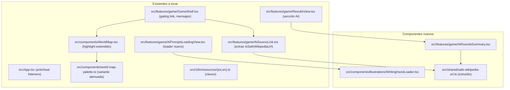
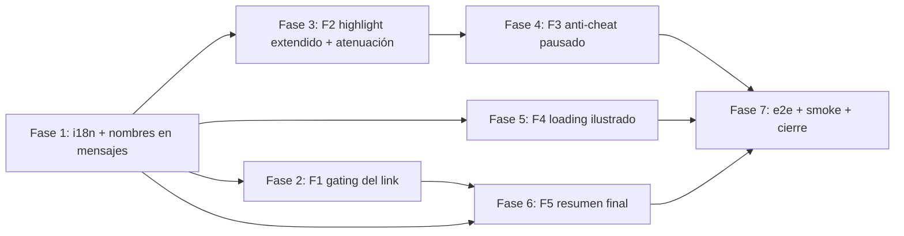

# Plan de implementación — UX feedback modo AI trivia

Documento destino al ejecutar: [`docs/tasks/modo-ai-trivia-ux-feedback/02-plan-implementacion-ux-feedback-modo-ai.md`](docs/tasks/modo-ai-trivia-ux-feedback/02-plan-implementacion-ux-feedback-modo-ai.md).

Sigue el formato checklist por fases del precedente [`riddle-storage-convex/02-plan-implementacion-riddle-storage-convex.md`](docs/tasks/backend-related-features/riddle-storage-convex/02-plan-implementacion-riddle-storage-convex.md). Cada tarea cierra con el ritual obligatorio (§0): Review / Analizar / Errores / Corregir / Testear.

## Frontend component breakdown



- **Componentes nuevos:**
  - `src/components/illustrations/WritingHandLoader.tsx` — SVG inline + `@keyframes` CSS, `aria-hidden`, respeta `prefers-reduced-motion`.
  - `src/features/game/AiRoundsSummary.tsx` — sección por-ronda dentro de `ResultsView` con prompt + país + link + intento + delta de score.
  - Util compartida `safeWikipediaUrl` extraída de `AiSourceLink` (ubicación: `src/shared/` o `src/services/` — a decidir en Tarea 6.2).
- **Componentes existentes a modificar:**
  - `WorldMap.tsx` — extender `MapAnswerFeedback` con `wrongSelectionsIso2?`, actualizar `mapFeedbackShallowEqual`, `worldMapGeographyRowPropsEqual` y `geographyStyleForIso` para pintar N selecciones y atenuar al acertar.
  - `world-map-palette.ts` — derivar `MAP_WRONG_SELECTION_DIMMED_PALETTE` desde `MAP_WRONG_SELECTION_PALETTE` (opacidad ~0.5) — no se cambia el color base.
  - `GameShell.tsx` — gating de `AiSourceLink`, construcción del `mapFeedback` con `wrongSelectionsIso2`, mensajes con nombre de país.
  - `App.tsx` — listeners de anticheat consultan estado de ronda activa.
  - `AiPromptsLoadingView.tsx` — inserta `<WritingHandLoader />` preservando copy/cancel/`role="status"`.
  - `ResultsView.tsx` — renderiza `<AiRoundsSummary />` cuando `questionMode === 'ai'`.
  - `AiSourceLink.tsx` — consume util extraída.
  - `src/i18n/resources/{es,en}.ts` — refactor de claves de feedback + claves nuevas de resumen final.

## Implementation order y dependencias



**Razones de orden:** Fase 1 expone helpers de copy con nombre de país y refactoriza i18n (rompe tests que las fases siguientes ya consumen actualizado). F2 y F5 son independientes y pueden hacerse en cualquier orden. F3 depende de F1 (mensajes con nombre de país consumen los mismos helpers). F4 depende de F3 (cambia `mapFeedback` durante intentos abiertos; la pausa de anticheat se valida con sesiones reales). F6 reutiliza la utilidad extraída en F2 y los helpers de F1. F7 cierra con e2e + docs.

## Detalle por fase

### Fase 1 — i18n y mensajes con nombre de país

- **Tarea 1.1** — Refactor de claves i18n en [`src/i18n/resources/es.ts`](src/i18n/resources/es.ts) y [`src/i18n/resources/en.ts`](src/i18n/resources/en.ts):
  - `game.feedbackWrong`: pasa de `{{iso2}}` a `{{country}}` — ES: "Incorrecto. Era **{{country}}**." / EN: "Incorrect. The answer was **{{country}}**."
  - `game.ai.tryAgain`: pasa a aceptar `{{country}}` y `{{remaining}}` — ES: "**Mal!** Ese es **{{country}}**. Te quedan {{remaining}} intento(s)." / EN: "**Wrong!** That's **{{country}}**. {{remaining}} attempt(s) left."
  - `game.ai.finalWrong`: pasa de `{{iso2}}` a `{{country}}` — ES: "Se agotaron los intentos. Era **{{country}}**." / EN: "Out of attempts. The answer was **{{country}}**."
  - Nueva `game.ai.correct`: "**Bien!** Era **{{country}}**." / "**Correct!** It was **{{country}}**."
  - Nuevas en `results`: `results.ai.summaryHeading`, `results.ai.attemptLabel`, `results.ai.notSolved`, `results.ai.scoreDelta`, `results.ai.sourceLink` (label si reusa fuera de `AiSourceLink`).
- **Tarea 1.2** — Actualizar consumidores de las claves modificadas en [`src/features/game/GameShell.tsx`](src/features/game/GameShell.tsx) (líneas 211-216 actuales): pasar `country = getLocalizedCountryName(catalogCountry, locale)` en lugar de `iso2`. Resolver `catalogCountry` desde `src/data/countries.ts` por `targetCountryCode` y por `last attempt.selectedCountryCode`.
- **Tarea 1.3** — Pequeño helper en `src/features/game/use-localized-country-name.ts` (o función local en `GameShell`) para resolver el nombre dado un ISO2 + locale, encapsulando el catálogo y el fallback a ISO2 entre llaves (RF-F29).
- **Tests:** ampliar [`src/features/game/GameShell.test.tsx`](src/features/game/GameShell.test.tsx) — actualizar el caso que usa `'UY'` para esperar el nombre traducido (con `locale = es`, "Era Uruguay"). Agregar nuevos casos: mensaje intermedio con `{{country}}` + `{{remaining}}`, mensaje "Bien!" con nombre. Actualizar [`src/App.test.tsx`](src/App.test.tsx) si valida copy de error.

### Fase 2 — F1: gating del link de fuente

- **Tarea 2.1** — En [`src/features/game/GameShell.tsx`](src/features/game/GameShell.tsx) línea ~182 (`activeRound.aiSource ? <AiSourceLink … /> : null`): cambiar la condición a `roundGuess && (roundGuess.isCorrect || aiAttemptsUsed >= MAX_AI_ATTEMPTS) && activeRound.aiSource`.
- **Tarea 2.2** — Tests en [`src/features/game/GameShell.test.tsx`](src/features/game/GameShell.test.tsx) — `it('no muestra AiSourceLink con ronda abierta y attempts < MAX')`, `it('muestra AiSourceLink al acertar en intento 2')`, `it('muestra AiSourceLink al agotar 3 intentos sin acierto')`. Construir sesiones helper que incluyan `attempts[]` con datos sintéticos.
- **Sin cambios** en `AiSourceLink.tsx` ni en el contrato API.

### Fase 3 — F2: highlight extendido y copy

- **Tarea 3.1** — Extender contrato en [`src/components/WorldMap.tsx`](src/components/WorldMap.tsx):
  ```ts
  export interface MapAnswerFeedback {
    readonly selectedIso2: IsoCountryCode
    readonly targetIso2: IsoCountryCode
    readonly isCorrect: boolean
    readonly wrongSelectionsIso2?: readonly IsoCountryCode[]
  }
  ```
  Actualizar `mapFeedbackShallowEqual` y `worldMapGeographyRowPropsEqual` para comparar el array (igualdad por longitud + ISO2 ordenados o `join('|')`).
- **Tarea 3.2** — Crear `MAP_WRONG_SELECTION_DIMMED_PALETTE` en [`src/components/world-map-palette.ts`](src/components/world-map-palette.ts) — misma forma que `MAP_WRONG_SELECTION_PALETTE` pero `fill` con menor opacidad (vía hex con alfa, ej. `#d94c3880` o `rgba(217,76,56,0.5)`). Documentar que vive como token derivado, no reemplaza al base.
- **Tarea 3.3** — Modificar `geographyStyleForIso` en `WorldMap.tsx` (líneas 217-249):
  - Cuando `!isCorrect`: si `iso2 ∈ wrongSelectionsIso2 ∪ selectedIso2` → `MAP_WRONG_SELECTION_PALETTE`.
  - Cuando `isCorrect && iso2 === targetIso2` → `MAP_CORRECT_TARGET_PALETTE` (sin cambio).
  - **Nuevo:** cuando `isCorrect && wrongSelectionsIso2?.includes(iso2)` → `MAP_WRONG_SELECTION_DIMMED_PALETTE`.
- **Tarea 3.4** — En [`src/features/game/GameShell.tsx`](src/features/game/GameShell.tsx) líneas 85-92, construir `mapFeedback` ampliado durante intentos AI abiertos y al cerrar:
  - Ronda AI abierta con `attempts.length > 0`: `mapFeedback = { selectedIso2: lastAttempt.selectedCountryCode, targetIso2, isCorrect: false, wrongSelectionsIso2: attempts.filter(!isCorrect).map(selectedCountryCode) }`.
  - Ronda cerrada (cualquier modo): mantener `selectedIso2 = roundGuess.selectedCountryCode`, `isCorrect = roundGuess.isCorrect`, agregar `wrongSelectionsIso2` solo en AI cuando `attempts` tenga errores previos al acierto.
- **Tests:**
  - [`src/components/WorldMap.test.tsx`](src/components/WorldMap.test.tsx): caso con `wrongSelectionsIso2` rendering `MAP_WRONG_SELECTION_PALETTE`; caso con `isCorrect && wrongSelectionsIso2` renderiza atenuado + correcto en verde.
  - [`src/features/game/GameShell.test.tsx`](src/features/game/GameShell.test.tsx): caso con sesión de modo AI con 2 attempts erróneos en curso valida que el mensaje muestra país clickeado + remaining = 1.

### Fase 4 — F3: anti-cheat pausado entre rondas

- **Tarea 4.1** — En [`src/App.tsx`](src/App.tsx) `useEffect` líneas 363-393, agregar guarda dentro de `handleWindowBlur` y `handleVisibilityChange`:
  ```ts
  const activeRound = currentSession.rounds[currentSession.activeRoundIndex]
  if (activeRound?.guess) {
    return  // ronda cerrada y sin avanzar: anti-cheat pausado
  }
  ```
  Capturar `currentSession` desde `gameSession` snapshot del momento; usar refs si el closure se complica.
- **Tarea 4.2** — Considerar extraer `isAntiCheatActive(session)` a [`src/services/anticheat-policy.ts`](src/services/anticheat-policy.ts) como helper puro testeable (`session.status === 'playing' && !session.rounds[session.activeRoundIndex]?.guess`).
- **Tests:**
  - [`src/services/anticheat-policy.test.ts`](src/services/anticheat-policy.test.ts): casos del helper puro (ronda abierta/cerrada/sin partida).
  - [`src/App.test.tsx`](src/App.test.tsx): test de integración — partida AI en strict, simular `window.blur` con ronda cerrada (atributo `guess` presente) → `incidentCount` no incrementa; simular blur con ronda abierta → incrementa y aborta.

### Fase 5 — F4: loading ilustrado

- **Tarea 5.1** — Crear [`src/components/illustrations/WritingHandLoader.tsx`](src/components/illustrations/WritingHandLoader.tsx) con SVG inline (mano + pluma + papel) y bloque `<style>` con `@keyframes` envuelto en `@media (prefers-reduced-motion: no-preference)`. Props: `className?`, `aria-hidden` por defecto `true`. Paleta usando hex de [`src/components/world-map-palette.ts`](src/components/world-map-palette.ts) (`#bda57a`, `#7d6845`, `#3a2412`) o tokens CSS.
- **Tarea 5.2** — Crear test [`src/components/illustrations/WritingHandLoader.test.tsx`](src/components/illustrations/WritingHandLoader.test.tsx): smoke render + asserción de `aria-hidden="true"` + presencia de `@keyframes` o `data-animated` para mocks.
- **Tarea 5.3** — Modificar [`src/features/game/AiPromptsLoadingView.tsx`](src/features/game/AiPromptsLoadingView.tsx) — insertar `<WritingHandLoader className="mx-auto" />` entre el `<h1>` y el `<Panel>`. Preservar copy/cancel actuales.
- **Tests:** ampliar (o crear si no existe) `AiPromptsLoadingView.test.tsx` — verifica que `WritingHandLoader` se monta, copy intacto, botón cancelar funcional. Usar [`src/test/render-with-i18n.tsx`](src/test/render-with-i18n.tsx).

### Fase 6 — F5: resumen final con adivinanzas

- **Tarea 6.1** — Crear [`src/features/game/AiRoundsSummary.tsx`](src/features/game/AiRoundsSummary.tsx) con shape:
  ```tsx
  export interface AiRoundsSummaryProps {
    readonly session: GameSession
    readonly locale: AppLocale
  }
  ```
  Para cada `Round`: número, prompt, nombre del país (`getLocalizedCountryName`), link a fuente (anchor o texto plano), badge "Acertaste en intento N" / "Sin acierto", chip de delta de score (`getAiScoreForAttempt(attempts.length)` si acertó; `0` si no).
- **Tarea 6.2** — Extraer `isSafeWikipediaUrl` de [`src/features/game/AiSourceLink.tsx`](src/features/game/AiSourceLink.tsx) a `src/shared/safe-wikipedia-url.ts` (o `src/services/safe-wikipedia-url.ts`); consumirlo desde `AiSourceLink` y `AiRoundsSummary`. Mantener mismo regex `/\.wikipedia\.org$/i` y check HTTPS.
- **Tarea 6.3** — Integrar en [`src/features/game/ResultsView.tsx`](src/features/game/ResultsView.tsx) — agregar `<AiRoundsSummary session={session} locale={i18n.language} />` debajo del `<Panel>` del leaderboard, solo si `session.config.questionMode === 'ai'`.
- **Tests:**
  - [`src/features/game/AiRoundsSummary.test.tsx`](src/features/game/AiRoundsSummary.test.tsx): lista 3 rondas (acierto intento 1, acierto intento 3, fallo), valida copy + delta + link presence/ausencia.
  - [`src/shared/safe-wikipedia-url.test.ts`](src/shared/safe-wikipedia-url.test.ts): casos válidos/inválidos.
  - Actualizar tests existentes de `AiSourceLink.test.tsx` para que sigan pasando contra el helper extraído (sin cambio funcional).

### Fase 7 — e2e + smoke + cierre

- **Tarea 7.1** — Ampliar [`e2e/ai-trivia-flow.spec.ts`](e2e/ai-trivia-flow.spec.ts): nuevo flujo de 1 jugador que falla 2 países (verifica highlight rojo persistente + mensaje con país), acierta al 3er intento (verifica "Bien! Era …" + link visible + rojos previos atenuados), avanza, finaliza, verifica `AiRoundsSummary` con intento de acierto + delta + link.
- **Tarea 7.2** — Nuevo caso e2e: con ronda cerrada, simular `window.dispatchEvent('blur')` → la partida sigue. Con ronda abierta y modo AI, mismo blur → partida abortada.
- **Tarea 7.3** — Verificar e2e de [`e2e/game-flow.spec.ts`](e2e/game-flow.spec.ts) — confirmar que el copy nuevo de country/capital (`{{country}}` en lugar de `{{iso2}}`) no rompe asserts; actualizar si los strings cambiaron.
- **Tarea 7.4** — Smoke manual en `vercel dev`: partida AI completa de 3 rondas con 1+ acierto en intento 2/3, 1+ fallo definitivo. Confirma highlights, copy, link, resumen.
- **Tarea 7.5** — Cierre documental:
  - Aplicar callout de superseding al inicio de [`docs/tasks/backend-related-features/modo-ai-trivia/01-prd-modo-ai-trivia.md`](docs/tasks/backend-related-features/modo-ai-trivia/01-prd-modo-ai-trivia.md) apuntando a este PRD.
  - Actualizar §1 de [`docs/requirements/04-current-state-post-mvp.mdc`](docs/requirements/04-current-state-post-mvp.mdc) con la iteración cerrada.
  - Mover entrada de [`docs/tasks/ideas-features-backlog.md`](docs/tasks/ideas-features-backlog.md) de **En ejecución** → **Cerradas**.
  - Crear `docs/tasks/modo-ai-trivia-ux-feedback/README.md` con índice de la carpeta (decision + PRD + plan + estado).

## Testing strategy (resumen por componente)

| Componente | Tipo de test | Archivo | Cobertura clave |
|---|---|---|---|
| `WorldMap` | Vitest | [`src/components/WorldMap.test.tsx`](src/components/WorldMap.test.tsx) | wrongSelectionsIso2 → rojo; isCorrect + wrong previos → atenuados; sin regresión country/capital |
| `GameShell` | Vitest | [`src/features/game/GameShell.test.tsx`](src/features/game/GameShell.test.tsx) | Gating del link (F1); mensajes con nombre de país (F2); mapFeedback construido con array |
| `App` | Vitest | [`src/App.test.tsx`](src/App.test.tsx) | Anti-cheat pausado en ronda cerrada (F3) |
| `anticheat-policy` helper | Vitest | [`src/services/anticheat-policy.test.ts`](src/services/anticheat-policy.test.ts) | `isAntiCheatActive` puro |
| `WritingHandLoader` | Vitest | nuevo `.test.tsx` | aria-hidden; smoke render; reduce-motion |
| `AiPromptsLoadingView` | Vitest | nuevo o existente | Monta el loader; copy y cancelar intactos |
| `AiRoundsSummary` | Vitest | nuevo `.test.tsx` | Lista rondas con prompt/país/link/intento/delta |
| `safeWikipediaUrl` | Vitest | nuevo `.test.ts` | HTTPS + dominio Wikipedia |
| `AiSourceLink` | Vitest existente | [`src/features/game/AiSourceLink.test.tsx`](src/features/game/AiSourceLink.test.tsx) | Sigue pasando contra util extraída |
| Flujo AI completo | Playwright | [`e2e/ai-trivia-flow.spec.ts`](e2e/ai-trivia-flow.spec.ts) | 2 fallos + acierto → highlights atenuados + link + resumen |
| Flujo country/capital | Playwright | [`e2e/game-flow.spec.ts`](e2e/game-flow.spec.ts) | Copy con nombre en lugar de ISO2 |
| Anti-cheat AI | Playwright | [`e2e/ai-trivia-flow.spec.ts`](e2e/ai-trivia-flow.spec.ts) | Blur en ronda cerrada no aborta; blur en ronda abierta aborta |

**Comandos:** `npm run test` (Vitest), `npm run e2e` (Playwright), `npx tsc --noEmit` (typecheck), `npm run lint`.

**Ritual obligatorio por tarea** (heredado de `riddle-storage-convex` plan §0): después de cada checkbox `### Tarea …`, ejecutar Review → Analizar → Buscar errores (`tsc --noEmit` + lint) → Corregir → Testear (Vitest relevantes + e2e si aplica).

## Patrones del repo referenciados

- **Test wrapper:** [`src/test/render-with-i18n.tsx`](src/test/render-with-i18n.tsx) — todos los tests Vitest de componentes que consumen i18n.
- **Mock de endpoint AI en e2e:** patrón `mockPromptsApi` en [`e2e/ai-trivia-flow.spec.ts`](e2e/ai-trivia-flow.spec.ts) líneas 60-71.
- **Helper de país localizado:** [`getLocalizedCountryName`](src/data/country-localization.ts) ya consumido por `learn/`.
- **Memo de filas del mapa:** `worldMapGeographyRowPropsEqual` + `mapFeedbackShallowEqual` en [`WorldMap.tsx`](src/components/WorldMap.tsx) líneas 263-291 (debe ampliarse al sumar `wrongSelectionsIso2`).
- **Convenciones:** named exports, sin `any`, kebab-case en archivos, `i18next` con namespaces (`game`, `results`, `errors`, etc.), tokens visuales centralizados en `world-map-palette.ts` y `src/styles/tokens.css`.