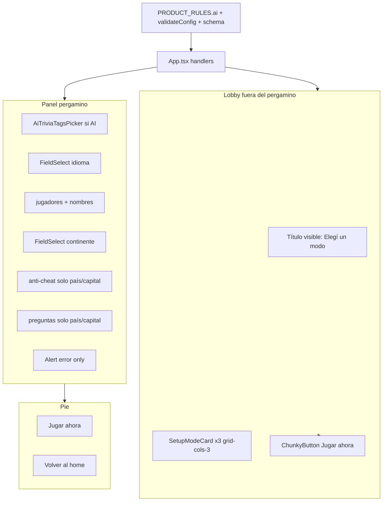
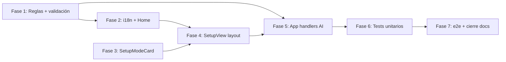

# Plan de implementación — Setup redesign

Documento destino al ejecutar: [`docs/tasks/setup-redesign/02-plan-implementacion-setup-redesign.md`](docs/tasks/setup-redesign/02-plan-implementacion-setup-redesign.md).

Referencias: [`00-decision-setup-look-and-feel.md`](docs/tasks/setup-redesign/00-decision-setup-look-and-feel.md), [`01-prd-setup-redesign.md`](docs/tasks/setup-redesign/01-prd-setup-redesign.md).

Ritual entre tareas (igual que [`modo-ai-trivia-ux-feedback/03-todo-list-*.md`](docs/tasks/modo-ai-trivia-ux-feedback/03-todo-list-ux-feedback-modo-ai.md) §0): **Review → Analizar → Errores (`tsc` + lint) → Corregir → Testear** antes de pasar a la siguiente tarea.

---

## Arquitectura objetivo



**Componentes nuevos**

| Componente | Ubicación | Rol |
|------------|-----------|-----|
| `SetupModeCard` | [`src/features/setup/SetupModeCard.tsx`](src/features/setup/SetupModeCard.tsx) | Card vertical seleccionable; patrón [`HomeModeCard`](src/features/home/HomeModeCard.tsx); fondo CSS placeholder por modo |
| `SetupModeCardGroup` | mismo archivo o [`SetupModeCardGroup.tsx`](src/features/setup/SetupModeCardGroup.tsx) | `role="radiogroup"` + 3 radios accesibles; flechas/teclado |
| `SetupView.test.tsx` | [`src/features/setup/SetupView.test.tsx`](src/features/setup/SetupView.test.tsx) | Tests de layout, visibilidad condicional, lobby |

**Archivos existentes a modificar**

| Archivo | Cambio principal |
|---------|------------------|
| [`src/services/product-rules.ts`](src/services/product-rules.ts) | `PRODUCT_RULES.ai = { maxPlayers: 2, fixedQuestionCount: 5 }` |
| [`src/services/validate-config.ts`](src/services/validate-config.ts) | Reglas AI: `players.length <= ai.maxPlayers`, `questionCount === ai.fixedQuestionCount` |
| [`src/features/setup/setup-config-schema.ts`](src/features/setup/setup-config-schema.ts) | `superRefine` / refinements AI alineados a `PRODUCT_RULES.ai` |
| [`src/App.tsx`](src/App.tsx) | `handleQuestionModeChange`, `handlePlayerCountChange` con max dinámico, recorte + toast, reset preguntas |
| [`src/features/setup/SetupView.tsx`](src/features/setup/SetupView.tsx) | Reestructuración lobby + panel; eliminar JSON/éxito; reorden campos |
| [`src/features/home/HomeView.tsx`](src/features/home/HomeView.tsx) | Solo copy i18n (sin cambio estructural) |
| [`src/i18n/resources/es.ts`](src/i18n/resources/es.ts) / [`en.ts`](src/i18n/resources/en.ts) | Claves nuevas + eliminar obsoletas |
| [`src/App.test.tsx`](src/App.test.tsx) | Selectores/copy del setup |
| [`e2e/helpers.ts`](e2e/helpers.ts) + specs | Regex `Jugar ahora` / `Play now`; helpers de modo por card |

**Sin tocar:** motor de juego, API AI, Convex, mapa, HUD, resultados, tokens globales, `package.json`.

---

## Orden de fases y dependencias



**Razón:** F1 fija contrato numérico antes de UI/handlers. F2 desbloquea copy en componentes. F3 entrega cards antes del layout. F4 compone la pantalla. F5 conecta lógica de recorte/toast en `App.tsx` (puede solaparse parcialmente con F4 si los handlers se escriben primero). F6 consolida tests App/SetupView. F7 cierra e2e y documentación.

---

## Fase 1 — Reglas de producto y validación (RF-S30, RF-S37)

**Objetivo:** una sola fuente de verdad para límites AI antes de tocar UI.

### Tarea 1.1 — Extender `PRODUCT_RULES`

- Agregar en [`product-rules.ts`](src/services/product-rules.ts):
  ```ts
  ai: { maxPlayers: 2, fixedQuestionCount: 5 }
  ```
- Helper opcional `getMaxPlayersForMode(questionMode)` para evitar duplicar ternarios en App/SetupView.
- Actualizar [`product-rules.test.ts`](src/services/product-rules.test.ts).

### Tarea 1.2 — `validateConfig` con reglas AI

- En [`validate-config.ts`](src/services/validate-config.ts), cuando `questionMode === 'ai'`:
  - Si `players.length > PRODUCT_RULES.ai.maxPlayers` → error `validation.config.aiPlayersMax` (nueva clave i18n con `{{max}}`).
  - Si `questionCount !== PRODUCT_RULES.ai.fixedQuestionCount` → error `validation.config.aiFixedQuestionCount` (nueva clave con `{{count}}`).
- Mantener reglas existentes para país/capital (max 6 global).
- Ampliar [`validate-config.test.ts`](src/services/validate-config.test.ts): AI válido con 2 jugadores y 5 preguntas; AI inválido con 3 jugadores o questionCount ≠ 5.

### Tarea 1.3 — Schema Zod alineado

- En [`setup-config-schema.ts`](src/features/setup/setup-config-schema.ts): `superRefine` para AI (jugadores ≤ 2, `questionCount === 5`).
- Mensajes schema: `schema.aiPlayersMax`, `schema.aiFixedQuestionCount` (o reutilizar claves de dominio según convención del repo).
- Ampliar [`setup-config-schema.test.ts`](src/features/setup/setup-config-schema.test.ts) con fixtures AI válidos/inválidos.

**Tests mínimos:** Vitest de las tres unidades anteriores.

---

## Fase 2 — i18n, Home y copy del setup (RF-S40, RF-S50, RF-S28, D9)

**Objetivo:** textos listos antes de renderizar la UI nueva.

### Tarea 2.1 — Claves nuevas (ES + EN)

| Clave | Uso |
|-------|-----|
| `setup.modeLegend` | Título visible sobre las cards ("Elegí un modo" / "Choose a mode") |
| `setup.startGame` | **"Jugar ahora"** / **"Play now"** (ambos CTAs) |
| `setup.regionLabel` | "Elige un continente" / "Choose a continent" |
| `setup.aiPlayersClamped` | Toast al recortar jugadores en AI |
| `setup.badge`, `setup.lead` | Copy más lúdico (ADR D9) |
| `setup.questionsAvailable`, `setup.questionRange` | Redacción menos técnica (país/capital) |
| `setup.playerCountLabel` | Considerar interpolación `{{min}}–{{max}}` para reflejar max 2 en AI |
| `home.gameCard.description`, `home.gameCard.ariaLabel` | Tres modos (PRD §4.5) |
| `validation.config.aiPlayersMax`, `validation.config.aiFixedQuestionCount` | Errores de dominio |
| `validation.schema.aiPlayersMax`, `validation.schema.aiFixedQuestionCount` | Errores schema (si aplica) |

### Tarea 2.2 — Eliminar claves obsoletas

Borrar de [`es.ts`](src/i18n/resources/es.ts) y [`en.ts`](src/i18n/resources/en.ts):

- `setup.validConfig`
- `setup.configPreviewHeading`
- `setup.aiStrictRequired`
- `setup.questionModeLegend` (reemplazada por `setup.modeLegend` en lobby)

Verificar con grep que no queden referencias en código.

**Tests mínimos:** `tsc --noEmit`; grep sin referencias rotas.

---

## Fase 3 — Componente `SetupModeCard` (RF-S20–S23)

**Objetivo:** cards reutilizables con placeholder CSS y a11y.

### Tarea 3.1 — `SetupModeCard`

- Basado en [`HomeModeCard.tsx`](src/features/home/HomeModeCard.tsx): zona imagen + nombre.
- **Sin** descripción; altura compacta en móvil (`min-h` / `aspect` reducido vs Home).
- Fondo por variante (`country` | `capital` | `ai`): gradientes CSS con tokens existentes (`bg-paper-mute`, `bg-info/20`, `bg-action/15`, etc.) — sin assets binarios.
- Seleccionado: `border-action border-2` (rojo PRD).
- Props: `mode`, `label`, `selected`, `onSelect`, `testId`.

### Tarea 3.2 — `SetupModeCardGroup`

- Contenedor `role="radiogroup"` + `aria-labelledby` apuntando al título visible.
- Cada card: input radio nativo oculto visualmente (patrón [`FieldRadioGroup`](src/components/ui/field-radio-group.tsx)) **o** `role="radio"` en botón con `aria-checked`.
- `data-testid`: `setup-mode-country`, `setup-mode-capital`, `setup-mode-ai`.
- Navegación flechas izq/der entre radios (handler `onKeyDown` en el grupo).
- `prefers-reduced-motion`: sin scale hover agresivo si aplica.

### Tarea 3.3 — Export en [`index.ts`](src/features/setup/index.ts)

**Tests:** [`SetupModeCard.test.tsx`](src/features/setup/SetupModeCard.test.tsx) — selección, borde, `aria-checked`, testids.

---

## Fase 4 — Reestructuración de `SetupView` (RF-S10–S14, RF-S24–S27)

**Objetivo:** layout lobby + pergamino según PRD.

### Tarea 4.1 — Estructura de layout

En [`SetupView.tsx`](src/features/setup/SetupView.tsx):

1. **Lobby** (fuera de `Panel`): `setup.modeLegend` + `SetupModeCardGroup` + `ChunkyButton` ancho `Jugar ahora` (`disabled={!canStartGame}`).
2. **Encabezado** existente: badge + título "Panel de configuración" + lead actualizado.
3. **Panel pergamino** con orden:
   - Tags (solo AI)
   - Idioma
   - Jugadores + nombres (`max` dinámico vía prop `playerMax` desde App)
   - Continente (label nuevo)
   - Anti-cheat (solo no-AI)
   - Preguntas + bloque disponibles/rango (solo no-AI)
   - **Solo** `Alert` de error (`validationResult`, `schemaOnlyErrors`); sin rama `validConfig`.
4. **Pie:** segundo `Jugar ahora` + `Volver al home`.

Eliminar: preview JSON, prop `setupDraft` si ya no se usa (limpiar interface + call site en App).

### Tarea 4.2 — Toast de recorte AI (presentación)

- Prop `setupNotice: string | null` desde App **o** estado local en SetupView según dónde viva el timer.
- Render: `Alert tone="info"` con `aria-live="polite"`, auto-ocultar ~4–5 s (`useEffect` + timeout).
- Mostrar solo cuando App dispara recorte (Fase 5).

### Tarea 4.3 — Responsividad above-the-fold

- `grid grid-cols-3 gap-2 md:gap-4` en cards.
- Alturas compactas en default; `md:` más altas para mostrar más fondo.
- Verificar en viewport 390px (test manual o Vitest con `innerWidth` si se agrega).

**Tests:** [`SetupView.test.tsx`](src/features/setup/SetupView.test.tsx):
- Lobby renderiza 3 cards + 2 botones "Jugar ahora".
- Modo AI oculta anti-cheat, preguntas y bloque rango; muestra tags primero.
- No aparece texto de config válida ni JSON.
- Label continente actualizado.

---

## Fase 5 — Orquestación en `App.tsx` (RF-S31–S36)

**Objetivo:** lógica de cambio de modo y límites dinámicos.

### Tarea 5.1 — `handleQuestionModeChange`

Reemplazar `setQuestionMode` directo por handler que:

1. Al **entrar en AI**:
   - `setQuestionCount(PRODUCT_RULES.ai.fixedQuestionCount)` (5).
   - Si `playerCount > 2`: recortar `players` a slice(0, 2), `setPlayerCount(2)`, setear mensaje toast (`setup.aiPlayersClamped`).
2. Al **salir de AI** (→ country/capital):
   - `setQuestionCount(5)` (reset PRD).
   - **No** restaurar playerCount previo (queda en 2).
3. `setQuestionMode(next)`.

### Tarea 5.2 — `handlePlayerCountChange` con max dinámico

- `effectiveMax = questionMode === 'ai' ? PRODUCT_RULES.ai.maxPlayers : PRODUCT_RULES.players.max`.
- Aplicar bound con `effectiveMax` en lugar del max global fijo.

### Tarea 5.3 — Estado del toast

- `const [setupNotice, setSetupNotice] = useState<string | null>(null)`.
- Pasar a `SetupView`; limpiar al cambiar modo o tras timeout (coordinar con SetupView).

### Tarea 5.4 — Wiring props

- Pasar `playerMax` a SetupView para atributo `max` del input.
- Eliminar `setupDraft` del render si se removió del componente.
- `effectiveAntiCheatMode` sin cambios (sigue forzando strict en AI).

**Tests:** ampliar [`App.test.tsx`](src/App.test.tsx):
- Setup ya no muestra "Modo de preguntas" como radio group ni "Cobertura geográfica".
- Botones "Jugar ahora" (2).
- AI: subir a 3 jugadores vía UI imposible; cambiar a AI con 4 jugadores pre-set → queda 2 + aviso.
- AI oculta número de preguntas.
- Inicio partida country/capital sin regresión.

---

## Fase 6 — Tests unitarios consolidados

**Objetivo:** cerrar huecos antes de e2e.

### Tarea 6.1 — Cobertura de integración App + setup

- Flujo: Home → setup → seleccionar card Capital → Jugar ahora → mapa.
- Config inválida: solo alerts de error, sin éxito.
- `aria-describedby` en preguntas solo cuando hay error y modo no-AI.

### Tarea 6.2 — Regresión validación AI

- Config AI manipulada en test de `validateSetupConfigSchema` + `validateConfig` ya cubierta en F1; smoke en App si hace falta.

**Comando:** `npm run test` (Vitest completo del repo o subset setup/app/services).

---

## Fase 7 — E2E, smoke y cierre de iteración

### Tarea 7.1 — Helpers e2e

En [`e2e/helpers.ts`](e2e/helpers.ts):

- `clickStartGame(page)` — botón `/Jugar ahora|Play now/i` (primer visible o ambos equivalentes).
- `selectSetupMode(page, 'country' | 'capital' | 'ai')` — click en `data-testid` correspondiente.
- Actualizar [`goToSetup`](e2e/helpers.ts) si hace falta esperar lobby.

### Tarea 7.2 — Actualizar specs existentes

Reemplazar `/Iniciar partida|Start game/i` por `/Jugar ahora|Play now/i` en:

- [`e2e/smoke.spec.ts`](e2e/smoke.spec.ts)
- [`e2e/game-flow.spec.ts`](e2e/game-flow.spec.ts)
- [`e2e/ai-trivia-flow.spec.ts`](e2e/ai-trivia-flow.spec.ts)

Ajustar aserciones que buscaban radios de modo o textos eliminados.

### Tarea 7.3 — Nuevos escenarios e2e (opcional archivo `e2e/setup-redesign.spec.ts`)

| Escenario | Verificación |
|-----------|--------------|
| Path rápido | Card País + Jugar ahora (CTA superior) → mapa sin scroll al panel |
| AI clamp | 4 jugadores en país → card AI → 2 jugadores visibles + toast |
| AI oculta controles | Sin input preguntas ni anti-cheat en AI |
| Home copy | Card Partida menciona IA (texto visible ES) |

### Tarea 7.4 — Verificación final

- `npx tsc --noEmit`
- `npm run lint`
- `npm run test`
- `npm run e2e`

### Tarea 7.5 — Documentación de cierre

- Callout superseding al inicio de [`01-prd-mvp-producto-y-requerimientos.mdc`](docs/requirements/01-prd-mvp-producto-y-requerimientos.mdc) §RF-01 (fecha de implementación).
- Actualizar [`setup-redesign/README.md`](docs/tasks/setup-redesign/README.md): PRD aprobado, plan ejecutado, estado.
- Mover entrada de [`ideas-features-backlog.md`](docs/tasks/ideas-features-backlog.md) **En ejecución → Cerradas** + línea en [`04-current-state-post-mvp.mdc`](docs/requirements/04-current-state-post-mvp.mdc) §1.
- Marcar PRD [`01-prd-setup-redesign.md`](docs/tasks/setup-redesign/01-prd-setup-redesign.md) como **aprobado/cerrado** al merge.

### Tarea 7.6 — Smoke manual (operador)

1. Móvil 390px: 3 cards + CTA visibles sin scroll.
2. País: defaults → Jugar ahora arriba → partida.
3. AI con 6 jugadores → recorte + toast → tags visibles arriba del pergamino → partida 5 rondas.
4. Volver a país: 2 jugadores, 5 preguntas editables de nuevo.
5. Home ES/EN: descripción con tres modos.

---

## Mapa PRD → Fases

| PRD | Fase |
|-----|------|
| RF-S10–S14 (lobby, CTA, home button) | 4, 5 |
| RF-S20–S23 (cards, a11y, CSS placeholder) | 3, 4 |
| RF-S24–S27 (panel, errores, orden) | 4 |
| RF-S28 (continente) | 2, 4 |
| RF-S30–S37 (reglas AI) | 1, 5 |
| RF-S40 (Home) | 2 |
| RF-S50 (i18n cleanup) | 2 |
| RNF-P/A/I | 3, 4, 6, 7 |
| E-01–E-12 | 5, 6, 7 |

---

## Entregable siguiente: `03-todo-list`

Tras aprobar este plan, generar [`docs/tasks/setup-redesign/03-todo-list-setup-redesign.md`](docs/tasks/setup-redesign/03-todo-list-setup-redesign.md) copiando:

- §0 ritual obligatorio (de iteración UX-feedback).
- Un bloque `### Tarea X.Y` por cada tarea de arriba con checkboxes `- [ ]` y sub-checklist Review/Analizar/Errores/Corregir/Testear.
- Tabla de trazabilidad RF-S → Tarea al final.

**Estimación orientativa:** 7 fases, ~22 tareas atómicas, sin dependencias npm ni cambios backend.
